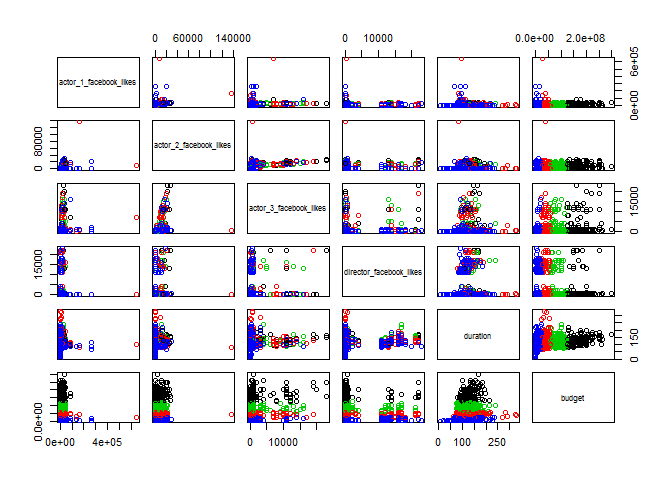

Limpieza y preparación de datos
-------------------------------

En primer lugar se cargan los datos se desde el directorio actual, almacenados en un fichero CSV:

``` r
fileMovies <- file("./movie_metadata_clean_no_supervised.csv","r") 
moviesDatasetClustering <- read.csv(fileMovies) 
close(fileMovies) 
head(moviesDatasetClustering[,1:3])
```

A continuación se calcula el número ideal de conjuntos y se muestran los resultados:

``` r
if(! "dplyr" %in% installed.packages()) 
  install.packages("dplyr", depend = TRUE) 
if(! "plotrix" %in% installed.packages()) 
  install.packages("plotrix", depend = TRUE) 
if(! "knitr" %in% installed.packages()) 
  install.packages("knitr", depend = TRUE) 

library(dplyr) 
library(plotrix) 
library(knitr) 

wss <- (nrow(moviesDatasetClustering)-1)*sum(apply(moviesDatasetClustering,2,var)) 
for (i in 2:15) 
  wss[i] <- sum(kmeans(moviesDatasetClustering, centers=i)$withinss) 

plot(1:15, wss, type="b", xlab="Numero de Clusters", ylab="Sumas de cuadrados dentro de los grupos", 
     main="Num de clusters optimo segun Elbow", pch=20, cex=2)
```


``` r
set.seed(1234) 
kmeans.clust <- kmeans(moviesDatasetClustering, 4) 
kmeans.clust

plot(moviesDatasetClustering, col=kmeans.clust$cluster)
```


