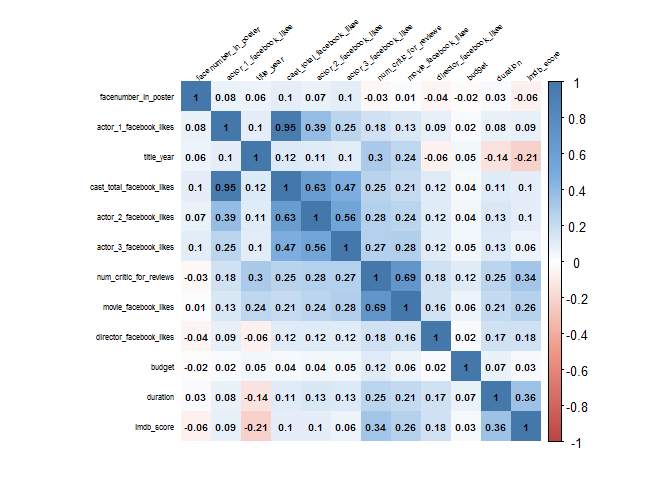
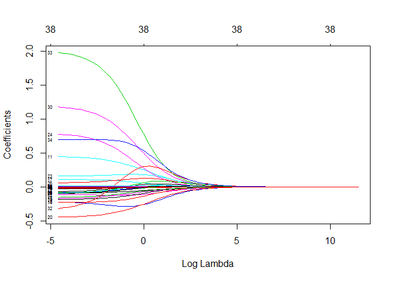
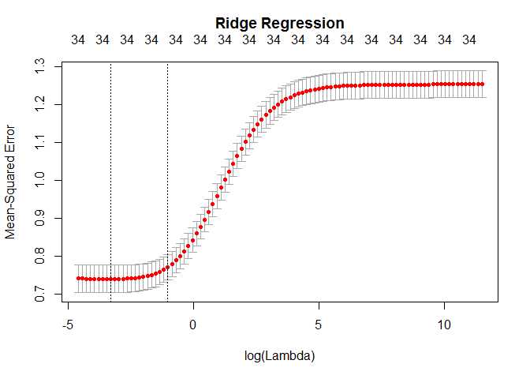
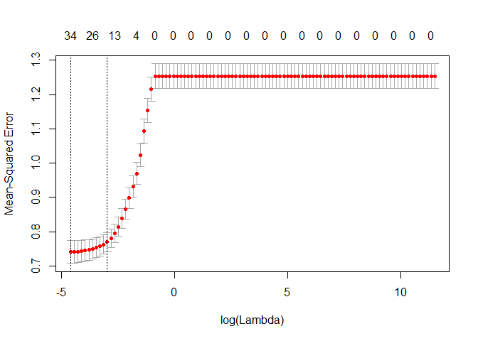

En primer lugar se cargan los datos se desde el directorio actual, almacenados en un fichero CSV:

``` r
fileMovies <- file("./movie_metadata_clean_supervised.csv","r") 
moviesDatasetSupervised <- read.csv(fileMovies) 

close(fileMovies) 
head(moviesDatasetSupervised[,1:20])
```

Calculamos la matriz de correlación entre las diferentes columnas del dataset:

``` r
# instalacion de la libreria ggplot2
if(! "ggplot2" %in% installed.packages())
  install.packages("ggplot2", repos="http://cran.rstudio.com/", depend = TRUE)
library("ggplot2")

# subconjunto de etiquetas para la creacion de la matriz de correlacion
matCor <- cor(moviesDatasetSupervised)

# instalacion de la libreria corrplot
if(! "corrplot" %in% installed.packages()) 
  install.packages("corrplot", repos="http://cran.rstudio.com/", depend = TRUE)
library("corrplot")

matCor[is.na(matCor)] <- 0

# generacion de la paleta de colores
col <- colorRampPalette(c("#BB4444", "#EE9988", "#FFFFFF", "#77AADD", "#4477AA"))
```

Mostramos la matriz de correlación:

``` r
# matriz de correlacion
par(xpd = TRUE)
corrplot(matCor, method = "shade", shade.col = NA, tl.col = "black",
         tl.srt = 40, col = col(200), addCoef.col="black",
         order="AOE",
         mar = c(2,0,1,0), number.cex=0.2, tl.cex = 0.2)
```



Preparamos las entradas de los modelos de regresión:

``` r
movies_with_good_variables = moviesDatasetSupervised[, c("imdb_score",
                                                          "actor_1_facebook_likes", 
                                                          "actor_2_facebook_likes", 
                                                          "actor_3_facebook_likes",
                                                          "director_facebook_likes",
                                                          "duration",
                                                          "budget",
                                                          "title_year",
                                                          "facenumber_in_poster",
                                                          "num_critic_for_reviews",
                                                          "color",
                                                          "drama_genre",
                                                          "comedy_genre",
                                                          "thriller_genre",
                                                          "action_genre",
                                                          "romance_genre",
                                                          "adventure_genre",
                                                          "crime_genre",
                                                          "scifi_genre",
                                                          "fantasy_genre",
                                                          "horror_genre",
                                                          "family_genre",
                                                          "mystery_genre",
                                                          "biography_genre",
                                                          "animation_genre",
                                                          "music_genre",
                                                          "war_genre",
                                                          "history_genre",
                                                          "sport_genre",
                                                          "musical_genre",
                                                          "documentary_genre",
                                                          "western_genre",
                                                          "filmnoir_genre",
                                                          "short_genre",
                                                          "news_genre"
                                                         )]
x = as.matrix(movies_with_good_variables[, -1])
y = movies_with_good_variables[, 1]
```

Incluímos las librerías necesarias para crear los modelos detallados a continuación:

``` r
if(! "ggplot2" %in% installed.packages()) 
  install.packages("ggplot2", repos="http://cran.rstudio.com/", depend = TRUE)
library("ggplot2")

if(! "VIM" %in% installed.packages()) 
  install.packages("VIM", repos="http://cran.rstudio.com/", depend = TRUE)
library("VIM")
```

    ## Loading required package: colorspace

    ## Loading required package: grid

    ## Loading required package: data.table

    ## VIM is ready to use. 
    ##  Since version 4.0.0 the GUI is in its own package VIMGUI.
    ## 
    ##           Please use the package to use the new (and old) GUI.

    ## Suggestions and bug-reports can be submitted at: https://github.com/alexkowa/VIM/issues

    ## 
    ## Attaching package: 'VIM'

    ## The following object is masked from 'package:datasets':
    ## 
    ##     sleep

``` r
if(! "mice" %in% installed.packages()) 
  install.packages("mice", repos="http://cran.rstudio.com/", depend = TRUE)
library("mice")

if(! "vcd" %in% installed.packages()) 
  install.packages("vcd", repos="http://cran.rstudio.com/", depend = TRUE)
library("vcd")

if(! "car" %in% installed.packages()) 
  install.packages("car", repos="http://cran.rstudio.com/", depend = TRUE)
library("car")

if(! "tabplot" %in% installed.packages()) 
  install.packages("tabplot", repos="http://cran.rstudio.com/", depend = TRUE)
library("tabplot")
```

    ## Loading required package: bit

    ## Attaching package bit

    ## package:bit (c) 2008-2012 Jens Oehlschlaegel (GPL-2)

    ## creators: bit bitwhich

    ## coercion: as.logical as.integer as.bit as.bitwhich which

    ## operator: ! & | xor != ==

    ## querying: print length any all min max range sum summary

    ## bit access: length<- [ [<- [[ [[<-

    ## for more help type ?bit

    ## 
    ## Attaching package: 'bit'

    ## The following object is masked from 'package:data.table':
    ## 
    ##     setattr

    ## The following object is masked from 'package:base':
    ## 
    ##     xor

    ## Loading required package: ff

    ## Attaching package ff

    ## - getOption("fftempdir")=="C:/Users/JAVIER~1.POZ/AppData/Local/Temp/RtmpsHIngh"

    ## - getOption("ffextension")=="ff"

    ## - getOption("ffdrop")==TRUE

    ## - getOption("fffinonexit")==TRUE

    ## - getOption("ffpagesize")==65536

    ## - getOption("ffcaching")=="mmnoflush"  -- consider "ffeachflush" if your system stalls on large writes

    ## - getOption("ffbatchbytes")==84903198.72 -- consider a different value for tuning your system

    ## - getOption("ffmaxbytes")==4245159936 -- consider a different value for tuning your system

    ## 
    ## Attaching package: 'ff'

    ## The following objects are masked from 'package:bit':
    ## 
    ##     clone, clone.default, clone.list

    ## The following objects are masked from 'package:utils':
    ## 
    ##     write.csv, write.csv2

    ## The following objects are masked from 'package:base':
    ## 
    ##     is.factor, is.ordered

    ## Loading required package: ffbase

    ## 
    ## Attaching package: 'ffbase'

    ## The following objects are masked from 'package:ff':
    ## 
    ##     [.ff, [.ffdf, [<-.ff, [<-.ffdf

    ## The following objects are masked from 'package:base':
    ## 
    ##     %in%, table

``` r
if(! "PerformanceAnalytics" %in% installed.packages()) 
  install.packages("PerformanceAnalytics", repos="http://cran.rstudio.com/", depend = TRUE)
library("PerformanceAnalytics")
```

    ## Loading required package: xts

    ## Loading required package: zoo

    ## 
    ## Attaching package: 'zoo'

    ## The following objects are masked from 'package:base':
    ## 
    ##     as.Date, as.Date.numeric

    ## 
    ## Attaching package: 'xts'

    ## The following objects are masked from 'package:data.table':
    ## 
    ##     first, last

    ## 
    ## Attaching package: 'PerformanceAnalytics'

    ## The following object is masked from 'package:vcd':
    ## 
    ##     Kappa

    ## The following object is masked from 'package:graphics':
    ## 
    ##     legend

``` r
if(! "MASS" %in% installed.packages()) 
  install.packages("MASS", repos="http://cran.rstudio.com/", depend = TRUE)
library("MASS")

if(! "glmnet" %in% installed.packages()) 
  install.packages("glmnet", repos="http://cran.rstudio.com/", depend = TRUE)
library("glmnet")
```

    ## Loading required package: Matrix

    ## Loading required package: foreach

    ## Loaded glmnet 2.0-10

Calculamos el primer modelo en base a ridge regression:

``` r
# Fitting the ridge regression. Alpha = 0 for ridge regression.
grid = 10^seq(5, -2, length = 100)
ridge.models = glmnet(x, y, alpha = 0, lambda = grid)
dim(coef(ridge.models)) #20 different coefficients, estimated 100 times --once each per lambda value.
```

    ## [1]  35 100

``` r
coef(ridge.models) #Inspecting the various coefficient estimates.
```

    ## 35 x 100 sparse Matrix of class "dgCMatrix"

    ##    [[ suppressing 100 column names 's0', 's1', 's2' ... ]]

    ##                                                                  
    ## (Intercept)              6.422798e+00  6.422869e+00  6.422952e+00
    ## actor_1_facebook_likes   6.715634e-11  7.902887e-11  9.300163e-11
    ## actor_2_facebook_likes   2.819704e-10  3.318187e-10  3.904856e-10
    ## actor_3_facebook_likes   4.471952e-10  5.262524e-10  6.192950e-10
    ## director_facebook_likes  7.489159e-10  8.813203e-10  1.037143e-09
    ## duration                 1.942957e-07  2.286463e-07  2.690724e-07
    ## budget                   1.824351e-15  2.146905e-15  2.526489e-15
    ## title_year              -2.101525e-07 -2.473096e-07 -2.910361e-07
    ## facenumber_in_poster    -3.719013e-07 -4.376559e-07 -5.150375e-07
    ## num_critic_for_reviews   3.403499e-08  4.005274e-08  4.713440e-08
    ## color                   -8.514477e-06 -1.001985e-05 -1.179143e-05
    ## drama_genre              7.461276e-06  8.780424e-06  1.033286e-05
    ## comedy_genre            -4.479345e-06 -5.271320e-06 -6.203316e-06
    ## thriller_genre          -1.853903e-06 -2.181667e-06 -2.567408e-06
    ## action_genre            -2.805149e-06 -3.301120e-06 -3.884789e-06
    ## romance_genre            3.221520e-07  3.790977e-07  4.461200e-07
    ## adventure_genre          5.913625e-08  6.960804e-08  8.191746e-08
    ## crime_genre              1.278770e-06  1.504861e-06  1.770933e-06
    ## scifi_genre             -2.254739e-06 -2.653367e-06 -3.122499e-06
    ## fantasy_genre           -2.058413e-06 -2.422322e-06 -2.850597e-06
    ## horror_genre            -7.311018e-06 -8.603647e-06 -1.012483e-05
    ## family_genre            -2.624406e-06 -3.088407e-06 -3.634445e-06
    ## mystery_genre            1.411871e-07  1.661669e-07  1.955475e-07
    ## biography_genre          8.550873e-06  1.006268e-05  1.184181e-05
    ## animation_genre          1.996533e-06  2.349571e-06  2.765035e-06
    ## music_genre              3.606953e-07  4.244629e-07  4.995086e-07
    ## war_genre                7.451102e-06  8.768464e-06  1.031876e-05
    ## history_genre            7.449465e-06  8.766554e-06  1.031650e-05
    ## sport_genre              1.709737e-06  2.012025e-06  2.367757e-06
    ## musical_genre            1.307173e-06  1.538292e-06  1.810272e-06
    ## documentary_genre        7.224995e-06  8.502455e-06  1.000579e-05
    ## western_genre            3.284980e-06  3.865779e-06  4.549261e-06
    ## filmnoir_genre           1.442877e-05  1.697987e-05  1.998201e-05
    ## short_genre              7.528299e-06  8.859432e-06  1.042594e-05
    ## news_genre               1.308581e-05  1.539950e-05  1.812227e-05
    ##                                                                  
    ## (Intercept)              6.423050e+00  6.423166e+00  6.423301e+00
    ## actor_1_facebook_likes   1.094447e-10  1.287949e-10  1.515661e-10
    ## actor_2_facebook_likes   4.595245e-10  5.407690e-10  6.363765e-10
    ## actor_3_facebook_likes   7.287865e-10  8.576347e-10  1.009261e-09
    ## director_facebook_likes  1.220516e-09  1.436308e-09  1.690251e-09
    ## duration                 3.166459e-07  3.726302e-07  4.385123e-07
    ## budget                   2.973184e-15  3.498851e-15  4.117453e-15
    ## title_year              -3.424937e-07 -4.030493e-07 -4.743112e-07
    ## facenumber_in_poster    -6.061005e-07 -7.132640e-07 -8.393743e-07
    ## num_critic_for_reviews   5.546814e-08  6.527531e-08  7.681641e-08
    ## color                   -1.387623e-05 -1.632962e-05 -1.921675e-05
    ## drama_genre              1.215977e-05  1.430967e-05  1.683966e-05
    ## comedy_genre            -7.300085e-06 -8.590757e-06 -1.010961e-05
    ## thriller_genre          -3.021351e-06 -3.555555e-06 -4.184209e-06
    ## action_genre            -4.571654e-06 -5.379960e-06 -6.331179e-06
    ## romance_genre            5.249900e-07  6.178016e-07  7.270185e-07
    ## adventure_genre          9.640406e-08  1.134531e-07  1.335180e-07
    ## crime_genre              2.084046e-06  2.452519e-06  2.886138e-06
    ## scifi_genre             -3.674573e-06 -4.324252e-06 -5.088791e-06
    ## fantasy_genre           -3.354588e-06 -3.947680e-06 -4.645622e-06
    ## horror_genre            -1.191497e-05 -1.402160e-05 -1.650067e-05
    ## family_genre            -4.277017e-06 -5.033187e-06 -5.923036e-06
    ## mystery_genre            2.301230e-07  2.708120e-07  3.186956e-07
    ## biography_genre          1.393548e-05  1.639930e-05  1.929870e-05
    ## animation_genre          3.253968e-06  3.829368e-06  4.506527e-06
    ## music_genre              5.878216e-07  6.917471e-07  8.140447e-07
    ## war_genre                1.214314e-05  1.429005e-05  1.681650e-05
    ## history_genre            1.214046e-05  1.428687e-05  1.681273e-05
    ## sport_genre              2.786380e-06  3.279009e-06  3.858729e-06
    ## musical_genre            2.130338e-06  2.506991e-06  2.950235e-06
    ## documentary_genre        1.177492e-05  1.385686e-05  1.630691e-05
    ## western_genre            5.353576e-06  6.300086e-06  7.413924e-06
    ## filmnoir_genre           2.351493e-05  2.767244e-05  3.256499e-05
    ## short_genre              1.226945e-05  1.443894e-05  1.699206e-05
    ## news_genre               2.132643e-05  2.509709e-05  2.953442e-05
    ##                                                                  
    ## (Intercept)              6.423461e+00  6.423649e+00  6.423870e+00
    ## actor_1_facebook_likes   1.783630e-10  2.098972e-10  2.470060e-10
    ## actor_2_facebook_likes   7.488860e-10  8.812848e-10  1.037088e-09
    ## actor_3_facebook_likes   1.187691e-09  1.397663e-09  1.644750e-09
    ## director_facebook_likes  1.989089e-09  2.340758e-09  2.754597e-09
    ## duration                 5.160419e-07  6.072778e-07  7.146428e-07
    ## budget                   4.845417e-15  5.702074e-15  6.710170e-15
    ## title_year              -5.581724e-07 -6.568601e-07 -7.729956e-07
    ## facenumber_in_poster    -9.877811e-07 -1.162426e-06 -1.367948e-06
    ## num_critic_for_reviews   9.039797e-08  1.063807e-07  1.251891e-07
    ## color                   -2.261432e-05 -2.661254e-05 -3.131760e-05
    ## drama_genre              1.981694e-05  2.332057e-05  2.744359e-05
    ## comedy_genre            -1.189697e-05 -1.400031e-05 -1.647547e-05
    ## thriller_genre          -4.924014e-06 -5.794619e-06 -6.819150e-06
    ## action_genre            -7.450575e-06 -8.767881e-06 -1.031809e-05
    ## romance_genre            8.555394e-07  1.006775e-06  1.184737e-06
    ## adventure_genre          1.571325e-07  1.849250e-07  2.176353e-07
    ## crime_genre              3.396421e-06  3.996918e-06  4.703579e-06
    ## scifi_genre             -5.988494e-06 -7.047253e-06 -8.293184e-06
    ## fantasy_genre           -5.466948e-06 -6.433465e-06 -7.570833e-06
    ## horror_genre            -1.941803e-05 -2.285116e-05 -2.689122e-05
    ## family_genre            -6.970190e-06 -8.202452e-06 -9.652534e-06
    ## mystery_genre            3.750458e-07  4.413597e-07  5.193994e-07
    ## biography_genre          2.271066e-05  2.672580e-05  3.145072e-05
    ## animation_genre          5.303448e-06  6.241317e-06  7.345073e-06
    ## music_genre              9.579614e-07  1.127318e-06  1.326611e-06
    ## war_genre                1.978959e-05  2.328826e-05  2.740538e-05
    ## history_genre            1.978510e-05  2.328290e-05  2.739898e-05
    ## sport_genre              4.540930e-06  5.343728e-06  6.288433e-06
    ## musical_genre            3.471841e-06  4.085660e-06  4.807994e-06
    ## documentary_genre        1.919015e-05  2.258318e-05  2.657613e-05
    ## western_genre            8.724667e-06  1.026712e-05  1.208222e-05
    ## filmnoir_genre           3.832248e-05  4.509782e-05  5.307092e-05
    ## short_genre              1.999666e-05  2.353259e-05  2.769382e-05
    ## news_genre               3.475627e-05  4.090133e-05  4.813281e-05
    ##                                                                  
    ## (Intercept)              6.424130e+00  6.424436e+00  6.424797e+00
    ## actor_1_facebook_likes   2.906747e-10  3.420628e-10  4.025343e-10
    ## actor_2_facebook_likes   1.220432e-09  1.436185e-09  1.690071e-09
    ## actor_3_facebook_likes   1.935510e-09  2.277661e-09  2.680281e-09
    ## director_facebook_likes  3.241593e-09  3.814678e-09  4.489065e-09
    ## duration                 8.409877e-07  9.896672e-07  1.164628e-06
    ## budget                   7.896473e-15  9.292475e-15  1.093524e-14
    ## title_year              -9.096632e-07 -1.070492e-06 -1.259754e-06
    ## facenumber_in_poster    -1.609806e-06 -1.894422e-06 -2.229355e-06
    ## num_critic_for_reviews   1.473228e-07  1.733693e-07  2.040206e-07
    ## color                   -3.685443e-05 -4.337006e-05 -5.103745e-05
    ## drama_genre              3.229548e-05  3.800506e-05  4.472392e-05
    ## comedy_genre            -1.938817e-05 -2.281573e-05 -2.684913e-05
    ## thriller_genre          -8.024821e-06 -9.443655e-06 -1.111334e-05
    ## action_genre            -1.214236e-05 -1.428916e-05 -1.681549e-05
    ## romance_genre            1.394147e-06  1.640558e-06  1.930503e-06
    ## adventure_genre          2.561342e-07  3.014473e-07  3.547822e-07
    ## crime_genre              5.535171e-06  6.513775e-06  7.665377e-06
    ## scifi_genre             -9.759369e-06 -1.148474e-05 -1.351509e-05
    ## fantasy_genre           -8.909246e-06 -1.048423e-05 -1.233758e-05
    ## horror_genre            -3.164550e-05 -3.724024e-05 -4.382397e-05
    ## family_genre            -1.135893e-05 -1.336692e-05 -1.572979e-05
    ## mystery_genre            6.112381e-07  7.193160e-07  8.465048e-07
    ## biography_genre          3.701085e-05  4.355381e-05  5.125325e-05
    ## animation_genre          8.644070e-06  1.017286e-05  1.197212e-05
    ## music_genre              1.561129e-06  1.837096e-06  2.161834e-06
    ## war_genre                3.225026e-05  3.795149e-05  4.466039e-05
    ## history_genre            3.224260e-05  3.794231e-05  4.464933e-05
    ## sport_genre              7.400123e-06  8.708305e-06  1.024769e-05
    ## musical_genre            5.658023e-06  6.658314e-06  7.835425e-06
    ## documentary_genre        3.127506e-05  3.680481e-05  4.331226e-05
    ## western_genre            1.421816e-05  1.673164e-05  1.968934e-05
    ## filmnoir_genre           6.245347e-05  7.349457e-05  8.648734e-05
    ## short_genre              3.259095e-05  3.835416e-05  4.513665e-05
    ## news_genre               5.664276e-05  6.665718e-05  7.844199e-05
    ##                                                                  
    ## (Intercept)              6.425221e+00  6.425720e+00  6.426307e+00
    ## actor_1_facebook_likes   4.736943e-10  5.574314e-10  6.559672e-10
    ## actor_2_facebook_likes   1.988828e-09  2.340384e-09  2.754063e-09
    ## actor_3_facebook_likes   3.154052e-09  3.711539e-09  4.367525e-09
    ## director_facebook_likes  5.282655e-09  6.216512e-09  7.315416e-09
    ## duration                 1.370516e-06  1.612794e-06  1.897892e-06
    ## budget                   1.286835e-14  1.514313e-14  1.781993e-14
    ## title_year              -1.482475e-06 -1.744567e-06 -2.052990e-06
    ## facenumber_in_poster    -2.623499e-06 -3.087320e-06 -3.633133e-06
    ## num_critic_for_reviews   2.400903e-07  2.825363e-07  3.324853e-07
    ## color                   -6.006017e-05 -7.067771e-05 -8.317186e-05
    ## drama_genre              5.263041e-05  6.193439e-05  7.288276e-05
    ## comedy_genre            -3.159542e-05 -3.718054e-05 -4.375266e-05
    ## thriller_genre          -1.307821e-05 -1.539046e-05 -1.811149e-05
    ## action_genre            -1.978845e-05 -2.328697e-05 -2.740396e-05
    ## romance_genre            2.271665e-06  2.673081e-06  3.145379e-06
    ## adventure_genre          4.175609e-07  4.914584e-07  5.784480e-07
    ## crime_genre              9.020554e-06  1.061528e-05  1.249190e-05
    ## scifi_genre             -1.590432e-05 -1.871585e-05 -2.202427e-05
    ## fantasy_genre           -1.451848e-05 -1.708477e-05 -2.010454e-05
    ## horror_genre            -5.157149e-05 -6.068844e-05 -7.141680e-05
    ## family_genre            -1.851024e-05 -2.178200e-05 -2.563184e-05
    ## mystery_genre            9.961842e-07  1.172331e-06  1.379627e-06
    ## biography_genre          6.031350e-05  7.097498e-05  8.352050e-05
    ## animation_genre          1.408973e-05  1.658207e-05  1.951550e-05
    ## music_genre              2.543959e-06  2.993604e-06  3.522692e-06
    ## war_genre                5.255498e-05  6.184468e-05  7.277590e-05
    ## history_genre            5.254162e-05  6.182848e-05  7.275618e-05
    ## sport_genre              1.205913e-05  1.419067e-05  1.669883e-05
    ## musical_genre            9.220603e-06  1.085061e-05  1.276871e-05
    ## documentary_genre        5.097028e-05  5.998229e-05  7.058767e-05
    ## western_genre            2.316975e-05  2.726519e-05  3.208428e-05
    ## filmnoir_genre           1.017766e-04  1.197682e-04  1.409394e-04
    ## short_genre              5.311877e-05  6.251277e-05  7.356850e-05
    ## news_genre               9.231013e-05  1.086298e-04  1.278343e-04
    ##                                                                  
    ## (Intercept)              6.426998e+00  6.427812e+00  6.428769e+00
    ## actor_1_facebook_likes   7.719159e-10  9.083526e-10  1.068895e-09
    ## actor_2_facebook_likes   3.240836e-09  3.813607e-09  4.487557e-09
    ## actor_3_facebook_likes   5.139398e-09  6.047608e-09  7.116211e-09
    ## director_facebook_likes  8.608523e-09  1.013014e-08  1.192060e-08
    ## duration                 2.233374e-06  2.628140e-06  3.092658e-06
    ## budget                   2.096974e-14  2.467612e-14  2.903731e-14
    ## title_year              -2.415932e-06 -2.843026e-06 -3.345609e-06
    ## facenumber_in_poster    -4.275429e-06 -5.031257e-06 -5.920678e-06
    ## num_critic_for_reviews   3.912634e-07  4.604305e-07  5.418221e-07
    ## color                   -9.787415e-05 -1.151747e-04 -1.355322e-04
    ## drama_genre              8.576603e-05  1.009260e-04  1.187646e-04
    ## comedy_genre            -5.148611e-05 -6.058594e-05 -7.129338e-05
    ## thriller_genre          -2.131356e-05 -2.508169e-05 -2.951593e-05
    ## action_genre            -3.224871e-05 -3.794984e-05 -4.465868e-05
    ## romance_genre            3.701058e-06  4.354808e-06  5.123903e-06
    ## adventure_genre          6.808546e-07  8.014177e-07  9.433670e-07
    ## crime_genre              1.470021e-05  1.729882e-05  2.035667e-05
    ## scifi_genre             -2.591738e-05 -3.049842e-05 -3.588889e-05
    ## fantasy_genre           -2.365785e-05 -2.783887e-05 -3.275839e-05
    ## horror_genre            -8.404126e-05 -9.889676e-05 -1.163774e-04
    ## family_genre            -3.016181e-05 -3.549194e-05 -4.176342e-05
    ## mystery_genre            1.623581e-06  1.910676e-06  2.248543e-06
    ## biography_genre          9.828279e-05  1.156533e-04  1.360923e-04
    ## animation_genre          2.296819e-05  2.703217e-05  3.181583e-05
    ## music_genre              4.145244e-06  4.877756e-06  5.739623e-06
    ## war_genre                8.563848e-05  1.007734e-04  1.185816e-04
    ## history_genre            8.561436e-05  1.007437e-04  1.185449e-04
    ## sport_genre              1.965012e-05  2.312274e-05  2.720869e-05
    ## musical_genre            1.502579e-05  1.768172e-05  2.080694e-05
    ## documentary_genre        8.306813e-05  9.775517e-05  1.150389e-04
    ## western_genre            3.775478e-05  4.442697e-05  5.227761e-05
    ## filmnoir_genre           1.658520e-04  1.951667e-04  2.296606e-04
    ## short_genre              8.658006e-05  1.018937e-04  1.199169e-04
    ## news_genre               1.504333e-04  1.770268e-04  2.083204e-04
    ##                                                                  
    ## (Intercept)              6.429895e+00  6.431220e+00  6.432780e+00
    ## actor_1_facebook_likes   1.257797e-09  1.480066e-09  1.741585e-09
    ## actor_2_facebook_likes   5.280537e-09  6.213544e-09  7.311265e-09
    ## actor_3_facebook_likes   8.373490e-09  9.852706e-09  1.159296e-08
    ## director_facebook_likes  1.402739e-08  1.650633e-08  1.942309e-08
    ## duration                 3.639245e-06  4.282385e-06  5.039116e-06
    ## budget                   3.416891e-14  4.020686e-14  4.731103e-14
    ## title_year              -3.937016e-06 -4.632938e-06 -5.451835e-06
    ## facenumber_in_poster    -6.967297e-06 -8.198882e-06 -9.648105e-06
    ## num_critic_for_reviews   6.375979e-07  7.502985e-07  8.829127e-07
    ## color                   -1.594867e-04 -1.876730e-04 -2.208381e-04
    ## drama_genre              1.397549e-04  1.644532e-04  1.935138e-04
    ## comedy_genre            -8.389214e-05 -9.871591e-05 -1.161571e-04
    ## thriller_genre          -3.473402e-05 -4.087445e-05 -4.810023e-05
    ## action_genre            -5.255329e-05 -6.184315e-05 -7.277472e-05
    ## romance_genre            6.028642e-06  7.092877e-06  8.344628e-06
    ## adventure_genre          1.110510e-06  1.307339e-06  1.539153e-06
    ## crime_genre              2.395489e-05  2.818891e-05  3.317097e-05
    ## scifi_genre             -4.223168e-05 -4.969488e-05 -5.847618e-05
    ## fantasy_genre           -3.854670e-05 -4.535700e-05 -5.336943e-05
    ## horror_genre            -1.369466e-04 -1.611498e-04 -1.896283e-04
    ## family_genre            -4.914225e-05 -5.782367e-05 -6.803716e-05
    ## mystery_genre            2.646162e-06  3.114105e-06  3.664814e-06
    ## biography_genre          1.601415e-04  1.884375e-04  2.217294e-04
    ## animation_genre          3.744687e-05  4.407570e-05  5.187957e-05
    ## music_genre              6.753657e-06  7.946675e-06  9.350207e-06
    ## war_genre                1.395348e-04  1.641876e-04  1.931921e-04
    ## history_genre            1.394892e-04  1.641306e-04  1.931204e-04
    ## sport_genre              3.201614e-05  3.767232e-05  4.432679e-05
    ## musical_genre            2.448430e-05  2.881128e-05  3.390249e-05
    ## documentary_genre        1.353784e-04  1.593139e-04  1.874810e-04
    ## western_genre            6.151457e-05  7.238231e-05  8.516821e-05
    ## filmnoir_genre           2.702483e-04  3.180049e-04  3.741953e-04
    ## short_genre              1.411297e-04  1.660969e-04  1.954840e-04
    ## news_genre               2.451444e-04  2.884758e-04  3.394635e-04
    ##                                                                  
    ## (Intercept)              6.434614e+00  6.436773e+00  6.439314e+00
    ## actor_1_facebook_likes   2.049277e-09  2.411281e-09  2.837163e-09
    ## actor_2_facebook_likes   8.602727e-09  1.012205e-08  1.190934e-08
    ## actor_3_facebook_likes   1.364021e-08  1.604846e-08  1.888118e-08
    ## director_facebook_likes  2.285489e-08  2.689253e-08  3.164279e-08
    ## duration                 5.929475e-06  6.977023e-06  8.209461e-06
    ## budget                   5.566942e-14  6.550308e-14  7.707185e-14
    ## title_year              -6.415422e-06 -7.549243e-06 -8.883345e-06
    ## facenumber_in_poster    -1.135340e-05 -1.335998e-05 -1.572102e-05
    ## num_critic_for_reviews   1.038956e-06  1.222565e-06  1.438603e-06
    ## color                   -2.598604e-04 -3.057728e-04 -3.597900e-04
    ## drama_genre              2.277062e-04  2.679354e-04  3.152653e-04
    ## comedy_genre            -1.366771e-04 -1.608184e-04 -1.892186e-04
    ## thriller_genre          -5.660310e-05 -6.660867e-05 -7.838237e-05
    ## action_genre            -8.563795e-05 -1.007739e-04 -1.185839e-04
    ## romance_genre            9.816797e-06  1.154801e-05  1.358359e-05
    ## adventure_genre          1.812208e-06  2.133893e-06  2.512941e-06
    ## crime_genre              3.903312e-05  4.593067e-05  5.404626e-05
    ## scifi_genre             -6.880805e-05 -8.096388e-05 -9.526505e-05
    ## fantasy_genre           -6.279578e-05 -7.388497e-05 -8.692954e-05
    ## horror_genre            -2.231366e-04 -2.625616e-04 -3.089467e-04
    ## family_genre            -8.005252e-05 -9.418679e-05 -1.108125e-04
    ## mystery_genre            4.312931e-06  5.075695e-06  5.973397e-06
    ## biography_genre          2.608977e-04  3.069775e-04  3.611856e-04
    ## animation_genre          6.106740e-05  7.188546e-05  8.462422e-05
    ## music_genre              1.100131e-05  1.294353e-05  1.522802e-05
    ## war_genre                2.273151e-04  2.674576e-04  3.146789e-04
    ## history_genre            2.272243e-04  2.673419e-04  3.145303e-04
    ## sport_genre              5.215537e-05  6.136470e-05  7.219760e-05
    ## musical_genre            3.989274e-05  4.694055e-05  5.523231e-05
    ## documentary_genre        2.206279e-04  2.596347e-04  3.055374e-04
    ## western_genre            1.002101e-04  1.179052e-04  1.387200e-04
    ## filmnoir_genre           4.403068e-04  5.180880e-04  6.095948e-04
    ## short_genre              2.300745e-04  2.707911e-04  3.187211e-04
    ## news_genre               3.994595e-04  4.700539e-04  5.531167e-04
    ##                                                                  
    ## (Intercept)              6.442303e+00  6.445820e+00  6.449958e+00
    ## actor_1_facebook_likes   3.338169e-09  3.927513e-09  4.620720e-09
    ## actor_2_facebook_likes   1.401172e-08  1.648454e-08  1.939282e-08
    ## actor_3_facebook_likes   2.221290e-08  2.613113e-08  3.073858e-08
    ## director_facebook_likes  3.723115e-08  4.380512e-08  5.153801e-08
    ## duration                 9.659354e-06  1.136498e-05  1.337130e-05
    ## budget                   9.068113e-14  1.066898e-13  1.255195e-13
    ## title_year              -1.045306e-05 -1.229996e-05 -1.447289e-05
    ## facenumber_in_poster    -1.849907e-05 -2.176770e-05 -2.561341e-05
    ## num_critic_for_reviews   1.692790e-06  1.991853e-06  2.343701e-06
    ## color                   -4.233400e-04 -4.981013e-04 -5.860467e-04
    ## drama_genre              3.709467e-04  4.364496e-04  5.135016e-04
    ## comedy_genre            -2.226271e-04 -2.619244e-04 -3.081445e-04
    ## thriller_genre          -9.223646e-05 -1.085382e-04 -1.277198e-04
    ## action_genre            -1.395398e-04 -1.641967e-04 -1.932072e-04
    ## romance_genre            1.597667e-05  1.878956e-05  2.209520e-05
    ## adventure_genre          2.959681e-06  3.486336e-06  4.107392e-06
    ## crime_genre              6.359466e-05  7.482841e-05  8.804438e-05
    ## scifi_genre             -1.120894e-04 -1.318809e-04 -1.551613e-04
    ## fantasy_genre           -1.022732e-04 -1.203196e-04 -1.415426e-04
    ## horror_genre            -3.635182e-04 -4.277178e-04 -5.032401e-04
    ## family_genre            -1.303672e-04 -1.533647e-04 -1.804081e-04
    ## mystery_genre            7.029923e-06  8.273395e-06  9.736919e-06
    ## biography_genre          4.249516e-04  4.999554e-04  5.881697e-04
    ## animation_genre          9.962630e-05  1.172961e-04  1.381111e-04
    ## music_genre              1.791487e-05  2.107461e-05  2.479002e-05
    ## war_genre                3.702231e-04  4.355518e-04  5.123810e-04
    ## history_genre            3.700312e-04  4.353023e-04  5.120547e-04
    ## sport_genre              8.493930e-05  9.992479e-05  1.175473e-04
    ## musical_genre            6.498712e-05  7.646248e-05  8.996100e-05
    ## documentary_genre        3.595546e-04  4.231208e-04  4.979232e-04
    ## western_genre            1.632027e-04  1.919970e-04  2.258588e-04
    ## filmnoir_genre           7.172437e-04  8.438744e-04  9.928233e-04
    ## short_genre              3.751452e-04  4.415727e-04  5.197828e-04
    ## news_genre               6.508475e-04  7.658325e-04  9.011127e-04
    ##                                                                  
    ## (Intercept)              6.454826e+00  6.460554e+00  6.467291e+00
    ## actor_1_facebook_likes   5.436024e-09  6.394834e-09  7.522273e-09
    ## actor_2_facebook_likes   2.281285e-08  2.683420e-08  3.156186e-08
    ## actor_3_facebook_likes   3.615576e-08  4.252393e-08  5.000864e-08
    ## director_facebook_likes  6.063340e-08  7.133039e-08  8.390962e-08
    ## duration                 1.573116e-05  1.850661e-05  2.177047e-05
    ## budget                   1.476652e-13  1.737083e-13  2.043308e-13
    ## title_year              -1.702932e-05 -2.003677e-05 -2.357462e-05
    ## facenumber_in_poster    -3.013789e-05 -3.546072e-05 -4.172240e-05
    ## num_critic_for_reviews   2.757632e-06  3.244572e-06  3.817361e-06
    ## color                   -6.894938e-04 -8.111651e-04 -9.542575e-04
    ## drama_genre              6.041322e-04  7.107249e-04  8.360782e-04
    ## comedy_genre            -3.625018e-04 -4.264217e-04 -5.015763e-04
    ## thriller_genre          -1.502893e-04 -1.768443e-04 -2.080877e-04
    ## action_genre            -2.273389e-04 -2.674941e-04 -3.147334e-04
    ## romance_genre            2.597895e-05  3.054058e-05  3.589657e-05
    ## adventure_genre          4.840028e-06  5.704647e-06  6.725512e-06
    ## crime_genre              1.035915e-04  1.218797e-04  1.433909e-04
    ## scifi_genre             -1.825435e-04 -2.147472e-04 -2.526172e-04
    ## fantasy_genre           -1.664987e-04 -1.958403e-04 -2.303325e-04
    ## horror_genre            -5.920758e-04 -6.965637e-04 -8.194503e-04
    ## family_genre            -2.122050e-04 -2.495851e-04 -2.935206e-04
    ## mystery_genre            1.145948e-05  1.348698e-05  1.587348e-05
    ## biography_genre          6.919109e-04  8.138971e-04  9.573169e-04
    ## animation_genre          1.626354e-04  1.915361e-04  2.256021e-04
    ## music_genre              2.915819e-05  3.429293e-05  4.032754e-05
    ## war_genre                6.027247e-04  7.089459e-04  8.338148e-04
    ## history_genre            6.022955e-04  7.083782e-04  8.330602e-04
    ## sport_genre              1.382682e-04  1.626288e-04  1.912632e-04
    ## musical_genre            1.058382e-04  1.245114e-04  1.464708e-04
    ## documentary_genre        5.859477e-04  6.895304e-04  8.114201e-04
    ## western_genre            2.656749e-04  3.124855e-04  3.675099e-04
    ## filmnoir_genre           1.168009e-03  1.374032e-03  1.616292e-03
    ## short_genre              6.118730e-04  7.203174e-04  8.480347e-04
    ## news_genre               1.060263e-03  1.247484e-03  1.467714e-03
    ##                                                                  
    ## (Intercept)              6.475216e+00  6.484538e+00  6.495502e+00
    ## actor_1_facebook_likes   8.847811e-09  1.040600e-08  1.223731e-08
    ## actor_2_facebook_likes   3.711894e-08  4.364959e-08  5.132250e-08
    ## actor_3_facebook_likes   5.880368e-08  6.913575e-08  8.126970e-08
    ## director_facebook_likes  9.870041e-08  1.160890e-07  1.365279e-07
    ## duration                 2.560824e-05  3.012015e-05  3.542372e-05
    ## budget                   2.403328e-13  2.826520e-13  3.323867e-13
    ## title_year              -2.773612e-05 -3.263083e-05 -3.838738e-05
    ## facenumber_in_poster    -4.908808e-05 -5.775174e-05 -6.794119e-05
    ## num_critic_for_reviews   4.491086e-06  5.283461e-06  6.215285e-06
    ## color                   -1.122523e-03 -1.320364e-03 -1.552943e-03
    ## drama_genre              9.834758e-04  1.156770e-03  1.360476e-03
    ## comedy_genre            -5.899263e-04 -6.937695e-04 -8.157960e-04
    ## thriller_genre          -2.448457e-04 -2.880898e-04 -3.389615e-04
    ## action_genre            -3.703034e-04 -4.356686e-04 -5.125493e-04
    ## romance_genre            4.218271e-05  4.955700e-05  5.820294e-05
    ## adventure_genre          7.931530e-06  9.357193e-06  1.104375e-05
    ## crime_genre              1.686906e-04  1.984431e-04  2.334279e-04
    ## scifi_genre             -2.971447e-04 -3.494922e-04 -4.110220e-04
    ## fantasy_genre           -2.708717e-04 -3.185073e-04 -3.744669e-04
    ## horror_genre            -9.639595e-04 -1.133874e-03 -1.333630e-03
    ## family_genre            -3.451500e-04 -4.058053e-04 -4.770432e-04
    ## mystery_genre            1.868266e-05  2.198953e-05  2.588248e-05
    ## biography_genre          1.125908e-03  1.324050e-03  1.556869e-03
    ## animation_genre          2.657681e-04  3.131416e-04  3.690373e-04
    ## music_genre              4.741807e-05  5.574694e-05  6.552720e-05
    ## war_genre                9.805775e-04  1.153034e-03  1.355631e-03
    ## history_genre            9.795697e-04  1.151683e-03  1.353812e-03
    ## sport_genre              2.249143e-04  2.644517e-04  3.108915e-04
    ## musical_genre            1.722914e-04  2.026477e-04  2.383302e-04
    ## documentary_genre        9.548506e-04  1.123626e-03  1.322223e-03
    ## western_genre            4.321763e-04  5.081563e-04  5.974042e-04
    ## filmnoir_genre           1.901125e-03  2.235955e-03  2.629485e-03
    ## short_genre              9.984704e-04  1.175693e-03  1.384511e-03
    ## news_genre               1.726752e-03  2.031411e-03  2.389687e-03
    ##                                                                  
    ## (Intercept)              6.508395e+00  6.523555e+00  6.541378e+00
    ## actor_1_facebook_likes   1.438914e-08  1.691688e-08  1.988529e-08
    ## actor_2_facebook_likes   6.033492e-08  7.091711e-08  8.333760e-08
    ## actor_3_facebook_likes   9.551461e-08  1.122306e-07  1.318364e-07
    ## director_facebook_likes  1.605474e-07  1.887678e-07  2.219143e-07
    ## duration                 4.165658e-05  4.897983e-05  5.758180e-05
    ## budget                   3.908227e-13  4.594629e-13  5.400630e-13
    ## title_year              -4.515679e-05 -5.311624e-05 -6.247350e-05
    ## facenumber_in_poster    -7.992391e-05 -9.401375e-05 -1.105788e-04
    ## num_critic_for_reviews   7.310964e-06  8.599124e-06  1.011332e-05
    ## color                   -1.826308e-03 -2.147542e-03 -2.524931e-03
    ## drama_genre              1.599884e-03  1.881185e-03  2.211622e-03
    ## comedy_genre            -9.591533e-04 -1.127519e-03 -1.325187e-03
    ## thriller_genre          -3.988025e-04 -4.691886e-04 -5.519708e-04
    ## action_genre            -6.029654e-04 -7.092881e-04 -8.342989e-04
    ## romance_genre            6.833306e-05  8.019280e-05  9.406456e-05
    ## adventure_genre          1.304065e-05  1.540728e-05  1.821521e-05
    ## crime_genre              2.745594e-04  3.229094e-04  3.797337e-04
    ## scifi_genre             -4.833299e-04 -5.682827e-04 -6.680631e-04
    ## fantasy_genre           -4.401846e-04 -5.173340e-04 -6.078648e-04
    ## horror_genre            -1.568428e-03 -1.844355e-03 -2.168539e-03
    ## family_genre            -5.606808e-04 -6.588358e-04 -7.739726e-04
    ## mystery_genre            3.046568e-05  3.586195e-05  4.221609e-05
    ## biography_genre          1.830360e-03  2.151526e-03  2.528536e-03
    ## animation_genre          4.350175e-04  5.129414e-04  6.050258e-04
    ## music_genre              7.700727e-05  9.047636e-05  1.062704e-04
    ## war_genre                1.593562e-03  1.872890e-03  2.200676e-03
    ## history_genre            1.591105e-03  1.869561e-03  2.196157e-03
    ## sport_genre              3.654206e-04  4.294229e-04  5.045094e-04
    ## musical_genre            2.802648e-04  3.295348e-04  3.874069e-04
    ## documentary_genre        1.555906e-03  1.830866e-03  2.154387e-03
    ## western_genre            7.022025e-04  8.252133e-04  9.695359e-04
    ## filmnoir_genre           3.091900e-03  3.635115e-03  4.273049e-03
    ## short_genre              1.630610e-03  1.920716e-03  2.262797e-03
    ## news_genre               2.810964e-03  3.306248e-03  3.888443e-03
    ##                                                                  
    ## (Intercept)              6.562328e+00  6.586950e+00  6.615879e+00
    ## actor_1_facebook_likes   2.336988e-08  2.745863e-08  3.225384e-08
    ## actor_2_facebook_likes   9.790898e-08  1.149944e-07  1.350147e-07
    ## actor_3_facebook_likes   1.548181e-07  1.817381e-07  2.132456e-07
    ## director_facebook_likes  2.608336e-07  3.065132e-07  3.601022e-07
    ## duration                 6.768247e-05  7.953837e-05  9.344821e-05
    ## budget                   6.346701e-13  7.456683e-13  8.758279e-13
    ## title_year              -7.347211e-05 -8.639727e-05 -1.015827e-04
    ## facenumber_in_poster    -1.300506e-04 -1.529347e-04 -1.798225e-04
    ## num_critic_for_reviews   1.189287e-05  1.398377e-05  1.643983e-05
    ## color                   -2.968161e-03 -3.488533e-03 -4.099224e-03
    ## drama_genre              2.599651e-03  3.055141e-03  3.589584e-03
    ## comedy_genre            -1.557161e-03 -1.829260e-03 -2.148245e-03
    ## thriller_genre          -6.493217e-04 -7.637907e-04 -8.983678e-04
    ## action_genre            -9.812597e-04 -1.153993e-03 -1.356973e-03
    ## romance_genre            1.102718e-04  1.291831e-04  1.512153e-04
    ## adventure_genre          2.155090e-05  2.551912e-05  3.024721e-05
    ## crime_genre              4.465024e-04  5.249350e-04  6.170403e-04
    ## scifi_genre             -7.852191e-04 -9.227220e-04 -1.084030e-03
    ## fantasy_genre           -7.140449e-04 -8.385060e-04 -9.842948e-04
    ## horror_genre            -2.549309e-03 -2.996391e-03 -3.521125e-03
    ## family_genre            -9.089524e-04 -1.067090e-03 -1.252213e-03
    ## mystery_genre            4.969898e-05  5.851229e-05  6.889420e-05
    ## biography_genre          2.970909e-03  3.489708e-03  4.097768e-03
    ## animation_genre          7.139182e-04  8.427880e-04  9.954372e-04
    ## music_genre              1.247788e-04  1.464512e-04  1.718054e-04
    ## war_genre                2.585138e-03  3.035811e-03  3.563733e-03
    ## history_genre            2.578988e-03  3.027427e-03  3.552287e-03
    ## sport_genre              5.925516e-04  6.957189e-04  8.165188e-04
    ## musical_genre            4.553597e-04  5.351171e-04  6.286851e-04
    ## documentary_genre        2.535032e-03  2.982871e-03  3.509741e-03
    ## western_genre            1.138772e-03  1.337099e-03  1.569344e-03
    ## filmnoir_genre           5.021945e-03  5.900723e-03  6.931388e-03
    ## short_genre              2.666300e-03  3.142436e-03  3.704527e-03
    ## news_genre               4.572660e-03  5.376590e-03  6.320916e-03
    ##                                                                  
    ## (Intercept)              6.649886e+00  6.689799e+00  6.736651e+00
    ## actor_1_facebook_likes   3.782003e-08  4.438257e-08  5.205856e-08
    ## actor_2_facebook_likes   1.581897e-07  1.855130e-07  2.174241e-07
    ## actor_3_facebook_likes   2.496840e-07  2.925611e-07  3.425417e-07
    ## director_facebook_likes  4.224962e-07  4.959565e-07  5.819362e-07
    ## duration                 1.096531e-04  1.287279e-04  1.510571e-04
    ## budget                   1.028223e-12  1.206790e-12  1.415704e-12
    ## title_year              -1.194260e-04 -1.403708e-04 -1.649541e-04
    ## facenumber_in_poster    -2.113559e-04 -2.484232e-04 -2.919282e-04
    ## num_critic_for_reviews   1.932633e-05  2.271265e-05  2.668604e-05
    ## color                   -4.813328e-03 -5.652275e-03 -6.634977e-03
    ## drama_genre              4.213466e-03  4.946965e-03  5.805823e-03
    ## comedy_genre            -2.522011e-03 -2.959496e-03 -3.471158e-03
    ## thriller_genre          -1.055311e-03 -1.240744e-03 -1.458517e-03
    ## action_genre            -1.595108e-03 -1.875053e-03 -2.203698e-03
    ## romance_genre            1.763841e-04  2.059461e-04  2.401248e-04
    ## adventure_genre          3.655091e-05  4.354170e-05  5.195645e-05
    ## crime_genre              7.248499e-04  8.516040e-04  1.000242e-03
    ## scifi_genre             -1.271943e-03 -1.493100e-03 -1.751953e-03
    ## fantasy_genre           -1.153614e-03 -1.352647e-03 -1.585025e-03
    ## horror_genre            -4.135995e-03 -4.857510e-03 -5.702902e-03
    ## family_genre            -1.468601e-03 -1.721525e-03 -2.016650e-03
    ## mystery_genre            8.188383e-05  9.658299e-05  1.139642e-04
    ## biography_genre          4.808474e-03  5.641355e-03  6.614980e-03
    ## animation_genre          1.176653e-03  1.391596e-03  1.647100e-03
    ## music_genre              2.012164e-04  2.357129e-04  2.758928e-04
    ## war_genre                4.180311e-03  4.902382e-03  5.745709e-03
    ## history_genre            4.165885e-03  4.882655e-03  5.718715e-03
    ## sport_genre              9.578436e-04  1.123004e-03  1.315787e-03
    ## musical_genre            7.384538e-04  8.670234e-04  1.017555e-03
    ## documentary_genre        4.129413e-03  4.858461e-03  5.715979e-03
    ## western_genre            1.841101e-03  2.158716e-03  2.529510e-03
    ## filmnoir_genre           8.139484e-03  9.554547e-03  1.121068e-02
    ## short_genre              4.368374e-03  5.152944e-03  6.080749e-03
    ## news_genre               7.429784e-03  8.731384e-03  1.025852e-02
    ##                                                                  
    ## (Intercept)              6.791626e+00  6.856098e+00  6.931664e+00
    ## actor_1_facebook_likes   6.102750e-08  7.149428e-08  8.369154e-08
    ## actor_2_facebook_likes   2.546438e-07  2.979878e-07  3.483719e-07
    ## actor_3_facebook_likes   4.007048e-07  4.682560e-07  5.465280e-07
    ## director_facebook_likes  6.824741e-07  7.999049e-07  9.368900e-07
    ## duration                 1.771724e-04  2.076830e-04  2.432844e-04
    ## budget                   1.659872e-12  1.944898e-12  2.277149e-12
    ## title_year              -1.937947e-04 -2.276119e-04 -2.672401e-04
    ## facenumber_in_poster    -3.429650e-04 -4.028040e-04 -4.729171e-04
    ## num_critic_for_reviews   3.134593e-05  3.680769e-05  4.320493e-05
    ## color                   -7.785137e-03 -9.130021e-03 -1.070086e-02
    ## drama_genre              6.810593e-03  7.984875e-03  9.355652e-03
    ## comedy_genre            -4.068931e-03 -4.766435e-03 -5.579119e-03
    ## thriller_genre          -1.714175e-03 -2.014178e-03 -2.366036e-03
    ## action_genre            -2.589351e-03 -3.041675e-03 -3.571886e-03
    ## romance_genre            2.795107e-04  3.247177e-04  3.763589e-04
    ## adventure_genre          6.210999e-05  7.439162e-05  8.928241e-05
    ## crime_genre              1.174437e-03  1.378445e-03  1.617177e-03
    ## scifi_genre             -2.054646e-03 -2.408221e-03 -2.820711e-03
    ## fantasy_genre           -1.855963e-03 -2.171359e-03 -2.537829e-03
    ## horror_genre            -6.692691e-03 -7.850520e-03 -9.203526e-03
    ## family_genre            -2.360515e-03 -2.760488e-03 -3.224804e-03
    ## mystery_genre            1.345324e-04  1.588926e-04  1.877717e-04
    ## biography_genre          7.751814e-03  9.077416e-03  1.062068e-02
    ## animation_genre          1.951260e-03  2.313923e-03  2.747096e-03
    ## music_genre              3.226011e-04  3.767712e-04  4.394168e-04
    ## war_genre                6.729356e-03  7.874897e-03  9.206569e-03
    ## history_genre            6.692402e-03  7.824300e-03  9.137300e-03
    ## sport_genre              1.540491e-03  1.801962e-03  2.105619e-03
    ## musical_genre            1.193634e-03  1.399365e-03  1.639420e-03
    ## documentary_genre        6.724503e-03  7.910481e-03  9.304925e-03
    ## western_genre            2.961780e-03  3.464890e-03  4.049317e-03
    ## filmnoir_genre           1.314710e-02  1.540866e-02  1.804648e-02
    ## short_genre              7.178743e-03  8.479211e-03  1.002088e-02
    ## news_genre               1.204933e-02  1.414802e-02  1.660576e-02
    ##                                                                  
    ## (Intercept)              7.020173e+00  7.123757e+00  7.244874e+00
    ## actor_1_facebook_likes   9.788166e-08  1.143582e-07  1.334464e-07
    ## actor_2_facebook_likes   4.068147e-07  4.744363e-07  5.524501e-07
    ## actor_3_facebook_likes   6.369740e-07  7.411500e-07  8.606843e-07
    ## director_facebook_likes  1.096444e-06  1.281958e-06  1.497214e-06
    ## duration                 2.847659e-04  3.330174e-04  3.890341e-04
    ## budget                   2.663806e-12  3.112899e-12  3.633321e-12
    ## title_year              -3.136442e-04 -3.679375e-04 -4.313995e-04
    ## facenumber_in_poster    -5.550046e-04 -6.510237e-04 -7.632175e-04
    ## num_critic_for_reviews   5.069188e-05  5.944604e-05  6.967088e-05
    ## color                   -1.253325e-02 -1.466753e-02 -1.714909e-02
    ## drama_genre              1.095361e-02  1.281343e-02  1.497405e-02
    ## comedy_genre            -6.524390e-03 -7.621699e-03 -8.892567e-03
    ## thriller_genre          -2.778458e-03 -3.261517e-03 -3.826826e-03
    ## action_genre            -4.192970e-03 -4.919915e-03 -5.769966e-03
    ## romance_genre            4.350100e-04  5.011549e-04  5.751075e-04
    ## adventure_genre          1.073754e-04  1.293986e-04  1.562389e-04
    ## crime_genre              1.896288e-03  2.222266e-03  2.602527e-03
    ## scifi_genre             -3.301226e-03 -3.860037e-03 -4.508627e-03
    ## fantasy_genre           -2.962731e-03 -3.454153e-03 -4.020874e-03
    ## horror_genre            -1.078272e-02 -1.262334e-02 -1.476519e-02
    ## family_genre            -3.762573e-03 -4.383755e-03 -5.099081e-03
    ## mystery_genre            2.220445e-04  2.627658e-04  3.112101e-04
    ## biography_genre          1.241403e-02  1.449348e-02  1.689863e-02
    ## animation_genre          3.265463e-03  3.887014e-03  4.633825e-03
    ## music_genre              5.116148e-04  5.944725e-04  6.890744e-04
    ## war_genre                1.075134e-02  1.253890e-02  1.460144e-02
    ## history_genre            1.065655e-02  1.240927e-02  1.442435e-02
    ## sport_genre              2.457453e-03  2.864008e-03  3.332309e-03
    ## musical_genre            1.919079e-03  2.244251e-03  2.621474e-03
    ## documentary_genre        1.094418e-02  1.287079e-02  1.513449e-02
    ## western_genre            4.726670e-03  5.509642e-03  6.411889e-03
    ## filmnoir_genre           2.111835e-02  2.468918e-02  2.883118e-02
    ## short_genre              1.185030e-02  1.402348e-02  1.660791e-02
    ## news_genre               1.948149e-02  2.284295e-02  2.676757e-02
    ##                                                                  
    ## (Intercept)              7.386339e+00  7.551366e+00  7.743606e+00
    ## actor_1_facebook_likes   1.555025e-07  1.809114e-07  2.100812e-07
    ## actor_2_facebook_likes   6.421474e-07  7.448690e-07  8.619634e-07
    ## actor_3_facebook_likes   9.972266e-07  1.152373e-06  1.327557e-06
    ## director_facebook_likes  1.746385e-06  2.034016e-06  2.364979e-06
    ## duration                 4.539186e-04  5.288782e-04  6.152169e-04
    ## budget                   4.234783e-12  4.927727e-12  5.723138e-12
    ## title_year              -5.054956e-04 -5.918958e-04 -6.924936e-04
    ## facenumber_in_poster    -8.941439e-04 -1.046701e-03 -1.224150e-03
    ## num_critic_for_reviews   8.159864e-05  9.549304e-05  1.116517e-04
    ## color                   -2.002857e-02 -2.336189e-02 -2.721007e-02
    ## drama_genre              1.747876e-02  2.037525e-02  2.371537e-02
    ## comedy_genre            -1.036051e-02 -1.205086e-02 -1.399037e-02
    ## thriller_genre          -4.487711e-03 -5.259400e-03 -6.159178e-03
    ## action_genre            -6.762876e-03 -7.921162e-03 -9.270341e-03
    ## romance_genre            6.569043e-04  7.461577e-04  8.418627e-04
    ## adventure_genre          1.889659e-04  2.288498e-04  2.773672e-04
    ## crime_genre              3.045506e-03  3.560758e-03  4.159039e-03
    ## scifi_genre             -5.259719e-03 -6.127260e-03 -7.126338e-03
    ## fantasy_genre           -4.672262e-03 -5.418113e-03 -6.268402e-03
    ## horror_genre            -1.725292e-02 -2.013613e-02 -2.346936e-02
    ## family_genre            -5.919898e-03 -6.857931e-03 -7.924943e-03
    ## mystery_genre            3.689192e-04  4.377597e-04  5.199906e-04
    ## biography_genre          1.967237e-02  2.286036e-02  2.651012e-02
    ## animation_genre          5.533009e-03  6.617859e-03  7.929202e-03
    ## music_genre              7.963979e-04  9.171884e-04  1.051777e-03
    ## war_genre                1.697331e-02  1.969025e-02  2.278841e-02
    ## history_genre            1.673168e-02  1.936114e-02  2.234107e-02
    ## sport_genre              3.869736e-03  4.483824e-03  5.181961e-03
    ## musical_genre            3.057872e-03  3.561049e-03  4.138892e-03
    ## documentary_genre        1.779335e-02  2.091500e-02  2.457805e-02
    ## western_genre            7.447800e-03  8.632115e-03  9.979356e-03
    ## filmnoir_genre           3.362369e-02  3.915268e-02  4.550955e-02
    ## short_genre              1.968498e-02  2.335285e-02  2.772982e-02
    ## news_genre               3.134341e-02  3.666996e-02  4.285874e-02
    ##                                                                  
    ## (Intercept)              7.967181e+00  8.226717e+00  8.527358e+00
    ## actor_1_facebook_likes   2.434355e-07  2.814016e-07  3.243947e-07
    ## actor_2_facebook_likes   9.947252e-07  1.144313e-06  1.311642e-06
    ## actor_3_facebook_likes   1.523905e-06  1.742046e-06  1.981868e-06
    ## director_facebook_likes  2.744395e-06  3.177502e-06  3.669478e-06
    ## duration                 7.143186e-04  8.276211e-04  9.565775e-04
    ## budget                   6.632251e-12  7.666112e-12  8.834960e-12
    ## title_year              -8.094227e-04 -9.450707e-04 -1.102088e-03
    ## facenumber_in_poster    -1.430120e-03 -1.668610e-03 -1.943958e-03
    ## num_critic_for_reviews   1.304084e-04  1.521341e-04  1.772377e-04
    ## color                   -3.163860e-02 -3.671655e-02 -4.251489e-02
    ## drama_genre              2.755469e-02  3.195165e-02  3.696641e-02
    ## comedy_genre            -1.620665e-02 -1.872730e-02 -2.157874e-02
    ## thriller_genre          -7.206533e-03 -8.423233e-03 -9.833340e-03
    ## action_genre            -1.083913e-02 -1.265956e-02 -1.476701e-02
    ## romance_genre            9.421482e-04  1.043965e-03  1.142706e-03
    ## adventure_genre          3.361831e-04  4.070925e-04  4.918994e-04
    ## crime_genre              4.852396e-03  5.654224e-03  6.579317e-03
    ## scifi_genre             -8.273022e-03 -9.584114e-03 -1.107678e-02
    ## fantasy_genre           -7.232940e-03 -8.320934e-03 -9.540443e-03
    ## horror_genre            -2.731184e-02 -3.172689e-02 -3.678100e-02
    ## family_genre            -9.132271e-03 -1.049025e-02 -1.200752e-02
    ## mystery_genre            6.183421e-04  7.361021e-04  8.772080e-04
    ## biography_genre          3.066962e-02  3.538539e-02  4.069992e-02
    ## animation_genre          9.516967e-03  1.144194e-02  1.377767e-02
    ## music_genre              1.199823e-03  1.359964e-03  1.529343e-03
    ## war_genre                2.630278e-02  3.026516e-02  3.470151e-02
    ## history_genre            2.569621e-02  2.944509e-02  3.359653e-02
    ## sport_genre              5.970960e-03  6.856500e-03  7.842396e-03
    ## musical_genre            4.799259e-03  5.549492e-03  6.395724e-03
    ## documentary_genre        2.887354e-02  3.390652e-02  3.979755e-02
    ## western_genre            1.150302e-02  1.321449e-02  1.512164e-02
    ## filmnoir_genre           5.278911e-02  6.108649e-02  7.049261e-02
    ## short_genre              3.295820e-02  3.920875e-02  4.668535e-02
    ## news_genre               5.003357e-02  5.833032e-02  6.789592e-02
    ##                                                                  
    ## (Intercept)              8.874783e+00  9.275191e+00  9.735239e+00
    ## actor_1_facebook_likes   3.727973e-07  4.269345e-07  4.870272e-07
    ## actor_2_facebook_likes   1.497251e-06  1.701145e-06  1.922633e-06
    ## actor_3_facebook_likes   2.242230e-06  2.520629e-06  2.812920e-06
    ## director_facebook_likes  4.225193e-06  4.848889e-06  5.543822e-06
    ## duration                 1.102604e-03  1.267013e-03  1.450938e-03
    ## budget                   1.014740e-11  1.160935e-11  1.322339e-11
    ## title_year              -1.283389e-03 -1.492145e-03 -1.731749e-03
    ## facenumber_in_poster    -2.260786e-03 -2.623895e-03 -3.038195e-03
    ## num_critic_for_reviews   2.061649e-04  2.393959e-04  2.774415e-04
    ## color                   -4.910427e-02 -5.655197e-02 -6.491787e-02
    ## drama_genre              4.265912e-02  4.908780e-02  5.630567e-02
    ## comedy_genre            -2.478474e-02 -2.836453e-02 -3.233099e-02
    ## thriller_genre          -1.146310e-02 -1.334066e-02 -1.549551e-02
    ## action_genre            -1.720008e-02 -2.000020e-02 -2.321095e-02
    ## romance_genre            1.231763e-03  1.302025e-03  1.341329e-03
    ## adventure_genre          5.922034e-04  7.090587e-04  8.424360e-04
    ## crime_genre              7.643885e-03  8.865533e-03  1.026316e-02
    ## scifi_genre             -1.276808e-02 -1.467438e-02 -1.681072e-02
    ## fantasy_genre           -1.089775e-02 -1.239670e-02 -1.403806e-02
    ## horror_genre            -4.254231e-02 -4.907870e-02 -5.645522e-02
    ## family_genre            -1.369031e-02 -1.554168e-02 -1.756089e-02
    ## mystery_genre            1.046334e-03  1.248956e-03  1.491343e-03
    ## biography_genre          4.664834e-02  5.325454e-02  6.052665e-02
    ## animation_genre          1.661236e-02  2.005069e-02  2.421515e-02
    ## music_genre              1.703001e-03  1.873117e-03  2.028128e-03
    ## war_genre                3.962868e-02  4.505068e-02  5.095450e-02
    ## history_genre            3.814570e-02  4.306936e-02  4.832092e-02
    ## sport_genre              8.929716e-03  1.011574e-02  1.139283e-02
    ## musical_genre            7.341923e-03  8.388633e-03  9.531413e-03
    ## documentary_genre        4.668412e-02  5.472180e-02  6.408477e-02
    ## western_genre            1.722706e-02  1.952606e-02  2.200429e-02
    ## filmnoir_genre           8.108812e-02  9.293523e-02  1.060677e-01
    ## short_genre              5.562990e-02  6.632700e-02  7.910786e-02
    ## news_genre               7.888636e-02  9.146334e-02  1.057893e-01
    ##                                                                  
    ## (Intercept)              1.026209e+01  1.086320e+01  1.154625e+01
    ## actor_1_facebook_likes   5.532261e-07  6.254987e-07  7.036550e-07
    ## actor_2_facebook_likes   2.160116e-06  2.410948e-06  2.671289e-06
    ## actor_3_facebook_likes   3.112678e-06  3.411240e-06  3.697269e-06
    ## director_facebook_likes  6.311726e-06  7.152408e-06  8.063178e-06
    ## duration                 1.655221e-03  1.880335e-03  2.126267e-03
    ## budget                   1.498505e-11  1.688408e-11  1.890100e-11
    ## title_year              -2.005836e-03 -2.318166e-03 -2.672595e-03
    ## facenumber_in_poster    -3.508232e-03 -4.038231e-03 -4.631538e-03
    ## num_critic_for_reviews   3.208319e-04  3.701124e-04  4.258278e-04
    ## color                   -7.424973e-02 -8.457732e-02 -9.590622e-02
    ## drama_genre              6.435823e-02  7.327984e-02  8.309052e-02
    ## comedy_genre            -3.668722e-02 -4.142555e-02 -4.652443e-02
    ## thriller_genre          -1.795821e-02 -2.075879e-02 -2.392590e-02
    ## action_genre            -2.687738e-02 -3.104416e-02 -3.575391e-02
    ## romance_genre            1.334060e-03  1.260558e-03  1.096953e-03
    ## adventure_genre          9.905908e-04  1.149083e-03  1.309701e-03
    ## crime_genre              1.185695e-02  1.366792e-02  1.571767e-02
    ## scifi_genre             -1.918998e-02 -2.182237e-02 -2.471473e-02
    ## fantasy_genre           -1.581898e-02 -1.773272e-02 -1.976863e-02
    ## horror_genre            -6.473090e-02 -7.395528e-02 -8.416442e-02
    ## family_genre            -1.974308e-02 -2.207934e-02 -2.455737e-02
    ## mystery_genre            1.780618e-03  2.124440e-03  2.530757e-03
    ## biography_genre          6.845219e-02  7.699345e-02  8.608334e-02
    ## animation_genre          2.924665e-02  3.530413e-02  4.256242e-02
    ## music_genre              2.151583e-03  2.221215e-03  2.207847e-03
    ## war_genre                5.730589e-02  6.404561e-02  7.108659e-02
    ## history_genre            5.382565e-02  5.947635e-02  6.513082e-02
    ## sport_genre              1.274728e-02  1.415825e-02  1.559706e-02
    ## musical_genre            1.075888e-02  1.205070e-02  1.337543e-02
    ## documentary_genre        7.496565e-02  8.757400e-02  1.021332e-01
    ## western_genre            2.463533e-02  2.737839e-02  3.017635e-02
    ## filmnoir_genre           1.204785e-01  1.361056e-01  1.528173e-01
    ## short_genre              9.435229e-02  1.124887e-01  1.339897e-01
    ## news_genre               1.220205e-01  1.402976e-01  1.607343e-01
    ##                                                                  
    ## (Intercept)              1.231896e+01  1.318895e+01  1.416339e+01
    ## actor_1_facebook_likes   7.873208e-07  8.759350e-07  9.687631e-07
    ## actor_2_facebook_likes   2.936027e-06  3.198806e-06  3.452161e-06
    ## actor_3_facebook_likes   3.956750e-06  4.173165e-06  4.327970e-06
    ## director_facebook_likes  9.038369e-06  1.006894e-05  1.114224e-05
    ## duration                 2.392425e-03  2.677563e-03  2.979733e-03
    ## budget                   2.100599e-11  2.315778e-11  2.530314e-11
    ## title_year              -3.072984e-03 -3.523093e-03 -4.026461e-03
    ## facenumber_in_poster    -5.290227e-03 -6.014613e-03 -6.802755e-03
    ## num_critic_for_reviews   4.885066e-04  5.586423e-04  6.366722e-04
    ## color                   -1.082112e-01 -1.214297e-01 -1.354568e-01
    ## drama_genre              9.379294e-02  1.053700e-01  1.177834e-01
    ## comedy_genre            -5.194686e-02 -5.763933e-02 -6.353193e-02
    ## thriller_genre          -2.748514e-02 -3.145738e-02 -3.585682e-02
    ## action_genre            -4.104475e-02 -4.694739e-02 -5.348168e-02
    ## romance_genre            8.151292e-04  3.830828e-04 -2.342744e-04
    ## adventure_genre          1.459218e-03  1.578173e-03  1.639829e-03
    ## crime_genre              1.802769e-02  2.061851e-02  2.350836e-02
    ## scifi_genre             -2.787024e-02 -3.128832e-02 -3.496497e-02
    ## fantasy_genre           -2.191265e-02 -2.414819e-02 -2.645751e-02
    ## horror_genre            -9.537701e-02 -1.075906e-01 -1.207784e-01
    ## family_genre            -2.716285e-02 -2.988151e-02 -3.270179e-02
    ## mystery_genre            3.007241e-03  3.560527e-03  4.195231e-03
    ## biography_genre          9.562275e-02  1.054798e-01  1.154919e-01
    ## animation_genre          5.120833e-02  6.143444e-02  7.343063e-02
    ## music_genre              2.074682e-03  1.777081e-03  1.263133e-03
    ## war_genre                7.831289e-02  8.558101e-02  9.272416e-02
    ## history_genre            7.061163e-02  7.570932e-02  8.018969e-02
    ## sport_genre              1.702687e-02  1.840323e-02  1.967545e-02
    ## musical_genre            1.468861e-02  1.593159e-02  1.703139e-02
    ## documentary_genre        1.188754e-01  1.380333e-01  1.598303e-01
    ## western_genre            3.295461e-02  3.562114e-02  3.806807e-02
    ## filmnoir_genre           1.703961e-01  1.885260e-01  2.067823e-01
    ## short_genre              1.593633e-01  1.891369e-01  2.238357e-01
    ## news_genre               1.834032e-01  2.083209e-01  2.354317e-01
    ##                                                                  
    ## (Intercept)              1.524881e+01  1.645074e+01  1.777331e+01
    ## actor_1_facebook_likes   1.064928e-06  1.163454e-06  1.263329e-06
    ## actor_2_facebook_likes   3.687789e-06  3.896957e-06  4.071012e-06
    ## actor_3_facebook_likes   4.401392e-06  4.373548e-06  4.225827e-06
    ## director_facebook_likes  1.224199e-05  1.334855e-05  1.443957e-05
    ## duration                 3.296273e-03  3.623844e-03  3.958508e-03
    ## budget                   2.737744e-11  2.930647e-11  3.100952e-11
    ## title_year              -4.586261e-03 -5.205142e-03 -5.885047e-03
    ## facenumber_in_poster    -7.649987e-03 -8.548564e-03 -9.487498e-03
    ## num_critic_for_reviews   7.229528e-04  8.177335e-04  9.211292e-04
    ## color                   -1.501408e-01 -1.652826e-01 -1.806375e-01
    ## drama_genre              1.309732e-01  1.448591e-01  1.593424e-01
    ## comedy_genre            -6.953967e-02 -7.556528e-02 -8.150340e-02
    ## thriller_genre          -4.068914e-02 -4.594979e-02 -5.162252e-02
    ## action_genre            -6.065308e-02 -6.844896e-02 -7.683541e-02
    ## romance_genre           -1.073795e-03 -2.172257e-03 -3.564063e-03
    ## adventure_genre          1.609596e-03  1.445135e-03  1.097405e-03
    ## crime_genre              2.671149e-02  3.023612e-02  3.408200e-02
    ## scifi_genre             -3.889340e-02 -4.306501e-02 -4.747048e-02
    ## fantasy_genre           -2.882332e-02 -3.123044e-02 -3.366725e-02
    ## horror_genre            -1.348877e-01 -1.498381e-01 -1.655235e-01
    ## family_genre            -3.561772e-02 -3.863158e-02 -4.175574e-02
    ## mystery_genre            4.912852e-03  5.710690e-03  6.581004e-03
    ## biography_genre          1.254713e-01  1.352129e-01  1.445065e-01
    ## animation_genre          8.737362e-02  1.034149e-01  1.216683e-01
    ## music_genre              4.752795e-04 -6.468393e-04 -2.162321e-03
    ## war_genre                9.955966e-02  1.058993e-01  1.115617e-01
    ## history_genre            8.380551e-02  8.631228e-02  8.748697e-02
    ## sport_genre              2.078910e-02  2.168952e-02  2.232616e-02
    ## musical_genre            1.790223e-02  1.844886e-02  1.857204e-02
    ## documentary_genre        1.844665e-01  2.121031e-01  2.428449e-01
    ## western_genre            4.017518e-02  4.181532e-02  4.286160e-02
    ## filmnoir_genre           2.246287e-01  2.414235e-01  2.564378e-01
    ## short_genre              2.639525e-01  3.099116e-01  3.620278e-01
    ## news_genre               2.645927e-01  2.955634e-01  3.279996e-01
    ##                                                                  
    ## (Intercept)              1.921891e+01  2.078723e+01  2.247648e+01
    ## actor_1_facebook_likes   1.363557e-06  1.462766e-06  1.560854e-06
    ## actor_2_facebook_likes   4.201957e-06  4.282401e-06  4.308667e-06
    ## actor_3_facebook_likes   3.942402e-06  3.512519e-06  2.929396e-06
    ## director_facebook_likes  1.549088e-05  1.647855e-05  1.737813e-05
    ## duration                 4.295859e-03  4.631400e-03  4.959980e-03
    ## budget                   3.240397e-11  3.341217e-11  3.396289e-11
    ## title_year              -6.627020e-03 -7.430770e-03 -8.295233e-03
    ## facenumber_in_poster    -1.045265e-02 -1.142755e-02 -1.239278e-02
    ## num_critic_for_reviews   1.033092e-03  1.153385e-03  1.281550e-03
    ## color                   -1.959216e-01 -2.108276e-01 -2.250220e-01
    ## drama_genre              1.743093e-01  1.896433e-01  2.052024e-01
    ## comedy_genre            -8.724589e-02 -9.268698e-02 -9.772957e-02
    ## thriller_genre          -5.767851e-02 -6.407356e-02 -7.075708e-02
    ## action_genre            -8.575479e-02 -9.512836e-02 -1.048456e-01
    ## romance_genre           -5.278604e-03 -7.336098e-03 -9.750266e-03
    ## adventure_genre          5.127438e-04 -3.695809e-04 -1.592802e-03
    ## crime_genre              3.823800e-02  4.268266e-02  4.737344e-02
    ## scifi_genre             -5.210078e-02 -5.694657e-02 -6.200109e-02
    ## fantasy_genre           -3.612663e-02 -3.860431e-02 -4.110155e-02
    ## horror_genre            -1.818130e-01 -1.985562e-01 -2.155860e-01
    ## family_genre            -4.501302e-02 -4.843024e-02 -5.205074e-02
    ## mystery_genre            7.510643e-03  8.479852e-03  9.469405e-03
    ## biography_genre          1.531493e-01  1.609557e-01  1.677833e-01
    ## animation_genre          1.421975e-01  1.650076e-01  1.900288e-01
    ## music_genre             -4.123950e-03 -6.572534e-03 -9.531963e-03
    ## war_genre                1.163856e-01  1.202379e-01  1.230369e-01
    ## history_genre            8.714775e-02  8.517010e-02  8.150979e-02
    ## sport_genre              2.265747e-02  2.265441e-02  2.230800e-02
    ## musical_genre            1.817559e-02  1.717366e-02  1.550119e-02
    ## documentary_genre        2.767229e-01  3.136793e-01  3.535524e-01
    ## western_genre            4.319580e-02  4.271789e-02  4.135323e-02
    ## filmnoir_genre           2.688863e-01  2.779719e-01  2.829371e-01
    ## short_genre              4.204637e-01  4.851941e-01  5.559564e-01
    ## news_genre               3.614575e-01  3.954062e-01  4.292567e-01
    ##                                                                  
    ## (Intercept)              2.428086e+01  2.619144e+01  2.819567e+01
    ## actor_1_facebook_likes   1.656842e-06  1.750190e-06  1.840480e-06
    ## actor_2_facebook_likes   4.277432e-06  4.188328e-06  4.043395e-06
    ## actor_3_facebook_likes   2.193968e-06  1.313682e-06  3.025837e-07
    ## director_facebook_likes  1.816886e-05  1.883367e-05  1.936073e-05
    ## duration                 5.276983e-03  5.577958e-03  5.858958e-03
    ## budget                   3.400397e-11  3.350362e-11  3.245498e-11
    ## title_year              -9.217351e-03 -1.019250e-02 -1.121427e-02
    ## facenumber_in_poster    -1.332873e-02 -1.421588e-02 -1.503632e-02
    ## num_critic_for_reviews   1.416908e-03  1.558539e-03  1.705291e-03
    ## color                   -2.381851e-01 -2.500186e-01 -2.602682e-01
    ## drama_genre              2.208582e-01  2.364791e-01  2.519387e-01
    ## comedy_genre            -1.022925e-01 -1.063135e-01 -1.097528e-01
    ## thriller_genre          -7.766162e-02 -8.471200e-02 -9.182642e-02
    ## action_genre            -1.147807e-01 -1.247901e-01 -1.347204e-01
    ## romance_genre           -1.251928e-02 -1.562848e-02 -1.904902e-02
    ## adventure_genre         -3.205663e-03 -5.241266e-03 -7.716918e-03
    ## crime_genre              5.225865e-02  5.727146e-02  6.233439e-02
    ## scifi_genre             -6.725677e-02 -7.270504e-02 -7.833412e-02
    ## fantasy_genre           -4.362109e-02 -4.616615e-02 -4.873841e-02
    ## horror_genre            -2.327270e-01 -2.498007e-01 -2.666319e-01
    ## family_genre            -5.590980e-02 -6.003967e-02 -6.446091e-02
    ## mystery_genre            1.045426e-02  1.141091e-02  1.231863e-02
    ## biography_genre          1.735266e-01  1.781323e-01  1.815988e-01
    ## animation_genre          2.171231e-01  2.460769e-01  2.766068e-01
    ## music_genre             -1.300435e-02 -1.696765e-02 -2.137524e-02
    ## war_genre                1.247414e-01  1.253619e-01  1.249545e-01
    ## history_genre            7.619952e-02  6.935602e-02  6.117048e-02
    ## sport_genre              2.162679e-02  2.063982e-02  1.939389e-02
    ## musical_genre            1.311820e-02  1.001593e-02  6.218324e-03
    ## documentary_genre        3.960738e-01  4.408681e-01  4.874629e-01
    ## western_genre            3.906126e-02  3.583924e-02  3.172409e-02
    ## filmnoir_genre           2.831266e-01  2.780430e-01  2.673970e-01
    ## short_genre              6.322531e-01  7.133369e-01  7.982335e-01
    ## news_genre               4.623908e-01  4.942049e-01  5.241512e-01
    ##                                                                  
    ## (Intercept)              3.027739e+01  3.241698e+01  3.459199e+01
    ## actor_1_facebook_likes   1.927382e-06  2.010631e-06  2.089996e-06
    ## actor_2_facebook_likes   3.846904e-06  3.605017e-06  3.325327e-06
    ## actor_3_facebook_likes  -8.195091e-07 -2.028338e-06 -3.296867e-06
    ## director_facebook_likes  1.974428e-05  1.998488e-05  2.008917e-05
    ## duration                 6.116723e-03  6.348829e-03  6.553788e-03
    ## budget                   3.087735e-11  2.881500e-11  2.633352e-11
    ## title_year              -1.227441e-02 -1.336298e-02 -1.446861e-02
    ## facenumber_in_poster    -1.577498e-02 -1.642069e-02 -1.696678e-02
    ## num_critic_for_reviews   1.855803e-03  2.008536e-03  2.161833e-03
    ## color                   -2.687422e-01 -2.753248e-01 -2.799835e-01
    ## drama_genre              2.671182e-01  2.819081e-01  2.962100e-01
    ## comedy_genre            -1.125941e-01 -1.148444e-01 -1.165310e-01
    ## thriller_genre          -9.891984e-02 -1.059077e-01 -1.127096e-01
    ## action_genre            -1.444175e-01 -1.537352e-01 -1.625440e-01
    ## romance_genre           -2.273857e-02 -2.664318e-02 -3.070016e-02
    ## adventure_genre         -1.063128e-02 -1.396299e-02 -1.767100e-02
    ## crime_genre              6.736370e-02  7.227475e-02  7.698777e-02
    ## scifi_genre             -8.412665e-02 -9.005747e-02 -9.609208e-02
    ## fantasy_genre           -5.133621e-02 -5.395321e-02 -5.657772e-02
    ## horror_genre            -2.830555e-01 -2.989213e-01 -3.140988e-01
    ## family_genre            -6.917701e-02 -7.417085e-02 -7.940375e-02
    ## mystery_genre            1.316149e-02  1.392954e-02  1.461913e-02
    ## biography_genre          1.839729e-01  1.853422e-01  1.858252e-01
    ## animation_genre          3.083687e-01  3.409703e-01  3.739879e-01
    ## music_genre             -2.615794e-02 -3.122834e-02 -3.648674e-02
    ## war_genre                1.236141e-01  1.214642e-01  1.186463e-01
    ## history_genre            5.189336e-02  4.181407e-02  3.123824e-02
    ## sport_genre              1.794928e-02  1.637401e-02  1.473757e-02
    ## musical_genre            1.780567e-03 -3.215158e-03 -8.666048e-03
    ## documentary_genre        5.353071e-01  5.837955e-01  6.322990e-01
    ## western_genre            2.679075e-02  2.114733e-02  1.492786e-02
    ## filmnoir_genre           2.511408e-01  2.294808e-01  2.028678e-01
    ## short_genre              8.857824e-01  9.746967e-01  1.063636e+00
    ## news_genre               5.517743e-01  5.767393e-01  5.988460e-01
    ##                                                                  
    ## (Intercept)              3.677624e+01  3.894728e+01  4.107840e+01
    ## actor_1_facebook_likes   2.164685e-06  2.235551e-06  2.301970e-06
    ## actor_2_facebook_likes   3.016150e-06  2.687145e-06  2.346551e-06
    ## actor_3_facebook_likes  -4.594315e-06 -5.898179e-06 -7.181580e-06
    ## director_facebook_likes  2.007243e-05  1.994485e-05  1.972737e-05
    ## duration                 6.731488e-03  6.881406e-03  7.005228e-03
    ## budget                   2.351674e-11  2.045075e-11  1.723092e-11
    ## title_year              -1.557811e-02 -1.668011e-02 -1.776118e-02
    ## facenumber_in_poster    -1.741275e-02 -1.775836e-02 -1.801115e-02
    ## num_critic_for_reviews   2.313917e-03  2.463199e-03  2.608042e-03
    ## color                   -2.827895e-01 -2.838304e-01 -2.833106e-01
    ## drama_genre              3.099531e-01  3.230288e-01  3.353904e-01
    ## comedy_genre            -1.176827e-01 -1.183831e-01 -1.186873e-01
    ## thriller_genre          -1.192379e-01 -1.254573e-01 -1.313072e-01
    ## action_genre            -1.707650e-01 -1.782760e-01 -1.850499e-01
    ## romance_genre           -3.484153e-02 -3.900100e-02 -4.311053e-02
    ## adventure_genre         -2.170726e-02 -2.597331e-02 -3.040000e-02
    ## crime_genre              8.144018e-02  8.556184e-02  8.932081e-02
    ## scifi_genre             -1.021657e-01 -1.082591e-01 -1.142995e-01
    ## fantasy_genre           -5.916353e-02 -6.173530e-02 -6.425230e-02
    ## horror_genre            -3.284854e-01 -3.419926e-01 -3.545644e-01
    ## family_genre            -8.478683e-02 -9.030453e-02 -9.584957e-02
    ## mystery_genre            1.522878e-02  1.577392e-02  1.625890e-02
    ## biography_genre          1.855349e-01  1.846633e-01  1.833355e-01
    ## animation_genre          4.069713e-01  4.395070e-01  4.711877e-01
    ## music_genre             -4.182409e-02 -4.714339e-02 -5.234622e-02
    ## war_genre                1.152910e-01  1.115803e-01  1.076379e-01
    ## history_genre            2.047327e-02  9.786452e-03 -5.846899e-04
    ## sport_genre              1.310403e-02  1.153265e-02  1.006503e-02
    ## musical_genre           -1.446671e-02 -2.047770e-02 -2.658635e-02
    ## documentary_genre        6.802047e-01  7.269060e-01  7.718872e-01
    ## western_genre            8.292420e-03  1.383858e-03 -5.636478e-03
    ## filmnoir_genre           1.719713e-01  1.375988e-01  1.006819e-01
    ## short_genre              1.151288e+00  1.236413e+00  1.317957e+00
    ## news_genre               6.180179e-01  6.343312e-01  6.479371e-01
    ##                                                                  
    ## (Intercept)              4.314570e+01  4.512780e+01  4.700671e+01
    ## actor_1_facebook_likes   2.363815e-06  2.421005e-06  2.473517e-06
    ## actor_2_facebook_likes   2.002513e-06  1.662278e-06  1.331976e-06
    ## actor_3_facebook_likes  -8.423032e-06 -9.605144e-06 -1.071490e-05
    ## director_facebook_likes  1.943969e-05  1.910131e-05  1.873045e-05
    ## duration                 7.104892e-03  7.182850e-03  7.241857e-03
    ## budget                   1.394656e-11  1.067826e-11  7.494449e-12
    ## title_year              -1.880929e-02 -1.981372e-02 -2.076545e-02
    ## facenumber_in_poster    -1.818042e-02 -1.827744e-02 -1.831441e-02
    ## num_critic_for_reviews   2.747015e-03  2.878904e-03  3.002755e-03
    ## color                   -2.814615e-01 -2.785390e-01 -2.748043e-01
    ## drama_genre              3.469895e-01  3.577918e-01  3.677773e-01
    ## comedy_genre            -1.186645e-01 -1.183830e-01 -1.179071e-01
    ## thriller_genre          -1.367523e-01 -1.417706e-01 -1.463534e-01
    ## action_genre            -1.910708e-01 -1.963504e-01 -2.009231e-01
    ## romance_genre           -4.710966e-02 -5.094644e-02 -5.457910e-02
    ## adventure_genre         -3.490194e-02 -3.939554e-02 -4.380358e-02
    ## crime_genre              9.269606e-02  9.568323e-02  9.829230e-02
    ## scifi_genre             -1.202248e-01 -1.259733e-01 -1.314878e-01
    ## fantasy_genre           -6.669125e-02 -6.902993e-02 -7.124865e-02
    ## horror_genre            -3.661671e-01 -3.767900e-01 -3.864422e-01
    ## family_genre            -1.013371e-01 -1.066857e-01 -1.118233e-01
    ## mystery_genre            1.669338e-02  1.708644e-02  1.744570e-02
    ## biography_genre          1.816864e-01  1.798354e-01  1.778831e-01
    ## animation_genre          5.016553e-01  5.306089e-01  5.578131e-01
    ## music_genre             -5.734987e-02 -6.208770e-02 -6.651064e-02
    ## war_genre                1.035884e-01  9.953893e-02  9.557790e-02
    ## history_genre           -1.045261e-02 -1.968042e-02 -2.817993e-02
    ## sport_genre              8.730978e-03  7.547142e-03  6.518737e-03
    ## musical_genre           -3.267980e-02 -3.865707e-02 -4.443203e-02
    ## documentary_genre        8.147049e-01  8.550100e-01  8.925518e-01
    ## western_genre           -1.262409e-02 -1.945152e-02 -2.601258e-02
    ## filmnoir_genre           6.218109e-02  2.303243e-02 -1.590384e-02
    ## short_genre              1.395054e+00  1.467060e+00  1.533558e+00
    ## news_genre               6.590690e-01  6.680061e-01  6.750481e-01
    ##                                                                  
    ## (Intercept)              4.876847e+01  5.040338e+01  5.190591e+01
    ## actor_1_facebook_likes   2.521396e-06  2.564747e-06  2.603739e-06
    ## actor_2_facebook_likes   1.016511e-06  7.195444e-07  4.435586e-07
    ## actor_3_facebook_likes  -1.174355e-05 -1.268628e-05 -1.354159e-05
    ## director_facebook_likes  1.834323e-05  1.795322e-05  1.757126e-05
    ## duration                 7.284783e-03  7.314442e-03  7.333466e-03
    ## budget                   4.449669e-12  1.584238e-12 -1.074950e-12
    ## title_year              -2.165750e-02 -2.248504e-02 -2.324536e-02
    ## facenumber_in_poster    -1.830357e-02 -1.825650e-02 -1.818357e-02
    ## num_critic_for_reviews   3.117891e-03  3.223908e-03  3.320665e-03
    ## color                   -2.705073e-01 -2.658745e-01 -2.611009e-01
    ## drama_genre              3.769403e-01  3.852887e-01  3.928427e-01
    ## comedy_genre            -1.172948e-01 -1.165960e-01 -1.158524e-01
    ## thriller_genre          -1.505031e-01 -1.542317e-01 -1.575586e-01
    ## action_genre            -2.048398e-01 -2.081624e-01 -2.109580e-01
    ## romance_genre           -5.797672e-02 -6.111913e-02 -6.399602e-02
    ## adventure_genre         -4.805890e-02 -5.210670e-02 -5.590567e-02
    ## crime_genre              1.005445e-01  1.024689e-01  1.040989e-01
    ## scifi_genre             -1.367191e-01 -1.416275e-01 -1.461851e-01
    ## fantasy_genre           -7.333142e-02 -7.526666e-02 -7.704740e-02
    ## horror_genre            -3.951506e-01 -4.029558e-01 -4.099090e-01
    ## family_genre            -1.166902e-01 -1.212419e-01 -1.254489e-01
    ## mystery_genre            1.777692e-02  1.808409e-02  1.836962e-02
    ## biography_genre          1.759104e-01  1.739796e-01  1.721354e-01
    ## animation_genre          5.831015e-01  6.063754e-01  6.275986e-01
    ## music_genre             -7.058699e-02 -7.430101e-02 -7.765061e-02
    ## war_genre                9.177473e-02  8.818082e-02  8.483121e-02
    ## history_genre           -3.590629e-02 -4.285061e-02 -4.903181e-02
    ## sport_genre              5.641939e-03  4.906522e-03  4.298318e-03
    ## musical_genre           -4.993504e-02 -5.511337e-02 -5.993069e-02
    ## documentary_genre        9.271767e-01  9.588206e-01  9.874977e-01
    ## western_genre           -3.222444e-02 -3.802768e-02 -4.338487e-02
    ## filmnoir_genre          -5.388097e-02 -9.028862e-02 -1.246616e-01
    ## short_genre              1.594338e+00  1.649376e+00  1.698798e+00
    ## news_genre               6.804939e-01  6.846254e-01  6.876974e-01
    ##                                                                  
    ## (Intercept)              5.327443e+01  5.451065e+01  5.561899e+01
    ## actor_1_facebook_likes   2.638590e-06  2.669559e-06  2.696931e-06
    ## actor_2_facebook_likes   1.899790e-07 -4.067100e-08 -2.485985e-07
    ## actor_3_facebook_likes  -1.431072e-05 -1.499698e-05 -1.560512e-05
    ## director_facebook_likes  1.720551e-05  1.686170e-05  1.654342e-05
    ## duration                 7.344218e-03  7.348737e-03  7.348734e-03
    ## budget                  -3.512863e-12 -5.724366e-12 -7.712125e-12
    ## title_year              -2.393768e-02 -2.456293e-02 -2.512340e-02
    ## facenumber_in_poster    -1.809367e-02 -1.799413e-02 -1.789070e-02
    ## num_critic_for_reviews   3.408246e-03  3.486926e-03  3.557127e-03
    ## color                   -2.563457e-01 -2.517323e-01 -2.473506e-01
    ## drama_genre              3.996331e-01  4.056998e-01  4.110889e-01
    ## comedy_genre            -1.150969e-01 -1.143549e-01 -1.136444e-01
    ## thriller_genre          -1.605085e-01 -1.631096e-01 -1.653919e-01
    ## action_genre            -2.132945e-01 -2.152370e-01 -2.168457e-01
    ## romance_genre           -6.660567e-02 -6.895340e-02 -7.104994e-02
    ## adventure_genre         -5.942792e-02 -6.265795e-02 -6.559104e-02
    ## crime_genre              1.054698e-01  1.066164e-01  1.075713e-01
    ## scifi_genre             -1.503754e-01 -1.541929e-01 -1.576417e-01
    ## fantasy_genre           -7.867113e-02 -8.013933e-02 -8.145677e-02
    ## horror_genre            -4.160689e-01 -4.214984e-01 -4.262624e-01
    ## family_genre            -1.292960e-01 -1.327806e-01 -1.359101e-01
    ## mystery_genre            1.863484e-02  1.888038e-02  1.910650e-02
    ## biography_genre          1.704079e-01  1.688152e-01  1.673656e-01
    ## animation_genre          6.467887e-01  6.640080e-01  6.793525e-01
    ## music_genre             -8.064466e-02 -8.330013e-02 -8.563954e-02
    ## war_genre                8.174667e-02  7.893603e-02  7.639855e-02
    ## history_genre           -5.448872e-02 -5.927305e-02 -6.344366e-02
    ## sport_genre              3.801299e-03  3.399152e-03  3.076368e-03
    ## musical_genre           -6.436568e-02 -6.841025e-02 -7.206736e-02
    ## documentary_genre        1.013287e+00  1.036320e+00  1.056760e+00
    ## western_genre           -4.827802e-02 -5.270537e-02 -5.667800e-02
    ## filmnoir_genre          -1.566766e-01 -1.861399e-01 -2.129696e-01
    ## short_genre              1.742850e+00  1.781857e+00  1.816198e+00
    ## news_genre               6.899324e-01  6.915185e-01  6.926109e-01
    ##                                                                  
    ## (Intercept)              5.660599e+01  5.747962e+01  5.824692e+01
    ## actor_1_facebook_likes   2.721005e-06  2.742085e-06  2.760971e-06
    ## actor_2_facebook_likes  -4.345713e-07 -5.997597e-07 -7.478216e-07
    ## actor_3_facebook_likes  -1.614086e-05 -1.661038e-05 -1.702400e-05
    ## director_facebook_likes  1.625257e-05  1.598964e-05  1.575035e-05
    ## duration                 7.345595e-03  7.340411e-03  7.335684e-03
    ## budget                  -9.484602e-12 -1.105427e-11 -1.244339e-11
    ## title_year              -2.562242e-02 -2.606405e-02 -2.645198e-02
    ## facenumber_in_poster    -1.778773e-02 -1.768832e-02 -1.759442e-02
    ## num_critic_for_reviews   3.619378e-03  3.674274e-03  3.722505e-03
    ## color                   -2.432605e-01 -2.394976e-01 -2.360888e-01
    ## drama_genre              4.158509e-01  4.200386e-01  4.237184e-01
    ## comedy_genre            -1.129776e-01 -1.123620e-01 -1.118056e-01
    ## thriller_genre          -1.673857e-01 -1.691210e-01 -1.706232e-01
    ## action_genre            -2.181742e-01 -2.192698e-01 -2.201412e-01
    ## romance_genre           -7.290994e-02 -7.455057e-02 -7.597400e-02
    ## adventure_genre         -6.823134e-02 -7.058977e-02 -7.272213e-02
    ## crime_genre              1.083643e-01  1.090217e-01  1.095732e-01
    ## scifi_genre             -1.607337e-01 -1.634868e-01 -1.659446e-01
    ## fantasy_genre           -8.263081e-02 -8.367061e-02 -8.464718e-02
    ## horror_genre            -4.304252e-01 -4.340496e-01 -4.371463e-01
    ## family_genre            -1.386996e-01 -1.411697e-01 -1.433112e-01
    ## mystery_genre            1.931345e-02  1.950156e-02  1.964746e-02
    ## biography_genre          1.660603e-01  1.648956e-01  1.638681e-01
    ## animation_genre          6.929420e-01  7.049115e-01  7.154655e-01
    ## music_genre             -8.768869e-02 -8.947483e-02 -9.104620e-02
    ## war_genre                7.412620e-02  7.210571e-02  7.031670e-02
    ## history_genre           -6.706201e-02 -7.018902e-02 -7.293440e-02
    ## sport_genre              2.818894e-03  2.614450e-03  2.437858e-03
    ## musical_genre           -7.534878e-02 -7.827286e-02 -8.084352e-02
    ## documentary_genre        1.074800e+00  1.090642e+00  1.104526e+00
    ## western_genre           -6.021653e-02 -6.334819e-02 -6.611292e-02
    ## filmnoir_genre          -2.371747e-01 -2.588345e-01 -2.780085e-01
    ## short_genre              1.846281e+00  1.872519e+00  1.895416e+00
    ## news_genre               6.933345e-01  6.937878e-01  6.940535e-01
    ##                                                                  
    ## (Intercept)              5.892088e+01  5.950899e+01  6.002029e+01
    ## actor_1_facebook_likes   2.776896e-06  2.790692e-06  2.802611e-06
    ## actor_2_facebook_likes  -8.756819e-07 -9.874373e-07 -1.084721e-06
    ## actor_3_facebook_likes  -1.737962e-05 -1.768768e-05 -1.795376e-05
    ## director_facebook_likes  1.554154e-05  1.535719e-05  1.519537e-05
    ## duration                 7.328559e-03  7.321294e-03  7.314182e-03
    ## budget                  -1.365311e-11 -1.470782e-11 -1.562398e-11
    ## title_year              -2.679259e-02 -2.708978e-02 -2.734814e-02
    ## facenumber_in_poster    -1.750770e-02 -1.742853e-02 -1.735711e-02
    ## num_critic_for_reviews   3.764588e-03  3.801218e-03  3.832997e-03
    ## color                   -2.330110e-01 -2.302652e-01 -2.278331e-01
    ## drama_genre              4.269159e-01  4.296948e-01  4.321027e-01
    ## comedy_genre            -1.112990e-01 -1.108465e-01 -1.104455e-01
    ## thriller_genre          -1.719249e-01 -1.730477e-01 -1.740146e-01
    ## action_genre            -2.208900e-01 -2.215076e-01 -2.220181e-01
    ## romance_genre           -7.723329e-02 -7.832950e-02 -7.928047e-02
    ## adventure_genre         -7.456340e-02 -7.617901e-02 -7.758968e-02
    ## crime_genre              1.100237e-01  1.103969e-01  1.107063e-01
    ## scifi_genre             -1.680860e-01 -1.699620e-01 -1.715984e-01
    ## fantasy_genre           -8.544286e-02 -8.613735e-02 -8.674091e-02
    ## horror_genre            -4.398728e-01 -4.422267e-01 -4.442546e-01
    ## family_genre            -1.452179e-01 -1.468815e-01 -1.483277e-01
    ## mystery_genre            1.980166e-02  1.993917e-02  2.006121e-02
    ## biography_genre          1.629591e-01  1.621635e-01  1.614703e-01
    ## animation_genre          7.246154e-01  7.325720e-01  7.394679e-01
    ## music_genre             -9.238648e-02 -9.354163e-02 -9.453526e-02
    ## war_genre                6.874760e-02  6.737499e-02  6.617933e-02
    ## history_genre           -7.524410e-02 -7.722401e-02 -7.891827e-02
    ## sport_genre              2.311143e-03  2.211347e-03  2.132688e-03
    ## musical_genre           -8.312568e-02 -8.512689e-02 -8.687391e-02
    ## documentary_genre        1.116585e+00  1.127052e+00  1.136110e+00
    ## western_genre           -6.852511e-02 -7.062861e-02 -7.245619e-02
    ## filmnoir_genre          -2.950050e-01 -3.099328e-01 -3.229824e-01
    ## short_genre              1.915152e+00  1.932196e+00  1.946880e+00
    ## news_genre               6.941755e-01  6.942055e-01  6.941751e-01
    ##                                                                  
    ## (Intercept)              6.046340e+01  6.084635e+01  6.117055e+01
    ## actor_1_facebook_likes   2.812886e-06  2.821726e-06  2.829515e-06
    ## actor_2_facebook_likes  -1.169116e-06 -1.242112e-06 -1.309159e-06
    ## actor_3_facebook_likes  -1.818305e-05 -1.838021e-05 -1.855268e-05
    ## director_facebook_likes  1.505402e-05  1.493105e-05  1.482331e-05
    ## duration                 7.307426e-03  7.301148e-03  7.298226e-03
    ## budget                  -1.641721e-11 -1.710212e-11 -1.770492e-11
    ## title_year              -2.757202e-02 -2.776549e-02 -2.792944e-02
    ## facenumber_in_poster    -1.729330e-02 -1.723673e-02 -1.718940e-02
    ## num_critic_for_reviews   3.860487e-03  3.884207e-03  3.904572e-03
    ## color                   -2.256923e-01 -2.238178e-01 -2.222342e-01
    ## drama_genre              4.341836e-01  4.359778e-01  4.375508e-01
    ## comedy_genre            -1.100925e-01 -1.097834e-01 -1.095029e-01
    ## thriller_genre          -1.748456e-01 -1.755586e-01 -1.761510e-01
    ## action_genre            -2.224407e-01 -2.227912e-01 -2.230880e-01
    ## romance_genre           -8.010301e-02 -8.081267e-02 -8.140382e-02
    ## adventure_genre         -7.881665e-02 -7.988028e-02 -8.084323e-02
    ## crime_genre              1.109634e-01  1.111772e-01  1.113749e-01
    ## scifi_genre             -1.730207e-01 -1.742529e-01 -1.753096e-01
    ## fantasy_genre           -8.726380e-02 -8.771556e-02 -8.814031e-02
    ## horror_genre            -4.459983e-01 -4.474952e-01 -4.487239e-01
    ## family_genre            -1.495808e-01 -1.506635e-01 -1.515101e-01
    ## mystery_genre            2.016893e-02  2.026352e-02  2.030773e-02
    ## biography_genre          1.608687e-01  1.603481e-01  1.598694e-01
    ## animation_genre          7.454279e-01  7.505665e-01  7.550195e-01
    ## music_genre             -9.538822e-02 -9.611920e-02 -9.677431e-02
    ## war_genre                6.514147e-02  6.424335e-02  6.344598e-02
    ## history_genre           -8.036616e-02 -8.160218e-02 -8.271154e-02
    ## sport_genre              2.070593e-03  2.021456e-03  1.961680e-03
    ## musical_genre           -8.839339e-02 -8.971067e-02 -9.083140e-02
    ## documentary_genre        1.143927e+00  1.150660e+00  1.156500e+00
    ## western_genre           -7.403901e-02 -7.540608e-02 -7.657704e-02
    ## filmnoir_genre          -3.343441e-01 -3.442015e-01 -3.525786e-01
    ## short_genre              1.959506e+00  1.970341e+00  1.979775e+00
    ## news_genre               6.941074e-01  6.940184e-01  6.938950e-01
    ##                                                                  
    ## (Intercept)              6.145543e+01  6.170004e+01  6.190981e+01
    ## actor_1_facebook_likes   2.835998e-06  2.841545e-06  2.846291e-06
    ## actor_2_facebook_likes  -1.362804e-06 -1.408897e-06 -1.448430e-06
    ## actor_3_facebook_likes  -1.869730e-05 -1.882107e-05 -1.892690e-05
    ## director_facebook_likes  1.473127e-05  1.465200e-05  1.458379e-05
    ## duration                 7.292664e-03  7.287720e-03  7.283344e-03
    ## budget                  -1.821073e-11 -1.864445e-11 -1.901609e-11
    ## title_year              -2.807334e-02 -2.819688e-02 -2.830282e-02
    ## facenumber_in_poster    -1.714548e-02 -1.710720e-02 -1.707395e-02
    ## num_critic_for_reviews   3.922129e-03  3.937191e-03  3.950096e-03
    ## color                   -2.208082e-01 -2.195743e-01 -2.185091e-01
    ## drama_genre              4.388738e-01  4.400072e-01  4.409779e-01
    ## comedy_genre            -1.092696e-01 -1.090684e-01 -1.088948e-01
    ## thriller_genre          -1.766782e-01 -1.771270e-01 -1.775104e-01
    ## action_genre            -2.233285e-01 -2.235309e-01 -2.236999e-01
    ## romance_genre           -8.193175e-02 -8.238435e-02 -8.277215e-02
    ## adventure_genre         -8.162812e-02 -8.230519e-02 -8.288662e-02
    ## crime_genre              1.115209e-01  1.116430e-01  1.117453e-01
    ## scifi_genre             -1.762288e-01 -1.770186e-01 -1.776969e-01
    ## fantasy_genre           -8.847067e-02 -8.875376e-02 -8.899650e-02
    ## horror_genre            -4.498290e-01 -4.507749e-01 -4.515833e-01
    ## family_genre            -1.523267e-01 -1.530255e-01 -1.536249e-01
    ## mystery_genre            2.038619e-02  2.045297e-02  2.051084e-02
    ## biography_genre          1.594876e-01  1.591587e-01  1.588767e-01
    ## animation_genre          7.588125e-01  7.620642e-01  7.648490e-01
    ## music_genre             -9.730663e-02 -9.775986e-02 -9.814640e-02
    ## war_genre                6.278173e-02  6.221059e-02  6.172055e-02
    ## history_genre           -8.360359e-02 -8.436244e-02 -8.500847e-02
    ## sport_genre              1.933123e-03  1.910732e-03  1.892922e-03
    ## musical_genre           -9.181414e-02 -9.266138e-02 -9.338931e-02
    ## documentary_genre        1.161460e+00  1.165709e+00  1.169346e+00
    ## western_genre           -7.759157e-02 -7.846165e-02 -7.920750e-02
    ## filmnoir_genre          -3.599546e-01 -3.663042e-01 -3.717605e-01
    ## short_genre              1.987705e+00  1.994484e+00  2.000273e+00
    ## news_genre               6.937970e-01  6.937009e-01  6.936100e-01
    ##                                      
    ## (Intercept)              6.208947e+01
    ## actor_1_facebook_likes   2.850347e-06
    ## actor_2_facebook_likes  -1.482288e-06
    ## actor_3_facebook_likes  -1.901731e-05
    ## director_facebook_likes  1.452521e-05
    ## duration                 7.279498e-03
    ## budget                  -1.933413e-11
    ## title_year              -2.839356e-02
    ## facenumber_in_poster    -1.704518e-02
    ## num_critic_for_reviews   3.961139e-03
    ## color                   -2.175916e-01
    ## drama_genre              4.418082e-01
    ## comedy_genre            -1.087453e-01
    ## thriller_genre          -1.778377e-01
    ## action_genre            -2.238414e-01
    ## romance_genre           -8.310399e-02
    ## adventure_genre         -8.338513e-02
    ## crime_genre              1.118311e-01
    ## scifi_genre             -1.782785e-01
    ## fantasy_genre           -8.920432e-02
    ## horror_genre            -4.522735e-01
    ## family_genre            -1.541384e-01
    ## mystery_genre            2.056085e-02
    ## biography_genre          1.586351e-01
    ## animation_genre          7.672310e-01
    ## music_genre             -9.847592e-02
    ## war_genre                6.130072e-02
    ## history_genre           -8.555823e-02
    ## sport_genre              1.878693e-03
    ## musical_genre           -9.401370e-02
    ## documentary_genre        1.172455e+00
    ## western_genre           -7.984603e-02
    ## filmnoir_genre          -3.764413e-01
    ## short_genre              2.005215e+00
    ## news_genre               6.935260e-01

``` r
# Visualizing the ridge regression shrinkage.
plot(ridge.models, xvar = "lambda", label = TRUE, main = "Ridge Regression")
```



``` r
# Creating training and testing sets. Here we decide to use a 70-30 split with approximately 70% of our data in the training 
# set and 30% of our data in the test set.
set.seed(0)
train = sample(1:nrow(x), 7*nrow(x)/10)
test = (-train)
y.test = y[test]

length(train)/nrow(x)
```

    ## [1] 0.6997994

``` r
length(y.test)/nrow(x)
```

    ## [1] 0.3002006

``` r
#Instead of arbitrarily choosing random lambda values and calculating the MSE
#manually, it's a better idea to perform cross-validation in order to choose
#the best lambda over a slew of values.

#Running 10-fold cross validation.
set.seed(0)
cv.ridge.out = cv.glmnet(x[train, ], y[train], lambda = grid, alpha = 0, nfolds = 10)
plot(cv.ridge.out, main = "Ridge Regression\n")
```



``` r
bestlambda.ridge = cv.ridge.out$lambda.min
bestlambda.ridge
```

    ## [1] 0.0367838

``` r
log(bestlambda.ridge)
```

    ## [1] -3.302698

``` r
#What is the test MSE associated with this best value of lambda?
ridge.bestlambdatrain = predict(ridge.models, s = bestlambda.ridge, newx = x[test, ])
mean((ridge.bestlambdatrain - y.test)^2)
```

    ## [1] 0.6860364

``` r
#Refit the ridge regression on the overall dataset using the best lambda value
#from cross validation; inspect the coefficient estimates.
ridge.out = glmnet(x, y, alpha = 0)
predict(ridge.out, type = "coefficients", s = bestlambda.ridge)
```

    ## 35 x 1 sparse Matrix of class "dgCMatrix"
    ##                                     1
    ## (Intercept)              5.922907e+01
    ## actor_1_facebook_likes   2.784252e-06
    ## actor_2_facebook_likes  -9.383755e-07
    ## actor_3_facebook_likes  -1.754537e-05
    ## director_facebook_likes  1.544439e-05
    ## duration                 7.326795e-03
    ## budget                  -1.422333e-11
    ## title_year              -2.694845e-02
    ## facenumber_in_poster    -1.746854e-02
    ## num_critic_for_reviews   3.784033e-03
    ## color                   -2.316003e-01
    ## drama_genre              4.284213e-01
    ## comedy_genre            -1.110489e-01
    ## thriller_genre          -1.725038e-01
    ## action_genre            -2.212487e-01
    ## romance_genre           -7.780481e-02
    ## adventure_genre         -7.545191e-02
    ## crime_genre              1.102422e-01
    ## scifi_genre             -1.690641e-01
    ## fantasy_genre           -8.581708e-02
    ## horror_genre            -4.411022e-01
    ## family_genre            -1.460283e-01
    ## mystery_genre            1.984467e-02
    ## biography_genre          1.625003e-01
    ## animation_genre          7.288569e-01
    ## music_genre             -9.301724e-02
    ## war_genre                6.799477e-02
    ## history_genre           -7.632971e-02
    ## sport_genre              2.243782e-03
    ## musical_genre           -8.418835e-02
    ## documentary_genre        1.122202e+00
    ## western_genre           -6.963314e-02
    ## filmnoir_genre          -3.028363e-01
    ## short_genre              1.924344e+00
    ## news_genre               6.941722e-01

``` r
#Let's also inspect the MSE of our final ridge model on all our data.
ridge.bestlambda = predict(ridge.out, s = bestlambda.ridge, newx = x)
mean((ridge.bestlambda - y)^2)
```

    ## [1] 0.7103927

``` r
#Fitting the lasso regression. Alpha = 1 for lasso regression.
lasso.models = glmnet(x, y, alpha = 1, lambda = grid)

dim(coef(lasso.models)) #20 different coefficients, estimated 100 times --
```

    ## [1]  35 100

``` r
#once each per lambda value.
coef(lasso.models) #Inspecting the various coefficient estimates.
```

    ## 35 x 100 sparse Matrix of class "dgCMatrix"

    ##    [[ suppressing 100 column names 's0', 's1', 's2' ... ]]

    ##                                                                     
    ## (Intercept)             6.422398 6.422398 6.422398 6.422398 6.422398
    ## actor_1_facebook_likes  .        .        .        .        .       
    ## actor_2_facebook_likes  .        .        .        .        .       
    ## actor_3_facebook_likes  .        .        .        .        .       
    ## director_facebook_likes .        .        .        .        .       
    ## duration                .        .        .        .        .       
    ## budget                  .        .        .        .        .       
    ## title_year              .        .        .        .        .       
    ## facenumber_in_poster    .        .        .        .        .       
    ## num_critic_for_reviews  .        .        .        .        .       
    ## color                   .        .        .        .        .       
    ## drama_genre             .        .        .        .        .       
    ## comedy_genre            .        .        .        .        .       
    ## thriller_genre          .        .        .        .        .       
    ## action_genre            .        .        .        .        .       
    ## romance_genre           .        .        .        .        .       
    ## adventure_genre         .        .        .        .        .       
    ## crime_genre             .        .        .        .        .       
    ## scifi_genre             .        .        .        .        .       
    ## fantasy_genre           .        .        .        .        .       
    ## horror_genre            .        .        .        .        .       
    ## family_genre            .        .        .        .        .       
    ## mystery_genre           .        .        .        .        .       
    ## biography_genre         .        .        .        .        .       
    ## animation_genre         .        .        .        .        .       
    ## music_genre             .        .        .        .        .       
    ## war_genre               .        .        .        .        .       
    ## history_genre           .        .        .        .        .       
    ## sport_genre             .        .        .        .        .       
    ## musical_genre           .        .        .        .        .       
    ## documentary_genre       .        .        .        .        .       
    ## western_genre           .        .        .        .        .       
    ## filmnoir_genre          .        .        .        .        .       
    ## short_genre             .        .        .        .        .       
    ## news_genre              .        .        .        .        .       
    ##                                                                     
    ## (Intercept)             6.422398 6.422398 6.422398 6.422398 6.422398
    ## actor_1_facebook_likes  .        .        .        .        .       
    ## actor_2_facebook_likes  .        .        .        .        .       
    ## actor_3_facebook_likes  .        .        .        .        .       
    ## director_facebook_likes .        .        .        .        .       
    ## duration                .        .        .        .        .       
    ## budget                  .        .        .        .        .       
    ## title_year              .        .        .        .        .       
    ## facenumber_in_poster    .        .        .        .        .       
    ## num_critic_for_reviews  .        .        .        .        .       
    ## color                   .        .        .        .        .       
    ## drama_genre             .        .        .        .        .       
    ## comedy_genre            .        .        .        .        .       
    ## thriller_genre          .        .        .        .        .       
    ## action_genre            .        .        .        .        .       
    ## romance_genre           .        .        .        .        .       
    ## adventure_genre         .        .        .        .        .       
    ## crime_genre             .        .        .        .        .       
    ## scifi_genre             .        .        .        .        .       
    ## fantasy_genre           .        .        .        .        .       
    ## horror_genre            .        .        .        .        .       
    ## family_genre            .        .        .        .        .       
    ## mystery_genre           .        .        .        .        .       
    ## biography_genre         .        .        .        .        .       
    ## animation_genre         .        .        .        .        .       
    ## music_genre             .        .        .        .        .       
    ## war_genre               .        .        .        .        .       
    ## history_genre           .        .        .        .        .       
    ## sport_genre             .        .        .        .        .       
    ## musical_genre           .        .        .        .        .       
    ## documentary_genre       .        .        .        .        .       
    ## western_genre           .        .        .        .        .       
    ## filmnoir_genre          .        .        .        .        .       
    ## short_genre             .        .        .        .        .       
    ## news_genre              .        .        .        .        .       
    ##                                                                     
    ## (Intercept)             6.422398 6.422398 6.422398 6.422398 6.422398
    ## actor_1_facebook_likes  .        .        .        .        .       
    ## actor_2_facebook_likes  .        .        .        .        .       
    ## actor_3_facebook_likes  .        .        .        .        .       
    ## director_facebook_likes .        .        .        .        .       
    ## duration                .        .        .        .        .       
    ## budget                  .        .        .        .        .       
    ## title_year              .        .        .        .        .       
    ## facenumber_in_poster    .        .        .        .        .       
    ## num_critic_for_reviews  .        .        .        .        .       
    ## color                   .        .        .        .        .       
    ## drama_genre             .        .        .        .        .       
    ## comedy_genre            .        .        .        .        .       
    ## thriller_genre          .        .        .        .        .       
    ## action_genre            .        .        .        .        .       
    ## romance_genre           .        .        .        .        .       
    ## adventure_genre         .        .        .        .        .       
    ## crime_genre             .        .        .        .        .       
    ## scifi_genre             .        .        .        .        .       
    ## fantasy_genre           .        .        .        .        .       
    ## horror_genre            .        .        .        .        .       
    ## family_genre            .        .        .        .        .       
    ## mystery_genre           .        .        .        .        .       
    ## biography_genre         .        .        .        .        .       
    ## animation_genre         .        .        .        .        .       
    ## music_genre             .        .        .        .        .       
    ## war_genre               .        .        .        .        .       
    ## history_genre           .        .        .        .        .       
    ## sport_genre             .        .        .        .        .       
    ## musical_genre           .        .        .        .        .       
    ## documentary_genre       .        .        .        .        .       
    ## western_genre           .        .        .        .        .       
    ## filmnoir_genre          .        .        .        .        .       
    ## short_genre             .        .        .        .        .       
    ## news_genre              .        .        .        .        .       
    ##                                                                     
    ## (Intercept)             6.422398 6.422398 6.422398 6.422398 6.422398
    ## actor_1_facebook_likes  .        .        .        .        .       
    ## actor_2_facebook_likes  .        .        .        .        .       
    ## actor_3_facebook_likes  .        .        .        .        .       
    ## director_facebook_likes .        .        .        .        .       
    ## duration                .        .        .        .        .       
    ## budget                  .        .        .        .        .       
    ## title_year              .        .        .        .        .       
    ## facenumber_in_poster    .        .        .        .        .       
    ## num_critic_for_reviews  .        .        .        .        .       
    ## color                   .        .        .        .        .       
    ## drama_genre             .        .        .        .        .       
    ## comedy_genre            .        .        .        .        .       
    ## thriller_genre          .        .        .        .        .       
    ## action_genre            .        .        .        .        .       
    ## romance_genre           .        .        .        .        .       
    ## adventure_genre         .        .        .        .        .       
    ## crime_genre             .        .        .        .        .       
    ## scifi_genre             .        .        .        .        .       
    ## fantasy_genre           .        .        .        .        .       
    ## horror_genre            .        .        .        .        .       
    ## family_genre            .        .        .        .        .       
    ## mystery_genre           .        .        .        .        .       
    ## biography_genre         .        .        .        .        .       
    ## animation_genre         .        .        .        .        .       
    ## music_genre             .        .        .        .        .       
    ## war_genre               .        .        .        .        .       
    ## history_genre           .        .        .        .        .       
    ## sport_genre             .        .        .        .        .       
    ## musical_genre           .        .        .        .        .       
    ## documentary_genre       .        .        .        .        .       
    ## western_genre           .        .        .        .        .       
    ## filmnoir_genre          .        .        .        .        .       
    ## short_genre             .        .        .        .        .       
    ## news_genre              .        .        .        .        .       
    ##                                                                     
    ## (Intercept)             6.422398 6.422398 6.422398 6.422398 6.422398
    ## actor_1_facebook_likes  .        .        .        .        .       
    ## actor_2_facebook_likes  .        .        .        .        .       
    ## actor_3_facebook_likes  .        .        .        .        .       
    ## director_facebook_likes .        .        .        .        .       
    ## duration                .        .        .        .        .       
    ## budget                  .        .        .        .        .       
    ## title_year              .        .        .        .        .       
    ## facenumber_in_poster    .        .        .        .        .       
    ## num_critic_for_reviews  .        .        .        .        .       
    ## color                   .        .        .        .        .       
    ## drama_genre             .        .        .        .        .       
    ## comedy_genre            .        .        .        .        .       
    ## thriller_genre          .        .        .        .        .       
    ## action_genre            .        .        .        .        .       
    ## romance_genre           .        .        .        .        .       
    ## adventure_genre         .        .        .        .        .       
    ## crime_genre             .        .        .        .        .       
    ## scifi_genre             .        .        .        .        .       
    ## fantasy_genre           .        .        .        .        .       
    ## horror_genre            .        .        .        .        .       
    ## family_genre            .        .        .        .        .       
    ## mystery_genre           .        .        .        .        .       
    ## biography_genre         .        .        .        .        .       
    ## animation_genre         .        .        .        .        .       
    ## music_genre             .        .        .        .        .       
    ## war_genre               .        .        .        .        .       
    ## history_genre           .        .        .        .        .       
    ## sport_genre             .        .        .        .        .       
    ## musical_genre           .        .        .        .        .       
    ## documentary_genre       .        .        .        .        .       
    ## western_genre           .        .        .        .        .       
    ## filmnoir_genre          .        .        .        .        .       
    ## short_genre             .        .        .        .        .       
    ## news_genre              .        .        .        .        .       
    ##                                                                     
    ## (Intercept)             6.422398 6.422398 6.422398 6.422398 6.422398
    ## actor_1_facebook_likes  .        .        .        .        .       
    ## actor_2_facebook_likes  .        .        .        .        .       
    ## actor_3_facebook_likes  .        .        .        .        .       
    ## director_facebook_likes .        .        .        .        .       
    ## duration                .        .        .        .        .       
    ## budget                  .        .        .        .        .       
    ## title_year              .        .        .        .        .       
    ## facenumber_in_poster    .        .        .        .        .       
    ## num_critic_for_reviews  .        .        .        .        .       
    ## color                   .        .        .        .        .       
    ## drama_genre             .        .        .        .        .       
    ## comedy_genre            .        .        .        .        .       
    ## thriller_genre          .        .        .        .        .       
    ## action_genre            .        .        .        .        .       
    ## romance_genre           .        .        .        .        .       
    ## adventure_genre         .        .        .        .        .       
    ## crime_genre             .        .        .        .        .       
    ## scifi_genre             .        .        .        .        .       
    ## fantasy_genre           .        .        .        .        .       
    ## horror_genre            .        .        .        .        .       
    ## family_genre            .        .        .        .        .       
    ## mystery_genre           .        .        .        .        .       
    ## biography_genre         .        .        .        .        .       
    ## animation_genre         .        .        .        .        .       
    ## music_genre             .        .        .        .        .       
    ## war_genre               .        .        .        .        .       
    ## history_genre           .        .        .        .        .       
    ## sport_genre             .        .        .        .        .       
    ## musical_genre           .        .        .        .        .       
    ## documentary_genre       .        .        .        .        .       
    ## western_genre           .        .        .        .        .       
    ## filmnoir_genre          .        .        .        .        .       
    ## short_genre             .        .        .        .        .       
    ## news_genre              .        .        .        .        .       
    ##                                                                     
    ## (Intercept)             6.422398 6.422398 6.422398 6.422398 6.422398
    ## actor_1_facebook_likes  .        .        .        .        .       
    ## actor_2_facebook_likes  .        .        .        .        .       
    ## actor_3_facebook_likes  .        .        .        .        .       
    ## director_facebook_likes .        .        .        .        .       
    ## duration                .        .        .        .        .       
    ## budget                  .        .        .        .        .       
    ## title_year              .        .        .        .        .       
    ## facenumber_in_poster    .        .        .        .        .       
    ## num_critic_for_reviews  .        .        .        .        .       
    ## color                   .        .        .        .        .       
    ## drama_genre             .        .        .        .        .       
    ## comedy_genre            .        .        .        .        .       
    ## thriller_genre          .        .        .        .        .       
    ## action_genre            .        .        .        .        .       
    ## romance_genre           .        .        .        .        .       
    ## adventure_genre         .        .        .        .        .       
    ## crime_genre             .        .        .        .        .       
    ## scifi_genre             .        .        .        .        .       
    ## fantasy_genre           .        .        .        .        .       
    ## horror_genre            .        .        .        .        .       
    ## family_genre            .        .        .        .        .       
    ## mystery_genre           .        .        .        .        .       
    ## biography_genre         .        .        .        .        .       
    ## animation_genre         .        .        .        .        .       
    ## music_genre             .        .        .        .        .       
    ## war_genre               .        .        .        .        .       
    ## history_genre           .        .        .        .        .       
    ## sport_genre             .        .        .        .        .       
    ## musical_genre           .        .        .        .        .       
    ## documentary_genre       .        .        .        .        .       
    ## western_genre           .        .        .        .        .       
    ## filmnoir_genre          .        .        .        .        .       
    ## short_genre             .        .        .        .        .       
    ## news_genre              .        .        .        .        .       
    ##                                                                     
    ## (Intercept)             6.422398 6.422398 6.422398 6.422398 6.422398
    ## actor_1_facebook_likes  .        .        .        .        .       
    ## actor_2_facebook_likes  .        .        .        .        .       
    ## actor_3_facebook_likes  .        .        .        .        .       
    ## director_facebook_likes .        .        .        .        .       
    ## duration                .        .        .        .        .       
    ## budget                  .        .        .        .        .       
    ## title_year              .        .        .        .        .       
    ## facenumber_in_poster    .        .        .        .        .       
    ## num_critic_for_reviews  .        .        .        .        .       
    ## color                   .        .        .        .        .       
    ## drama_genre             .        .        .        .        .       
    ## comedy_genre            .        .        .        .        .       
    ## thriller_genre          .        .        .        .        .       
    ## action_genre            .        .        .        .        .       
    ## romance_genre           .        .        .        .        .       
    ## adventure_genre         .        .        .        .        .       
    ## crime_genre             .        .        .        .        .       
    ## scifi_genre             .        .        .        .        .       
    ## fantasy_genre           .        .        .        .        .       
    ## horror_genre            .        .        .        .        .       
    ## family_genre            .        .        .        .        .       
    ## mystery_genre           .        .        .        .        .       
    ## biography_genre         .        .        .        .        .       
    ## animation_genre         .        .        .        .        .       
    ## music_genre             .        .        .        .        .       
    ## war_genre               .        .        .        .        .       
    ## history_genre           .        .        .        .        .       
    ## sport_genre             .        .        .        .        .       
    ## musical_genre           .        .        .        .        .       
    ## documentary_genre       .        .        .        .        .       
    ## western_genre           .        .        .        .        .       
    ## filmnoir_genre          .        .        .        .        .       
    ## short_genre             .        .        .        .        .       
    ## news_genre              .        .        .        .        .       
    ##                                                                     
    ## (Intercept)             6.422398 6.422398 6.422398 6.422398 6.422398
    ## actor_1_facebook_likes  .        .        .        .        .       
    ## actor_2_facebook_likes  .        .        .        .        .       
    ## actor_3_facebook_likes  .        .        .        .        .       
    ## director_facebook_likes .        .        .        .        .       
    ## duration                .        .        .        .        .       
    ## budget                  .        .        .        .        .       
    ## title_year              .        .        .        .        .       
    ## facenumber_in_poster    .        .        .        .        .       
    ## num_critic_for_reviews  .        .        .        .        .       
    ## color                   .        .        .        .        .       
    ## drama_genre             .        .        .        .        .       
    ## comedy_genre            .        .        .        .        .       
    ## thriller_genre          .        .        .        .        .       
    ## action_genre            .        .        .        .        .       
    ## romance_genre           .        .        .        .        .       
    ## adventure_genre         .        .        .        .        .       
    ## crime_genre             .        .        .        .        .       
    ## scifi_genre             .        .        .        .        .       
    ## fantasy_genre           .        .        .        .        .       
    ## horror_genre            .        .        .        .        .       
    ## family_genre            .        .        .        .        .       
    ## mystery_genre           .        .        .        .        .       
    ## biography_genre         .        .        .        .        .       
    ## animation_genre         .        .        .        .        .       
    ## music_genre             .        .        .        .        .       
    ## war_genre               .        .        .        .        .       
    ## history_genre           .        .        .        .        .       
    ## sport_genre             .        .        .        .        .       
    ## musical_genre           .        .        .        .        .       
    ## documentary_genre       .        .        .        .        .       
    ## western_genre           .        .        .        .        .       
    ## filmnoir_genre          .        .        .        .        .       
    ## short_genre             .        .        .        .        .       
    ## news_genre              .        .        .        .        .       
    ##                                                                     
    ## (Intercept)             6.422398 6.422398 6.422398 6.422398 6.422398
    ## actor_1_facebook_likes  .        .        .        .        .       
    ## actor_2_facebook_likes  .        .        .        .        .       
    ## actor_3_facebook_likes  .        .        .        .        .       
    ## director_facebook_likes .        .        .        .        .       
    ## duration                .        .        .        .        .       
    ## budget                  .        .        .        .        .       
    ## title_year              .        .        .        .        .       
    ## facenumber_in_poster    .        .        .        .        .       
    ## num_critic_for_reviews  .        .        .        .        .       
    ## color                   .        .        .        .        .       
    ## drama_genre             .        .        .        .        .       
    ## comedy_genre            .        .        .        .        .       
    ## thriller_genre          .        .        .        .        .       
    ## action_genre            .        .        .        .        .       
    ## romance_genre           .        .        .        .        .       
    ## adventure_genre         .        .        .        .        .       
    ## crime_genre             .        .        .        .        .       
    ## scifi_genre             .        .        .        .        .       
    ## fantasy_genre           .        .        .        .        .       
    ## horror_genre            .        .        .        .        .       
    ## family_genre            .        .        .        .        .       
    ## mystery_genre           .        .        .        .        .       
    ## biography_genre         .        .        .        .        .       
    ## animation_genre         .        .        .        .        .       
    ## music_genre             .        .        .        .        .       
    ## war_genre               .        .        .        .        .       
    ## history_genre           .        .        .        .        .       
    ## sport_genre             .        .        .        .        .       
    ## musical_genre           .        .        .        .        .       
    ## documentary_genre       .        .        .        .        .       
    ## western_genre           .        .        .        .        .       
    ## filmnoir_genre          .        .        .        .        .       
    ## short_genre             .        .        .        .        .       
    ## news_genre              .        .        .        .        .       
    ##                                                                     
    ## (Intercept)             6.422398 6.422398 6.422398 6.422398 6.422398
    ## actor_1_facebook_likes  .        .        .        .        .       
    ## actor_2_facebook_likes  .        .        .        .        .       
    ## actor_3_facebook_likes  .        .        .        .        .       
    ## director_facebook_likes .        .        .        .        .       
    ## duration                .        .        .        .        .       
    ## budget                  .        .        .        .        .       
    ## title_year              .        .        .        .        .       
    ## facenumber_in_poster    .        .        .        .        .       
    ## num_critic_for_reviews  .        .        .        .        .       
    ## color                   .        .        .        .        .       
    ## drama_genre             .        .        .        .        .       
    ## comedy_genre            .        .        .        .        .       
    ## thriller_genre          .        .        .        .        .       
    ## action_genre            .        .        .        .        .       
    ## romance_genre           .        .        .        .        .       
    ## adventure_genre         .        .        .        .        .       
    ## crime_genre             .        .        .        .        .       
    ## scifi_genre             .        .        .        .        .       
    ## fantasy_genre           .        .        .        .        .       
    ## horror_genre            .        .        .        .        .       
    ## family_genre            .        .        .        .        .       
    ## mystery_genre           .        .        .        .        .       
    ## biography_genre         .        .        .        .        .       
    ## animation_genre         .        .        .        .        .       
    ## music_genre             .        .        .        .        .       
    ## war_genre               .        .        .        .        .       
    ## history_genre           .        .        .        .        .       
    ## sport_genre             .        .        .        .        .       
    ## musical_genre           .        .        .        .        .       
    ## documentary_genre       .        .        .        .        .       
    ## western_genre           .        .        .        .        .       
    ## filmnoir_genre          .        .        .        .        .       
    ## short_genre             .        .        .        .        .       
    ## news_genre              .        .        .        .        .       
    ##                                                                     
    ## (Intercept)             6.422398 6.422398 6.422398 6.422398 6.422398
    ## actor_1_facebook_likes  .        .        .        .        .       
    ## actor_2_facebook_likes  .        .        .        .        .       
    ## actor_3_facebook_likes  .        .        .        .        .       
    ## director_facebook_likes .        .        .        .        .       
    ## duration                .        .        .        .        .       
    ## budget                  .        .        .        .        .       
    ## title_year              .        .        .        .        .       
    ## facenumber_in_poster    .        .        .        .        .       
    ## num_critic_for_reviews  .        .        .        .        .       
    ## color                   .        .        .        .        .       
    ## drama_genre             .        .        .        .        .       
    ## comedy_genre            .        .        .        .        .       
    ## thriller_genre          .        .        .        .        .       
    ## action_genre            .        .        .        .        .       
    ## romance_genre           .        .        .        .        .       
    ## adventure_genre         .        .        .        .        .       
    ## crime_genre             .        .        .        .        .       
    ## scifi_genre             .        .        .        .        .       
    ## fantasy_genre           .        .        .        .        .       
    ## horror_genre            .        .        .        .        .       
    ## family_genre            .        .        .        .        .       
    ## mystery_genre           .        .        .        .        .       
    ## biography_genre         .        .        .        .        .       
    ## animation_genre         .        .        .        .        .       
    ## music_genre             .        .        .        .        .       
    ## war_genre               .        .        .        .        .       
    ## history_genre           .        .        .        .        .       
    ## sport_genre             .        .        .        .        .       
    ## musical_genre           .        .        .        .        .       
    ## documentary_genre       .        .        .        .        .       
    ## western_genre           .        .        .        .        .       
    ## filmnoir_genre          .        .        .        .        .       
    ## short_genre             .        .        .        .        .       
    ## news_genre              .        .        .        .        .       
    ##                                                                     
    ## (Intercept)             6.422398 6.422398 6.422398 6.422398 6.422398
    ## actor_1_facebook_likes  .        .        .        .        .       
    ## actor_2_facebook_likes  .        .        .        .        .       
    ## actor_3_facebook_likes  .        .        .        .        .       
    ## director_facebook_likes .        .        .        .        .       
    ## duration                .        .        .        .        .       
    ## budget                  .        .        .        .        .       
    ## title_year              .        .        .        .        .       
    ## facenumber_in_poster    .        .        .        .        .       
    ## num_critic_for_reviews  .        .        .        .        .       
    ## color                   .        .        .        .        .       
    ## drama_genre             .        .        .        .        .       
    ## comedy_genre            .        .        .        .        .       
    ## thriller_genre          .        .        .        .        .       
    ## action_genre            .        .        .        .        .       
    ## romance_genre           .        .        .        .        .       
    ## adventure_genre         .        .        .        .        .       
    ## crime_genre             .        .        .        .        .       
    ## scifi_genre             .        .        .        .        .       
    ## fantasy_genre           .        .        .        .        .       
    ## horror_genre            .        .        .        .        .       
    ## family_genre            .        .        .        .        .       
    ## mystery_genre           .        .        .        .        .       
    ## biography_genre         .        .        .        .        .       
    ## animation_genre         .        .        .        .        .       
    ## music_genre             .        .        .        .        .       
    ## war_genre               .        .        .        .        .       
    ## history_genre           .        .        .        .        .       
    ## sport_genre             .        .        .        .        .       
    ## musical_genre           .        .        .        .        .       
    ## documentary_genre       .        .        .        .        .       
    ## western_genre           .        .        .        .        .       
    ## filmnoir_genre          .        .        .        .        .       
    ## short_genre             .        .        .        .        .       
    ## news_genre              .        .        .        .        .       
    ##                                                                     
    ## (Intercept)             6.422398 6.422398 6.422398 6.422398 6.422398
    ## actor_1_facebook_likes  .        .        .        .        .       
    ## actor_2_facebook_likes  .        .        .        .        .       
    ## actor_3_facebook_likes  .        .        .        .        .       
    ## director_facebook_likes .        .        .        .        .       
    ## duration                .        .        .        .        .       
    ## budget                  .        .        .        .        .       
    ## title_year              .        .        .        .        .       
    ## facenumber_in_poster    .        .        .        .        .       
    ## num_critic_for_reviews  .        .        .        .        .       
    ## color                   .        .        .        .        .       
    ## drama_genre             .        .        .        .        .       
    ## comedy_genre            .        .        .        .        .       
    ## thriller_genre          .        .        .        .        .       
    ## action_genre            .        .        .        .        .       
    ## romance_genre           .        .        .        .        .       
    ## adventure_genre         .        .        .        .        .       
    ## crime_genre             .        .        .        .        .       
    ## scifi_genre             .        .        .        .        .       
    ## fantasy_genre           .        .        .        .        .       
    ## horror_genre            .        .        .        .        .       
    ## family_genre            .        .        .        .        .       
    ## mystery_genre           .        .        .        .        .       
    ## biography_genre         .        .        .        .        .       
    ## animation_genre         .        .        .        .        .       
    ## music_genre             .        .        .        .        .       
    ## war_genre               .        .        .        .        .       
    ## history_genre           .        .        .        .        .       
    ## sport_genre             .        .        .        .        .       
    ## musical_genre           .        .        .        .        .       
    ## documentary_genre       .        .        .        .        .       
    ## western_genre           .        .        .        .        .       
    ## filmnoir_genre          .        .        .        .        .       
    ## short_genre             .        .        .        .        .       
    ## news_genre              .        .        .        .        .       
    ##                                                                     
    ## (Intercept)             6.422398 6.422398 6.422398 6.422398 6.422398
    ## actor_1_facebook_likes  .        .        .        .        .       
    ## actor_2_facebook_likes  .        .        .        .        .       
    ## actor_3_facebook_likes  .        .        .        .        .       
    ## director_facebook_likes .        .        .        .        .       
    ## duration                .        .        .        .        .       
    ## budget                  .        .        .        .        .       
    ## title_year              .        .        .        .        .       
    ## facenumber_in_poster    .        .        .        .        .       
    ## num_critic_for_reviews  .        .        .        .        .       
    ## color                   .        .        .        .        .       
    ## drama_genre             .        .        .        .        .       
    ## comedy_genre            .        .        .        .        .       
    ## thriller_genre          .        .        .        .        .       
    ## action_genre            .        .        .        .        .       
    ## romance_genre           .        .        .        .        .       
    ## adventure_genre         .        .        .        .        .       
    ## crime_genre             .        .        .        .        .       
    ## scifi_genre             .        .        .        .        .       
    ## fantasy_genre           .        .        .        .        .       
    ## horror_genre            .        .        .        .        .       
    ## family_genre            .        .        .        .        .       
    ## mystery_genre           .        .        .        .        .       
    ## biography_genre         .        .        .        .        .       
    ## animation_genre         .        .        .        .        .       
    ## music_genre             .        .        .        .        .       
    ## war_genre               .        .        .        .        .       
    ## history_genre           .        .        .        .        .       
    ## sport_genre             .        .        .        .        .       
    ## musical_genre           .        .        .        .        .       
    ## documentary_genre       .        .        .        .        .       
    ## western_genre           .        .        .        .        .       
    ## filmnoir_genre          .        .        .        .        .       
    ## short_genre             .        .        .        .        .       
    ## news_genre              .        .        .        .        .       
    ##                                                                    
    ## (Intercept)             6.422398 6.422398 6.237220e+00 5.9813493076
    ## actor_1_facebook_likes  .        .        .            .           
    ## actor_2_facebook_likes  .        .        .            .           
    ## actor_3_facebook_likes  .        .        .            .           
    ## director_facebook_likes .        .        .            .           
    ## duration                .        .        1.606878e-03 0.0033649273
    ## budget                  .        .        .            .           
    ## title_year              .        .        .            .           
    ## facenumber_in_poster    .        .        .            .           
    ## num_critic_for_reviews  .        .        6.885505e-05 0.0004303647
    ## color                   .        .        .            .           
    ## drama_genre             .        .        .            0.0216602758
    ## comedy_genre            .        .        .            .           
    ## thriller_genre          .        .        .            .           
    ## action_genre            .        .        .            .           
    ## romance_genre           .        .        .            .           
    ## adventure_genre         .        .        .            .           
    ## crime_genre             .        .        .            .           
    ## scifi_genre             .        .        .            .           
    ## fantasy_genre           .        .        .            .           
    ## horror_genre            .        .        .            .           
    ## family_genre            .        .        .            .           
    ## mystery_genre           .        .        .            .           
    ## biography_genre         .        .        .            .           
    ## animation_genre         .        .        .            .           
    ## music_genre             .        .        .            .           
    ## war_genre               .        .        .            .           
    ## history_genre           .        .        .            .           
    ## sport_genre             .        .        .            .           
    ## musical_genre           .        .        .            .           
    ## documentary_genre       .        .        .            .           
    ## western_genre           .        .        .            .           
    ## filmnoir_genre          .        .        .            .           
    ## short_genre             .        .        .            .           
    ## news_genre              .        .        .            .           
    ##                                                               
    ## (Intercept)             5.7740882894 12.108028263 19.263105364
    ## actor_1_facebook_likes  .             .            .          
    ## actor_2_facebook_likes  .             .            .          
    ## actor_3_facebook_likes  .             .            .          
    ## director_facebook_likes .             .            .          
    ## duration                0.0044411099  0.004923164  0.005214157
    ## budget                  .             .            .          
    ## title_year              .            -0.003237916 -0.006871040
    ## facenumber_in_poster    .             .            .          
    ## num_critic_for_reviews  0.0007646634  0.001167695  0.001542612
    ## color                   .             .            .          
    ## drama_genre             0.1023882901  0.175258116  0.238354018
    ## comedy_genre            .             .            .          
    ## thriller_genre          .             .            .          
    ## action_genre            .             .            .          
    ## romance_genre           .             .            .          
    ## adventure_genre         .             .            .          
    ## crime_genre             .             .            .          
    ## scifi_genre             .             .            .          
    ## fantasy_genre           .             .            .          
    ## horror_genre            .             .            .          
    ## family_genre            .             .            .          
    ## mystery_genre           .             .            .          
    ## biography_genre         .             .            .          
    ## animation_genre         .             .            .          
    ## music_genre             .             .            .          
    ## war_genre               .             .            .          
    ## history_genre           .             .            .          
    ## sport_genre             .             .            .          
    ## musical_genre           .             .            .          
    ## documentary_genre       .             .            .          
    ## western_genre           .             .            .          
    ## filmnoir_genre          .             .            .          
    ## short_genre             .             .            .          
    ## news_genre              .             .            .          
    ##                                                               
    ## (Intercept)             25.439913452 30.967690284 35.884148687
    ## actor_1_facebook_likes   .            .            .          
    ## actor_2_facebook_likes   .            .            .          
    ## actor_3_facebook_likes   .            .            .          
    ## director_facebook_likes  .            .            .          
    ## duration                 0.005398214  0.005500118  0.005606161
    ## budget                   .            .            .          
    ## title_year              -0.010000944 -0.012796919 -0.015286604
    ## facenumber_in_poster     .            .            .          
    ## num_critic_for_reviews   0.001870365  0.002170628  0.002439965
    ## color                    .            .            .          
    ## drama_genre              0.287833548  0.327891281  0.365557697
    ## comedy_genre             .            .            .          
    ## thriller_genre           .            .            .          
    ## action_genre             .            .            .          
    ## romance_genre            .            .            .          
    ## adventure_genre          .            .            .          
    ## crime_genre              .            .            .          
    ## scifi_genre              .            .            .          
    ## fantasy_genre            .            .            .          
    ## horror_genre            -0.033125175 -0.097179291 -0.147924244
    ## family_genre             .            .            .          
    ## mystery_genre            .            .            .          
    ## biography_genre          .            .            .          
    ## animation_genre          .            .            .          
    ## music_genre              .            .            .          
    ## war_genre                .            .            .          
    ## history_genre            .            .            .          
    ## sport_genre              .            .            .          
    ## musical_genre            .            .            .          
    ## documentary_genre        .            0.094871007  0.293792920
    ## western_genre            .            .            .          
    ## filmnoir_genre           .            .            .          
    ## short_genre              .            .            .          
    ## news_genre               .            .            .          
    ##                                                                 
    ## (Intercept)             40.050908227  4.361703e+01  4.629212e+01
    ## actor_1_facebook_likes   .            .             .           
    ## actor_2_facebook_likes   .            .             .           
    ## actor_3_facebook_likes   .            .             .           
    ## director_facebook_likes  .            1.018893e-06  3.350030e-06
    ## duration                 0.005825122  6.055542e-03  6.241828e-03
    ## budget                   .            .             .           
    ## title_year              -0.017398108 -1.920851e-02 -2.055410e-02
    ## facenumber_in_poster     .            .             .           
    ## num_critic_for_reviews   0.002681114  2.874097e-03  3.027470e-03
    ## color                    .           -4.354506e-03 -3.867388e-02
    ## drama_genre              0.388929653  4.105192e-01  4.282860e-01
    ## comedy_genre             .            .             .           
    ## thriller_genre           .            .             .           
    ## action_genre            -0.038435633 -6.934745e-02 -9.479216e-02
    ## romance_genre            .            .             .           
    ## adventure_genre          .            .             .           
    ## crime_genre              .            .             .           
    ## scifi_genre              .            .             .           
    ## fantasy_genre            .            .             .           
    ## horror_genre            -0.195548672 -2.284520e-01 -2.556590e-01
    ## family_genre             .            .             .           
    ## mystery_genre            .            .             .           
    ## biography_genre          .            3.266846e-02  6.011368e-02
    ## animation_genre          0.025922519  1.108894e-01  1.837624e-01
    ## music_genre              .            .             .           
    ## war_genre                .            .             .           
    ## history_genre            .            .             .           
    ## sport_genre              .            .             .           
    ## musical_genre            .            .             .           
    ## documentary_genre        0.454343914  5.922284e-01  7.081754e-01
    ## western_genre            .            .             .           
    ## filmnoir_genre           .            .             .           
    ## short_genre              .            .             .           
    ## news_genre               .            .             .           
    ##                                                                  
    ## (Intercept)              4.867013e+01  5.070648e+01  5.243224e+01
    ## actor_1_facebook_likes   .             .             .           
    ## actor_2_facebook_likes   .             .             .           
    ## actor_3_facebook_likes   .             .             .           
    ## director_facebook_likes  5.267318e-06  6.891091e-06  8.285204e-06
    ## duration                 6.400596e-03  6.533327e-03  6.643780e-03
    ## budget                   .             .             .           
    ## title_year              -2.174942e-02 -2.277290e-02 -2.364000e-02
    ## facenumber_in_poster     .             .             .           
    ## num_critic_for_reviews   3.169472e-03  3.291525e-03  3.396049e-03
    ## color                   -6.727561e-02 -9.145834e-02 -1.119025e-01
    ## drama_genre              4.409516e-01  4.517093e-01  4.609732e-01
    ## comedy_genre             .             .             .           
    ## thriller_genre           .             .            -2.938061e-03
    ## action_genre            -1.121509e-01 -1.262655e-01 -1.373825e-01
    ## romance_genre            .             .             .           
    ## adventure_genre          .             .             .           
    ## crime_genre              .             .             .           
    ## scifi_genre             -2.499999e-02 -4.923615e-02 -6.977072e-02
    ## fantasy_genre            .             .             .           
    ## horror_genre            -2.771557e-01 -2.951140e-01 -3.096090e-01
    ## family_genre             .             .             .           
    ## mystery_genre            .             .             .           
    ## biography_genre          8.218984e-02  1.007393e-01  1.161681e-01
    ## animation_genre          2.473770e-01  3.017408e-01  3.472391e-01
    ## music_genre              .             .             .           
    ## war_genre                .             .             .           
    ## history_genre            .             .             .           
    ## sport_genre              .             .             .           
    ## musical_genre            .             .             .           
    ## documentary_genre        8.050837e-01  8.873759e-01  9.568478e-01
    ## western_genre            .             .             .           
    ## filmnoir_genre           .             .             .           
    ## short_genre              .             .             .           
    ## news_genre               .             .             .           
    ##                                                                  
    ## (Intercept)              5.382161e+01  5.503002e+01  5.610470e+01
    ## actor_1_facebook_likes   1.236377e-07  4.634135e-07  7.534155e-07
    ## actor_2_facebook_likes   .             .             .           
    ## actor_3_facebook_likes   .             .             .           
    ## director_facebook_likes  9.346578e-06  1.008788e-05  1.067063e-05
    ## duration                 6.698462e-03  6.724645e-03  6.761584e-03
    ## budget                   .             .             .           
    ## title_year              -2.433053e-02 -2.492737e-02 -2.545729e-02
    ## facenumber_in_poster    -2.226765e-03 -4.704605e-03 -6.868074e-03
    ## num_critic_for_reviews   3.481503e-03  3.553703e-03  3.617108e-03
    ## color                   -1.292520e-01 -1.430140e-01 -1.535509e-01
    ## drama_genre              4.653198e-01  4.650079e-01  4.625513e-01
    ## comedy_genre            -9.900405e-03 -2.518893e-02 -3.859887e-02
    ## thriller_genre          -1.667006e-02 -3.649484e-02 -5.478515e-02
    ## action_genre            -1.481996e-01 -1.593711e-01 -1.669981e-01
    ## romance_genre            .             .            -2.179514e-03
    ## adventure_genre          .             .            -1.238262e-02
    ## crime_genre              8.889648e-03  2.924889e-02  4.416697e-02
    ## scifi_genre             -8.710698e-02 -1.008712e-01 -1.114685e-01
    ## fantasy_genre           -3.536753e-03 -2.440704e-02 -3.760286e-02
    ## horror_genre            -3.238778e-01 -3.341119e-01 -3.471744e-01
    ## family_genre             .             .            -1.209042e-02
    ## mystery_genre            .             .             .           
    ## biography_genre          1.253225e-01  1.298604e-01  1.326268e-01
    ## animation_genre          3.840933e-01  4.217112e-01  4.663799e-01
    ## music_genre              .             .             .           
    ## war_genre                .             .             .           
    ## history_genre            .             .             .           
    ## sport_genre              .             .             .           
    ## musical_genre            .             .             .           
    ## documentary_genre        1.007676e+00  1.045731e+00  1.074101e+00
    ## western_genre            .             .             .           
    ## filmnoir_genre           .             .             .           
    ## short_genre              .             .             .           
    ## news_genre               .             .             .           
    ##                                                                  
    ## (Intercept)              5.703101e+01  5.786194e+01  5.857946e+01
    ## actor_1_facebook_likes   1.059499e-06  1.317170e-06  1.536613e-06
    ## actor_2_facebook_likes   .             .             .           
    ## actor_3_facebook_likes  -3.057770e-06 -5.832695e-06 -8.176902e-06
    ## director_facebook_likes  1.120222e-05  1.163064e-05  1.200647e-05
    ## duration                 6.817221e-03  6.872658e-03  6.913371e-03
    ## budget                   .             .             .           
    ## title_year              -2.591277e-02 -2.632166e-02 -2.667470e-02
    ## facenumber_in_poster    -8.453380e-03 -9.734463e-03 -1.082007e-02
    ## num_critic_for_reviews   3.676727e-03  3.727985e-03  3.772067e-03
    ## color                   -1.616865e-01 -1.687724e-01 -1.748692e-01
    ## drama_genre              4.604095e-01  4.585179e-01  4.567576e-01
    ## comedy_genre            -4.862930e-02 -5.728938e-02 -6.451711e-02
    ## thriller_genre          -7.246572e-02 -8.786252e-02 -1.007687e-01
    ## action_genre            -1.757023e-01 -1.832153e-01 -1.897623e-01
    ## romance_genre           -1.500179e-02 -2.557549e-02 -3.440821e-02
    ## adventure_genre         -2.356793e-02 -3.362241e-02 -4.205297e-02
    ## crime_genre              5.454917e-02  6.313248e-02  7.075718e-02
    ## scifi_genre             -1.212300e-01 -1.298441e-01 -1.369854e-01
    ## fantasy_genre           -4.514785e-02 -5.146868e-02 -5.669148e-02
    ## horror_genre            -3.628574e-01 -3.764284e-01 -3.877084e-01
    ## family_genre            -3.482875e-02 -5.338716e-02 -6.865355e-02
    ## mystery_genre            .             .             .           
    ## biography_genre          1.332163e-01  1.340422e-01  1.346516e-01
    ## animation_genre          5.114643e-01  5.512150e-01  5.850293e-01
    ## music_genre             -1.067771e-02 -2.833848e-02 -3.857541e-02
    ## war_genre                .             .             3.754768e-03
    ## history_genre            .             .             .           
    ## sport_genre              .             .             .           
    ## musical_genre            .            -4.936236e-03 -1.900119e-02
    ## documentary_genre        1.093928e+00  1.111405e+00  1.125688e+00
    ## western_genre            .             .             .           
    ## filmnoir_genre           .             .             .           
    ## short_genre              1.590292e-01  4.352211e-01  6.741946e-01
    ## news_genre               .             .             .           
    ##                                                                  
    ## (Intercept)              5.918542e+01  5.970354e+01  6.014252e+01
    ## actor_1_facebook_likes   1.723937e-06  1.882902e-06  2.018058e-06
    ## actor_2_facebook_likes   .             .             .           
    ## actor_3_facebook_likes  -1.016444e-05 -1.185390e-05 -1.329000e-05
    ## director_facebook_likes  1.232558e-05  1.259289e-05  1.282538e-05
    ## duration                 6.945875e-03  6.972231e-03  6.995333e-03
    ## budget                   .             .             .           
    ## title_year              -2.697278e-02 -2.722754e-02 -2.744347e-02
    ## facenumber_in_poster    -1.173471e-02 -1.251287e-02 -1.317025e-02
    ## num_critic_for_reviews   3.809682e-03  3.841902e-03  3.869053e-03
    ## color                   -1.800140e-01 -1.843478e-01 -1.880680e-01
    ## drama_genre              4.550984e-01  4.534320e-01  4.522443e-01
    ## comedy_genre            -7.058716e-02 -7.584435e-02 -8.023404e-02
    ## thriller_genre          -1.116764e-01 -1.208869e-01 -1.287751e-01
    ## action_genre            -1.955177e-01 -2.004233e-01 -2.045644e-01
    ## romance_genre           -4.182493e-02 -4.813538e-02 -5.350698e-02
    ## adventure_genre         -4.917607e-02 -5.526054e-02 -6.042342e-02
    ## crime_genre              7.740127e-02  8.295549e-02  8.775277e-02
    ## scifi_genre             -1.429250e-01 -1.480496e-01 -1.523376e-01
    ## fantasy_genre           -6.108247e-02 -6.485814e-02 -6.801128e-02
    ## horror_genre            -3.972846e-01 -4.055789e-01 -4.124974e-01
    ## family_genre            -8.152343e-02 -9.239876e-02 -1.017781e-01
    ## mystery_genre            .             .             .           
    ## biography_genre          1.352844e-01  1.359384e-01  1.364188e-01
    ## animation_genre          6.135987e-01  6.377670e-01  6.584728e-01
    ## music_genre             -4.745087e-02 -5.501858e-02 -6.133281e-02
    ## war_genre                8.698351e-03  1.298663e-02  1.656179e-02
    ## history_genre            .             .             .           
    ## sport_genre              .             .             .           
    ## musical_genre           -3.072396e-02 -4.065115e-02 -4.920233e-02
    ## documentary_genre        1.135953e+00  1.143939e+00  1.150841e+00
    ## western_genre            .             .             .           
    ## filmnoir_genre           .             .             .           
    ## short_genre              8.769295e-01  1.048958e+00  1.195414e+00
    ## news_genre               7.450505e-02  1.612983e-01  2.349773e-01

``` r
#Instead of arbitrarily choosing random lambda values and calculating the MSE
#manually, it's a better idea to perform cross-validation in order to choose
#the best lambda over a slew of values.

#Running 10-fold cross validation.
set.seed(0)
cv.lasso.out = cv.glmnet(x[train, ], y[train], lambda = grid, alpha = 1, nfolds = 10)
plot(cv.lasso.out, main = "Lasso Regression\n")
```



``` r
bestlambda.lasso = cv.lasso.out$lambda.min
bestlambda.lasso
```

    ## [1] 0.01

``` r
log(bestlambda.lasso)
```

    ## [1] -4.60517

``` r
#What is the test MSE associated with this best value of lambda?
lasso.bestlambdatrain = predict(lasso.models, s = bestlambda.lasso, newx = x[test, ])
mean((lasso.bestlambdatrain - y.test)^2)
```

    ## [1] 0.687821

``` r
#Here the MSE is much lower at approximately 89,452; a further improvement
#on that which we have seen above.

#Refit the lasso regression on the overall dataset using the best lambda value
#from cross validation; inspect the coefficient estimates.
lasso.out = glmnet(x, y, alpha = 1)
predict(lasso.out, type = "coefficients", s = bestlambda.lasso)
```

    ## 35 x 1 sparse Matrix of class "dgCMatrix"
    ##                                     1
    ## (Intercept)              6.014152e+01
    ## actor_1_facebook_likes   2.017979e-06
    ## actor_2_facebook_likes   .           
    ## actor_3_facebook_likes  -1.328898e-05
    ## director_facebook_likes  1.282824e-05
    ## duration                 6.995649e-03
    ## budget                   .           
    ## title_year              -2.744301e-02
    ## facenumber_in_poster    -1.316915e-02
    ## num_critic_for_reviews   3.868940e-03
    ## color                   -1.880860e-01
    ## drama_genre              4.523409e-01
    ## comedy_genre            -8.020018e-02
    ## thriller_genre          -1.288037e-01
    ## action_genre            -2.045576e-01
    ## romance_genre           -5.351449e-02
    ## adventure_genre         -6.041988e-02
    ## crime_genre              8.778644e-02
    ## scifi_genre             -1.523055e-01
    ## fantasy_genre           -6.798142e-02
    ## horror_genre            -4.124443e-01
    ## family_genre            -1.018509e-01
    ## mystery_genre            .           
    ## biography_genre          1.363862e-01
    ## animation_genre          6.585495e-01
    ## music_genre             -6.127854e-02
    ## war_genre                1.653373e-02
    ## history_genre            .           
    ## sport_genre              .           
    ## musical_genre           -4.925577e-02
    ## documentary_genre        1.150885e+00
    ## western_genre            .           
    ## filmnoir_genre           .           
    ## short_genre              1.195545e+00
    ## news_genre               2.349452e-01

``` r
#Let's also inspect the MSE of our final lasso model on all our data.
lasso.bestlambda = predict(lasso.out, s = bestlambda.lasso, newx = x)
mean((lasso.bestlambda - y)^2)
```

    ## [1] 0.7126899
