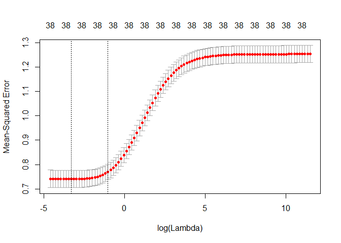

En primer lugar se cargan los datos se desde el directorio actual, almacenados en un fichero CSV:

``` r
fileMovies <- file("./movie_metadata_clean_supervised.csv","r") 
moviesDatasetSupervised <- read.csv(fileMovies) 

close(fileMovies) 
head(moviesDatasetSupervised[,1:20])
```

Calculamos la matriz de correlación entre las diferentes columnas del dataset:

``` r
# instalacion de la libreria ggplot2
if(! "ggplot2" %in% installed.packages())
  install.packages("ggplot2", repos="http://cran.rstudio.com/", depend = TRUE)
library("ggplot2")

# subconjunto de etiquetas para la creacion de la matriz de correlacion
matCor <- cor(moviesDatasetSupervised)

# instalacion de la libreria corrplot
if(! "corrplot" %in% installed.packages()) 
  install.packages("corrplot", repos="http://cran.rstudio.com/", depend = TRUE)
library("corrplot")

matCor[is.na(matCor)] <- 0

# generacion de la paleta de colores
col <- colorRampPalette(c("#BB4444", "#EE9988", "#FFFFFF", "#77AADD", "#4477AA"))
```

Mostramos la matriz de correlación:

``` r
# matriz de correlacion
par(xpd = TRUE)
png(height=2400, width=2400, pointsize=25, file="./model_supervised_files/figure-markdown_github/unnamed-chunk-3-1.png")
corrplot(matCor, method = "shade", shade.col = NA, tl.col = "black",
         tl.srt = 40, col = col(200), addCoef.col="black",
         order="AOE",
         mar = c(2,0,1,0), number.cex=0.6, tl.cex = 0.6)
par(xpd = FALSE)
```

Preparamos las entradas de los modelos de regresión:

``` r
movies_with_good_variables = moviesDatasetSupervised[, c("imdb_score",
                                                          "actor_1_facebook_likes", 
                                                          "actor_2_facebook_likes", 
                                                          "actor_3_facebook_likes",
                                                          "director_facebook_likes",
                                                          "duration",
                                                          "budget",
                                                          "title_year",
                                                          "facenumber_in_poster",
                                                          "num_critic_for_reviews",
                                                          "color",
                                                          "drama_genre",
                                                          "comedy_genre",
                                                          "thriller_genre",
                                                          "action_genre",
                                                          "romance_genre",
                                                          "adventure_genre",
                                                          "crime_genre",
                                                          "scifi_genre",
                                                          "fantasy_genre",
                                                          "horror_genre",
                                                          "family_genre",
                                                          "mystery_genre",
                                                          "biography_genre",
                                                          "animation_genre",
                                                          "music_genre",
                                                          "war_genre",
                                                          "history_genre",
                                                          "sport_genre",
                                                          "musical_genre",
                                                          "documentary_genre",
                                                          "western_genre",
                                                          "filmnoir_genre",
                                                          "short_genre",
                                                          "news_genre",
                                                          "director_movies",
                                                          "actor_1_movies",
                                                          "actor_2_movies",
                                                          "actor_3_movies"
                                                         )]
x = as.matrix(movies_with_good_variables[, -1])
y = movies_with_good_variables[, 1]
```

Incluímos las librerías necesarias para crear los modelos detallados a continuación:

``` r
if(! "ggplot2" %in% installed.packages()) 
  install.packages("ggplot2", repos="http://cran.rstudio.com/", depend = TRUE)
library("ggplot2")

if(! "VIM" %in% installed.packages()) 
  install.packages("VIM", repos="http://cran.rstudio.com/", depend = TRUE)
library("VIM")
```

    ## Loading required package: colorspace

    ## Loading required package: grid

    ## Loading required package: data.table

    ## VIM is ready to use. 
    ##  Since version 4.0.0 the GUI is in its own package VIMGUI.
    ## 
    ##           Please use the package to use the new (and old) GUI.

    ## Suggestions and bug-reports can be submitted at: https://github.com/alexkowa/VIM/issues

    ## 
    ## Attaching package: 'VIM'

    ## The following object is masked from 'package:datasets':
    ## 
    ##     sleep

``` r
if(! "mice" %in% installed.packages()) 
  install.packages("mice", repos="http://cran.rstudio.com/", depend = TRUE)
library("mice")

if(! "vcd" %in% installed.packages()) 
  install.packages("vcd", repos="http://cran.rstudio.com/", depend = TRUE)
library("vcd")

if(! "car" %in% installed.packages()) 
  install.packages("car", repos="http://cran.rstudio.com/", depend = TRUE)
library("car")

if(! "tabplot" %in% installed.packages()) 
  install.packages("tabplot", repos="http://cran.rstudio.com/", depend = TRUE)
library("tabplot")
```

    ## Loading required package: bit

    ## Attaching package bit

    ## package:bit (c) 2008-2012 Jens Oehlschlaegel (GPL-2)

    ## creators: bit bitwhich

    ## coercion: as.logical as.integer as.bit as.bitwhich which

    ## operator: ! & | xor != ==

    ## querying: print length any all min max range sum summary

    ## bit access: length<- [ [<- [[ [[<-

    ## for more help type ?bit

    ## 
    ## Attaching package: 'bit'

    ## The following object is masked from 'package:data.table':
    ## 
    ##     setattr

    ## The following object is masked from 'package:base':
    ## 
    ##     xor

    ## Loading required package: ff

    ## Attaching package ff

    ## - getOption("fftempdir")=="C:/Users/JAVIER~1.POZ/AppData/Local/Temp/RtmpqKd6vs"

    ## - getOption("ffextension")=="ff"

    ## - getOption("ffdrop")==TRUE

    ## - getOption("fffinonexit")==TRUE

    ## - getOption("ffpagesize")==65536

    ## - getOption("ffcaching")=="mmnoflush"  -- consider "ffeachflush" if your system stalls on large writes

    ## - getOption("ffbatchbytes")==84903198.72 -- consider a different value for tuning your system

    ## - getOption("ffmaxbytes")==4245159936 -- consider a different value for tuning your system

    ## 
    ## Attaching package: 'ff'

    ## The following objects are masked from 'package:bit':
    ## 
    ##     clone, clone.default, clone.list

    ## The following objects are masked from 'package:utils':
    ## 
    ##     write.csv, write.csv2

    ## The following objects are masked from 'package:base':
    ## 
    ##     is.factor, is.ordered

    ## Loading required package: ffbase

    ## 
    ## Attaching package: 'ffbase'

    ## The following objects are masked from 'package:ff':
    ## 
    ##     [.ff, [.ffdf, [<-.ff, [<-.ffdf

    ## The following objects are masked from 'package:base':
    ## 
    ##     %in%, table

``` r
if(! "PerformanceAnalytics" %in% installed.packages()) 
  install.packages("PerformanceAnalytics", repos="http://cran.rstudio.com/", depend = TRUE)
library("PerformanceAnalytics")
```

    ## Loading required package: xts

    ## Loading required package: zoo

    ## 
    ## Attaching package: 'zoo'

    ## The following objects are masked from 'package:base':
    ## 
    ##     as.Date, as.Date.numeric

    ## 
    ## Attaching package: 'xts'

    ## The following objects are masked from 'package:data.table':
    ## 
    ##     first, last

    ## 
    ## Attaching package: 'PerformanceAnalytics'

    ## The following object is masked from 'package:vcd':
    ## 
    ##     Kappa

    ## The following object is masked from 'package:graphics':
    ## 
    ##     legend

``` r
if(! "MASS" %in% installed.packages()) 
  install.packages("MASS", repos="http://cran.rstudio.com/", depend = TRUE)
library("MASS")

if(! "glmnet" %in% installed.packages()) 
  install.packages("glmnet", repos="http://cran.rstudio.com/", depend = TRUE)
library("glmnet")
```

    ## Loading required package: Matrix

    ## Loading required package: foreach

    ## Loaded glmnet 2.0-10

Calculamos el primer modelo en base a ridge regression:

``` r
# Crear modelo de regresion Ridge
grid = 10^seq(5, -2, length = 100)
ridge.models = glmnet(x, y, alpha = 0, lambda = grid)
dim(coef(ridge.models)) 
```

    ## [1]  39 100

``` r
coef(ridge.models) 
```

    ## 39 x 100 sparse Matrix of class "dgCMatrix"

    ##    [[ suppressing 100 column names 's0', 's1', 's2' ... ]]

    ##                                                                  
    ## (Intercept)              6.422792e+00  6.422862e+00  6.422944e+00
    ## actor_1_facebook_likes   6.715634e-11  7.902773e-11  9.300004e-11
    ## actor_2_facebook_likes   2.819704e-10  3.318142e-10  3.904794e-10
    ## actor_3_facebook_likes   4.471952e-10  5.262450e-10  6.192847e-10
    ## director_facebook_likes  7.489159e-10  8.813127e-10  1.037133e-09
    ## duration                 1.942957e-07  2.286456e-07  2.690714e-07
    ## budget                   1.824351e-15  2.146892e-15  2.526472e-15
    ## title_year              -2.101525e-07 -2.473095e-07 -2.910360e-07
    ## facenumber_in_poster    -3.719013e-07 -4.376566e-07 -5.150384e-07
    ## num_critic_for_reviews   3.403499e-08  4.005260e-08  4.713421e-08
    ## color                   -8.514477e-06 -1.001986e-05 -1.179145e-05
    ## drama_genre              7.461276e-06  8.780421e-06  1.033286e-05
    ## comedy_genre            -4.479345e-06 -5.271315e-06 -6.203309e-06
    ## thriller_genre          -1.853903e-06 -2.181679e-06 -2.567424e-06
    ## action_genre            -2.805149e-06 -3.301134e-06 -3.884809e-06
    ## romance_genre            3.221520e-07  3.791015e-07  4.461252e-07
    ## adventure_genre          5.913625e-08  6.959692e-08  8.190206e-08
    ## crime_genre              1.278770e-06  1.504846e-06  1.770912e-06
    ## scifi_genre             -2.254739e-06 -2.653369e-06 -3.122501e-06
    ## fantasy_genre           -2.058413e-06 -2.422329e-06 -2.850606e-06
    ## horror_genre            -7.311018e-06 -8.603629e-06 -1.012481e-05
    ## family_genre            -2.624406e-06 -3.088401e-06 -3.634436e-06
    ## mystery_genre            1.411871e-07  1.661589e-07  1.955364e-07
    ## biography_genre          8.550873e-06  1.006268e-05  1.184180e-05
    ## animation_genre          1.996533e-06  2.349583e-06  2.765051e-06
    ## music_genre              3.606953e-07  4.244837e-07  4.995375e-07
    ## war_genre                7.451102e-06  8.768461e-06  1.031876e-05
    ## history_genre            7.449465e-06  8.766549e-06  1.031649e-05
    ## sport_genre              1.709737e-06  2.012019e-06  2.367749e-06
    ## musical_genre            1.307173e-06  1.538312e-06  1.810300e-06
    ## documentary_genre        7.224995e-06  8.502503e-06  1.000585e-05
    ## western_genre            3.284980e-06  3.865776e-06  4.549256e-06
    ## filmnoir_genre           1.442877e-05  1.697990e-05  1.998205e-05
    ## short_genre              7.528299e-06  8.859473e-06  1.042600e-05
    ## news_genre               1.308581e-05  1.539956e-05  1.812235e-05
    ## director_movies          6.111109e-07  7.191567e-07  8.463067e-07
    ## actor_1_movies           1.879664e-07  2.211991e-07  2.603078e-07
    ## actor_2_movies           3.217673e-07  3.786554e-07  4.456010e-07
    ## actor_3_movies           3.222509e-07  3.792241e-07  4.462691e-07
    ##                                                                  
    ## (Intercept)              6.423041e+00  6.423154e+00  6.423288e+00
    ## actor_1_facebook_likes   1.094425e-10  1.287919e-10  1.515619e-10
    ## actor_2_facebook_likes   4.595159e-10  5.407571e-10  6.363601e-10
    ## actor_3_facebook_likes   7.287723e-10  8.576150e-10  1.009234e-09
    ## director_facebook_likes  1.220501e-09  1.436288e-09  1.690223e-09
    ## duration                 3.166445e-07  3.726284e-07  4.385097e-07
    ## budget                   2.973159e-15  3.498817e-15  4.117406e-15
    ## title_year              -3.424936e-07 -4.030492e-07 -4.743111e-07
    ## facenumber_in_poster    -6.061018e-07 -7.132658e-07 -8.393768e-07
    ## num_critic_for_reviews   5.546788e-08  6.527494e-08  7.681590e-08
    ## color                   -1.387625e-05 -1.632964e-05 -1.921678e-05
    ## drama_genre              1.215976e-05  1.430966e-05  1.683965e-05
    ## comedy_genre            -7.300075e-06 -8.590743e-06 -1.010959e-05
    ## thriller_genre          -3.021374e-06 -3.555586e-06 -4.184253e-06
    ## action_genre            -4.571681e-06 -5.379999e-06 -6.331232e-06
    ## romance_genre            5.249972e-07  6.178117e-07  7.270324e-07
    ## adventure_genre          9.638274e-08  1.134235e-07  1.334771e-07
    ## crime_genre              2.084018e-06  2.452481e-06  2.886085e-06
    ## scifi_genre             -3.674576e-06 -4.324257e-06 -5.088797e-06
    ## fantasy_genre           -3.354601e-06 -3.947697e-06 -4.645646e-06
    ## horror_genre            -1.191493e-05 -1.402155e-05 -1.650060e-05
    ## family_genre            -4.277005e-06 -5.033172e-06 -5.923014e-06
    ## mystery_genre            2.301076e-07  2.707907e-07  3.186661e-07
    ## biography_genre          1.393547e-05  1.639929e-05  1.929867e-05
    ## animation_genre          3.253991e-06  3.829399e-06  4.506571e-06
    ## music_genre              5.878616e-07  6.918025e-07  8.141214e-07
    ## war_genre                1.214313e-05  1.429004e-05  1.681649e-05
    ## history_genre            1.214045e-05  1.428686e-05  1.681271e-05
    ## sport_genre              2.786368e-06  3.278993e-06  3.858706e-06
    ## musical_genre            2.130376e-06  2.507044e-06  2.950308e-06
    ## documentary_genre        1.177501e-05  1.385699e-05  1.630709e-05
    ## western_genre            5.353570e-06  6.300078e-06  7.413913e-06
    ## filmnoir_genre           2.351498e-05  2.767252e-05  3.256509e-05
    ## short_genre              1.226953e-05  1.443905e-05  1.699221e-05
    ## news_genre               2.132654e-05  2.509725e-05  2.953464e-05
    ## director_movies          9.959362e-07  1.172019e-06  1.379231e-06
    ## actor_1_movies           3.063305e-07  3.604895e-07  4.242229e-07
    ## actor_2_movies           5.243815e-07  6.170885e-07  7.261834e-07
    ## actor_3_movies           5.251660e-07  6.180094e-07  7.272639e-07
    ##                                                                  
    ## (Intercept)              6.423445e+00  6.423630e+00  6.423848e+00
    ## actor_1_facebook_likes   1.783571e-10  2.098891e-10  2.469948e-10
    ## actor_2_facebook_likes   7.488632e-10  8.812533e-10  1.037045e-09
    ## actor_3_facebook_likes   1.187653e-09  1.397610e-09  1.644677e-09
    ## director_facebook_likes  1.989050e-09  2.340705e-09  2.754523e-09
    ## duration                 5.160383e-07  6.072728e-07  7.146359e-07
    ## budget                   4.845352e-15  5.701983e-15  6.710045e-15
    ## title_year              -5.581722e-07 -6.568598e-07 -7.729951e-07
    ## facenumber_in_poster    -9.877845e-07 -1.162431e-06 -1.367955e-06
    ## num_critic_for_reviews   9.039726e-08  1.063797e-07  1.251878e-07
    ## color                   -2.261436e-05 -2.661260e-05 -3.131768e-05
    ## drama_genre              1.981693e-05  2.332055e-05  2.744357e-05
    ## comedy_genre            -1.189694e-05 -1.400027e-05 -1.647542e-05
    ## thriller_genre          -4.924075e-06 -5.794703e-06 -6.819267e-06
    ## action_genre            -7.450648e-06 -8.767983e-06 -1.031823e-05
    ## romance_genre            8.555586e-07  1.006801e-06  1.184774e-06
    ## adventure_genre          1.570758e-07  1.848466e-07  2.175266e-07
    ## crime_genre              3.396346e-06  3.996815e-06  4.703437e-06
    ## scifi_genre             -5.988503e-06 -7.047266e-06 -8.293202e-06
    ## fantasy_genre           -5.466981e-06 -6.433510e-06 -7.570895e-06
    ## horror_genre            -1.941794e-05 -2.285103e-05 -2.689104e-05
    ## family_genre            -6.970160e-06 -8.202410e-06 -9.652476e-06
    ## mystery_genre            3.750049e-07  4.413032e-07  5.193210e-07
    ## biography_genre          2.271063e-05  2.672576e-05  3.145066e-05
    ## animation_genre          5.303508e-06  6.241401e-06  7.345189e-06
    ## music_genre              9.580677e-07  1.127465e-06  1.326814e-06
    ## war_genre                1.978958e-05  2.328823e-05  2.740535e-05
    ## history_genre            1.978508e-05  2.328287e-05  2.739894e-05
    ## sport_genre              4.540899e-06  5.343685e-06  6.288373e-06
    ## musical_genre            3.471941e-06  4.085800e-06  4.808188e-06
    ## documentary_genre        1.919039e-05  2.258351e-05  2.657659e-05
    ## western_genre            8.724651e-06  1.026709e-05  1.208219e-05
    ## filmnoir_genre           3.832263e-05  4.509802e-05  5.307120e-05
    ## short_genre              1.999687e-05  2.353287e-05  2.769421e-05
    ## news_genre               3.475657e-05  4.090174e-05  4.813338e-05
    ## director_movies          1.623075e-06  1.910026e-06  2.247703e-06
    ## actor_1_movies           4.992232e-07  5.874815e-07  6.913409e-07
    ## actor_2_movies           8.545622e-07  1.005633e-06  1.183404e-06
    ## actor_3_movies           8.558294e-07  1.007118e-06  1.185143e-06
    ##                                                                  
    ## (Intercept)              6.424105e+00  6.424407e+00  6.424762e+00
    ## actor_1_facebook_likes   2.906592e-10  3.420413e-10  4.025046e-10
    ## actor_2_facebook_likes   1.220372e-09  1.436101e-09  1.689955e-09
    ## actor_3_facebook_likes   1.935410e-09  2.277522e-09  2.680089e-09
    ## director_facebook_likes  3.241491e-09  3.814536e-09  4.488868e-09
    ## duration                 8.409783e-07  9.896541e-07  1.164610e-06
    ## budget                   7.896299e-15  9.292235e-15  1.093490e-14
    ## title_year              -9.096625e-07 -1.070492e-06 -1.259753e-06
    ## facenumber_in_poster    -1.609815e-06 -1.894434e-06 -2.229372e-06
    ## num_critic_for_reviews   1.473209e-07  1.733667e-07  2.040170e-07
    ## color                   -3.685455e-05 -4.337021e-05 -5.103767e-05
    ## drama_genre              3.229545e-05  3.800502e-05  4.472386e-05
    ## comedy_genre            -1.938810e-05 -2.281563e-05 -2.684899e-05
    ## thriller_genre          -8.024983e-06 -9.443879e-06 -1.111365e-05
    ## action_genre            -1.214256e-05 -1.428943e-05 -1.681587e-05
    ## romance_genre            1.394198e-06  1.640629e-06  1.930601e-06
    ## adventure_genre          2.559838e-07  3.012390e-07  3.544937e-07
    ## crime_genre              5.534973e-06  6.513501e-06  7.664998e-06
    ## scifi_genre             -9.759394e-06 -1.148477e-05 -1.351514e-05
    ## fantasy_genre           -8.909332e-06 -1.048435e-05 -1.233774e-05
    ## horror_genre            -3.164526e-05 -3.723990e-05 -4.382350e-05
    ## family_genre            -1.135885e-05 -1.336681e-05 -1.572964e-05
    ## mystery_genre            6.111296e-07  7.191658e-07  8.462968e-07
    ## biography_genre          3.701077e-05  4.355370e-05  5.125309e-05
    ## animation_genre          8.644231e-06  1.017308e-05  1.197243e-05
    ## music_genre              1.561411e-06  1.837486e-06  2.162375e-06
    ## war_genre                3.225022e-05  3.795144e-05  4.466032e-05
    ## history_genre            3.224254e-05  3.794222e-05  4.464921e-05
    ## sport_genre              7.400041e-06  8.708191e-06  1.024753e-05
    ## musical_genre            5.658290e-06  6.658685e-06  7.835939e-06
    ## documentary_genre        3.127570e-05  3.680570e-05  4.331349e-05
    ## western_genre            1.421812e-05  1.673158e-05  1.968926e-05
    ## filmnoir_genre           6.245386e-05  7.349511e-05  8.648808e-05
    ## short_genre              3.259150e-05  3.835492e-05  4.513771e-05
    ## news_genre               5.664354e-05  6.665826e-05  7.844349e-05
    ## director_movies          2.645069e-06  3.112674e-06  3.662928e-06
    ## actor_1_movies           8.135584e-07  9.573779e-07  1.126616e-06
    ## actor_2_movies           1.392594e-06  1.638751e-06  1.928405e-06
    ## actor_3_movies           1.394628e-06  1.641129e-06  1.931181e-06
    ##                                                                  
    ## (Intercept)              6.425180e+00  6.425671e+00  6.426250e+00
    ## actor_1_facebook_likes   4.736532e-10  5.573744e-10  6.558883e-10
    ## actor_2_facebook_likes   1.988668e-09  2.340162e-09  2.753756e-09
    ## actor_3_facebook_likes   3.153785e-09  3.711170e-09  4.367013e-09
    ## director_facebook_likes  5.282382e-09  6.216134e-09  7.314893e-09
    ## duration                 1.370491e-06  1.612759e-06  1.897843e-06
    ## budget                   1.286789e-14  1.514250e-14  1.781904e-14
    ## title_year              -1.482473e-06 -1.744565e-06 -2.052987e-06
    ## facenumber_in_poster    -2.623523e-06 -3.087354e-06 -3.633180e-06
    ## num_critic_for_reviews   2.400853e-07  2.825294e-07  3.324758e-07
    ## color                   -6.006047e-05 -7.067813e-05 -8.317244e-05
    ## drama_genre              5.263033e-05  6.193428e-05  7.288261e-05
    ## comedy_genre            -3.159523e-05 -3.718028e-05 -4.375230e-05
    ## thriller_genre          -1.307864e-05 -1.539105e-05 -1.811231e-05
    ## action_genre            -1.978897e-05 -2.328769e-05 -2.740495e-05
    ## romance_genre            2.271800e-06  2.673269e-06  3.145639e-06
    ## adventure_genre          4.171615e-07  4.909053e-07  5.776821e-07
    ## crime_genre              9.020029e-06  1.061456e-05  1.249089e-05
    ## scifi_genre             -1.590439e-05 -1.871594e-05 -2.202440e-05
    ## fantasy_genre           -1.451870e-05 -1.708509e-05 -2.010498e-05
    ## horror_genre            -5.157084e-05 -6.068754e-05 -7.141555e-05
    ## family_genre            -1.851002e-05 -2.178171e-05 -2.563143e-05
    ## mystery_genre            9.958961e-07  1.171932e-06  1.379075e-06
    ## biography_genre          6.031329e-05  7.097468e-05  8.352009e-05
    ## animation_genre          1.409016e-05  1.658266e-05  1.951632e-05
    ## music_genre              2.544708e-06  2.994642e-06  3.524128e-06
    ## war_genre                5.255487e-05  6.184453e-05  7.277570e-05
    ## history_genre            5.254144e-05  6.182824e-05  7.275585e-05
    ## sport_genre              1.205891e-05  1.419036e-05  1.669841e-05
    ## musical_genre            9.221314e-06  1.085160e-05  1.277007e-05
    ## documentary_genre        5.097199e-05  5.998465e-05  7.059094e-05
    ## western_genre            2.316964e-05  2.726504e-05  3.208407e-05
    ## filmnoir_genre           1.017776e-04  1.197696e-04  1.409414e-04
    ## short_genre              5.312024e-05  6.251480e-05  7.357130e-05
    ## news_genre               9.231220e-05  1.086327e-04  1.278382e-04
    ## director_movies          4.310434e-06  5.072372e-06  5.968952e-06
    ## actor_1_movies           1.325762e-06  1.560100e-06  1.835844e-06
    ## actor_2_movies           2.269236e-06  2.670278e-06  3.142158e-06
    ## actor_3_movies           2.272472e-06  2.674043e-06  3.146528e-06
    ##                                                                  
    ## (Intercept)              6.426931e+00  6.427732e+00  6.428675e+00
    ## actor_1_facebook_likes   7.718066e-10  9.082012e-10  1.068685e-09
    ## actor_2_facebook_likes   3.240410e-09  3.813018e-09  4.486741e-09
    ## actor_3_facebook_likes   5.138689e-09  6.046627e-09  7.114852e-09
    ## director_facebook_likes  8.607799e-09  1.012913e-08  1.191921e-08
    ## duration                 2.233307e-06  2.628048e-06  3.092531e-06
    ## budget                   2.096852e-14  2.467443e-14  2.903497e-14
    ## title_year              -2.415927e-06 -2.843020e-06 -3.345600e-06
    ## facenumber_in_poster    -4.275493e-06 -5.031346e-06 -5.920802e-06
    ## num_critic_for_reviews   3.912501e-07  4.604121e-07  5.417967e-07
    ## color                   -9.787496e-05 -1.151758e-04 -1.355338e-04
    ## drama_genre              8.576582e-05  1.009257e-04  1.187642e-04
    ## comedy_genre            -5.148561e-05 -6.058525e-05 -7.129242e-05
    ## thriller_genre          -2.131470e-05 -2.508327e-05 -2.951812e-05
    ## action_genre            -3.225009e-05 -3.795175e-05 -4.466132e-05
    ## romance_genre            3.701417e-06  4.355306e-06  5.124593e-06
    ## adventure_genre          6.797939e-07  7.999491e-07  9.413335e-07
    ## crime_genre              1.469881e-05  1.729689e-05  2.035400e-05
    ## scifi_genre             -2.591755e-05 -3.049866e-05 -3.588922e-05
    ## fantasy_genre           -2.365845e-05 -2.783971e-05 -3.275955e-05
    ## horror_genre            -8.403953e-05 -9.889437e-05 -1.163741e-04
    ## family_genre            -3.016124e-05 -3.549116e-05 -4.176233e-05
    ## mystery_genre            1.622816e-06  1.909616e-06  2.247076e-06
    ## biography_genre          9.828223e-05  1.156525e-04  1.360912e-04
    ## animation_genre          2.296932e-05  2.703373e-05  3.181800e-05
    ## music_genre              4.147234e-06  4.880510e-06  5.743438e-06
    ## war_genre                8.563820e-05  1.007730e-04  1.185810e-04
    ## history_genre            8.561390e-05  1.007431e-04  1.185441e-04
    ## sport_genre              1.964954e-05  2.312194e-05  2.720757e-05
    ## musical_genre            1.502767e-05  1.768433e-05  2.081056e-05
    ## documentary_genre        8.307265e-05  9.776143e-05  1.150476e-04
    ## western_genre            3.775448e-05  4.442655e-05  5.227703e-05
    ## filmnoir_genre           1.658547e-04  1.951704e-04  2.296659e-04
    ## short_genre              8.658394e-05  1.018990e-04  1.199243e-04
    ## news_genre               1.504388e-04  1.770344e-04  2.083310e-04
    ## director_movies          7.023953e-06  8.265343e-06  9.726023e-06
    ## actor_1_movies           2.160303e-06  2.542077e-06  2.991279e-06
    ## actor_2_movies           3.697373e-06  4.350620e-06  5.119178e-06
    ## actor_3_movies           3.702433e-06  4.356459e-06  5.125891e-06
    ##                                                                  
    ## (Intercept)              6.429785e+00  6.431091e+00  6.432628e+00
    ## actor_1_facebook_likes   1.257507e-09  1.479664e-09  1.741029e-09
    ## actor_2_facebook_likes   5.279407e-09  6.211979e-09  7.309099e-09
    ## actor_3_facebook_likes   8.371609e-09  9.850101e-09  1.158935e-08
    ## director_facebook_likes  1.402547e-08  1.650367e-08  1.941940e-08
    ## duration                 3.639068e-06  4.282140e-06  5.038777e-06
    ## budget                   3.416567e-14  4.020236e-14  4.730481e-14
    ## title_year              -3.937004e-06 -4.632922e-06 -5.451812e-06
    ## facenumber_in_poster    -6.967468e-06 -8.199120e-06 -9.648434e-06
    ## num_critic_for_reviews   6.375628e-07  7.502498e-07  8.828453e-07
    ## color                   -1.594888e-04 -1.876760e-04 -2.208422e-04
    ## drama_genre              1.397543e-04  1.644524e-04  1.935127e-04
    ## comedy_genre            -8.389081e-05 -9.871407e-05 -1.161545e-04
    ## thriller_genre          -3.473705e-05 -4.087865e-05 -4.810604e-05
    ## action_genre            -5.255695e-05 -6.184821e-05 -7.278173e-05
    ## romance_genre            6.029597e-06  7.094200e-06  8.346459e-06
    ## adventure_genre          1.107695e-06  1.303441e-06  1.533756e-06
    ## crime_genre              2.395119e-05  2.818378e-05  3.316387e-05
    ## scifi_genre             -4.223215e-05 -4.969552e-05 -5.847707e-05
    ## fantasy_genre           -3.854831e-05 -4.535922e-05 -5.337251e-05
    ## horror_genre            -1.369420e-04 -1.611435e-04 -1.896196e-04
    ## family_genre            -4.914075e-05 -5.782159e-05 -6.803428e-05
    ## mystery_genre            2.644131e-06  3.111293e-06  3.660920e-06
    ## biography_genre          1.601400e-04  1.884355e-04  2.217266e-04
    ## animation_genre          3.744987e-05  4.407985e-05  5.188533e-05
    ## music_genre              6.758938e-06  7.953989e-06  9.360333e-06
    ## war_genre                1.395340e-04  1.641865e-04  1.931906e-04
    ## history_genre            1.394880e-04  1.641289e-04  1.931181e-04
    ## sport_genre              3.201460e-05  3.767019e-05  4.432384e-05
    ## musical_genre            2.448932e-05  2.881822e-05  3.391209e-05
    ## documentary_genre        1.353904e-04  1.593305e-04  1.875040e-04
    ## western_genre            6.151378e-05  7.238121e-05  8.516668e-05
    ## filmnoir_genre           2.702555e-04  3.180150e-04  3.742093e-04
    ## short_genre              1.411400e-04  1.661112e-04  1.955037e-04
    ## news_genre               2.451591e-04  2.884960e-04  3.394916e-04
    ## director_movies          1.144469e-05  1.346684e-05  1.584600e-05
    ## actor_1_movies           3.519802e-06  4.141632e-06  4.873211e-06
    ## actor_2_movies           6.023365e-06  7.087059e-06  8.338324e-06
    ## actor_3_movies           6.031044e-06  7.095791e-06  8.348177e-06
    ##                                                                  
    ## (Intercept)              6.434436e+00  6.436563e+00  6.439066e+00
    ## actor_1_facebook_likes   2.048507e-09  2.410214e-09  2.835686e-09
    ## actor_2_facebook_likes   8.599728e-09  1.011790e-08  1.190359e-08
    ## actor_3_facebook_likes   1.363521e-08  1.604155e-08  1.887161e-08
    ## director_facebook_likes  2.284978e-08  2.688547e-08  3.163301e-08
    ## duration                 5.929005e-06  6.976372e-06  8.208560e-06
    ## budget                   5.566081e-14  6.549116e-14  7.705535e-14
    ## title_year              -6.415391e-06 -7.549200e-06 -8.883284e-06
    ## facenumber_in_poster    -1.135385e-05 -1.336061e-05 -1.572189e-05
    ## num_critic_for_reviews   1.038863e-06  1.222436e-06  1.438424e-06
    ## color                   -2.598661e-04 -3.057807e-04 -3.598009e-04
    ## drama_genre              2.277047e-04  2.679333e-04  3.152624e-04
    ## comedy_genre            -1.366736e-04 -1.608135e-04 -1.892119e-04
    ## thriller_genre          -5.661114e-05 -6.661980e-05 -7.839779e-05
    ## action_genre            -8.564766e-05 -1.007874e-04 -1.186025e-04
    ## romance_genre            9.819332e-06  1.155152e-05  1.358844e-05
    ## adventure_genre          1.804735e-06  2.123548e-06  2.498621e-06
    ## crime_genre              3.902329e-05  4.591706e-05  5.402742e-05
    ## scifi_genre             -6.880928e-05 -8.096558e-05 -9.526740e-05
    ## fantasy_genre           -6.280004e-05 -7.389088e-05 -8.693772e-05
    ## horror_genre            -2.231244e-04 -2.625448e-04 -3.089234e-04
    ## family_genre            -8.004853e-05 -9.418127e-05 -1.108049e-04
    ## mystery_genre            4.307540e-06  5.068232e-06  5.963066e-06
    ## biography_genre          2.608938e-04  3.069721e-04  3.611780e-04
    ## animation_genre          6.107536e-05  7.189650e-05  8.463949e-05
    ## music_genre              1.101533e-05  1.296294e-05  1.525489e-05
    ## war_genre                2.273130e-04  2.674548e-04  3.146750e-04
    ## history_genre            2.272210e-04  2.673374e-04  3.145241e-04
    ## sport_genre              5.215128e-05  6.135904e-05  7.218976e-05
    ## musical_genre            3.990604e-05  4.695896e-05  5.525780e-05
    ## documentary_genre        2.206597e-04  2.596788e-04  3.055984e-04
    ## western_genre            1.002080e-04  1.179023e-04  1.387159e-04
    ## filmnoir_genre           4.403261e-04  5.181147e-04  6.096318e-04
    ## short_genre              2.301018e-04  2.708289e-04  3.187734e-04
    ## news_genre               3.994984e-04  4.701077e-04  5.531912e-04
    ## director_movies          1.864507e-05  2.193802e-05  2.581177e-05
    ## actor_1_movies           5.733869e-06  6.746323e-06  7.937267e-06
    ## actor_2_movies           9.810131e-06  1.154121e-05  1.357702e-05
    ## actor_3_movies           9.821140e-06  1.155335e-05  1.359020e-05
    ##                                                                  
    ## (Intercept)              6.442012e+00  6.445478e+00  6.449555e+00
    ## actor_1_facebook_likes   3.336124e-09  3.924683e-09  4.616803e-09
    ## actor_2_facebook_likes   1.400377e-08  1.647353e-08  1.937758e-08
    ## actor_3_facebook_likes   2.219965e-08  2.611279e-08  3.071320e-08
    ## director_facebook_likes  3.721761e-08  4.378637e-08  5.151205e-08
    ## duration                 9.658107e-06  1.136325e-05  1.336891e-05
    ## budget                   9.065829e-14  1.066582e-13  1.254757e-13
    ## title_year              -1.045298e-05 -1.229984e-05 -1.447273e-05
    ## facenumber_in_poster    -1.850028e-05 -2.176937e-05 -2.561572e-05
    ## num_critic_for_reviews   1.692542e-06  1.991510e-06  2.343227e-06
    ## color                   -4.233550e-04 -4.981221e-04 -5.860754e-04
    ## drama_genre              3.709427e-04  4.364441e-04  5.134940e-04
    ## comedy_genre            -2.226178e-04 -2.619114e-04 -3.081265e-04
    ## thriller_genre          -9.225779e-05 -1.085678e-04 -1.277606e-04
    ## action_genre            -1.395656e-04 -1.642323e-04 -1.932565e-04
    ## romance_genre            1.598339e-05  1.879886e-05  2.210807e-05
    ## adventure_genre          2.939858e-06  3.458901e-06  4.069424e-06
    ## crime_genre              6.356859e-05  7.479232e-05  8.799442e-05
    ## scifi_genre             -1.120926e-04 -1.318854e-04 -1.551675e-04
    ## fantasy_genre           -1.022845e-04 -1.203352e-04 -1.415643e-04
    ## horror_genre            -3.634859e-04 -4.276732e-04 -5.031782e-04
    ## family_genre            -1.303566e-04 -1.533501e-04 -1.803879e-04
    ## mystery_genre            7.015622e-06  8.253599e-06  9.709522e-06
    ## biography_genre          4.249411e-04  4.999409e-04  5.881497e-04
    ## animation_genre          9.964744e-05  1.173254e-04  1.381516e-04
    ## music_genre              1.795206e-05  2.112608e-05  2.486126e-05
    ## war_genre                3.702178e-04  4.355444e-04  5.123708e-04
    ## history_genre            3.700226e-04  4.352904e-04  5.120382e-04
    ## sport_genre              8.492845e-05  9.990976e-05  1.175265e-04
    ## musical_genre            6.502239e-05  7.651131e-05  9.002857e-05
    ## documentary_genre        3.596392e-04  4.232378e-04  4.980852e-04
    ## western_genre            1.631971e-04  1.919893e-04  2.258481e-04
    ## filmnoir_genre           7.172949e-04  8.439453e-04  9.929214e-04
    ## short_genre              3.752176e-04  4.416730e-04  5.199215e-04
    ## news_genre               6.509506e-04  7.659752e-04  9.013101e-04
    ## director_movies          3.036846e-05  3.572809e-05  4.203158e-05
    ## actor_1_movies           9.338060e-06  1.098553e-05  1.292290e-05
    ## actor_2_movies           1.597095e-05  1.878560e-05  2.209437e-05
    ## actor_3_movies           1.598490e-05  1.879986e-05  2.210819e-05
    ##                                                                  
    ## (Intercept)              6.454353e+00  6.459996e+00  6.466636e+00
    ## actor_1_facebook_likes   5.430603e-09  6.387332e-09  7.511893e-09
    ## actor_2_facebook_likes   2.279176e-08  2.680501e-08  3.152148e-08
    ## actor_3_facebook_likes   3.612064e-08  4.247535e-08  4.994143e-08
    ## director_facebook_likes  6.059748e-08  7.128067e-08  8.384082e-08
    ## duration                 1.572786e-05  1.850203e-05  2.176415e-05
    ## budget                   1.476047e-13  1.736245e-13  2.042150e-13
    ## title_year              -1.702910e-05 -2.003646e-05 -2.357419e-05
    ## facenumber_in_poster    -3.014109e-05 -3.546514e-05 -4.172853e-05
    ## num_critic_for_reviews   2.756975e-06  3.243663e-06  3.816105e-06
    ## color                   -6.895336e-04 -8.112202e-04 -9.543337e-04
    ## drama_genre              6.041217e-04  7.107104e-04  8.360580e-04
    ## comedy_genre            -3.624769e-04 -4.263873e-04 -5.015287e-04
    ## thriller_genre          -1.503458e-04 -1.769226e-04 -2.081960e-04
    ## action_genre            -2.274071e-04 -2.675885e-04 -3.148640e-04
    ## romance_genre            2.599676e-05  3.056521e-05  3.593064e-05
    ## adventure_genre          4.787490e-06  5.631959e-06  6.624963e-06
    ## crime_genre              1.035223e-04  1.217841e-04  1.432585e-04
    ## scifi_genre             -1.825521e-04 -2.147591e-04 -2.526335e-04
    ## fantasy_genre           -1.665287e-04 -1.958819e-04 -2.303900e-04
    ## horror_genre            -5.919902e-04 -6.964453e-04 -8.192865e-04
    ## family_genre            -2.121770e-04 -2.495463e-04 -2.934669e-04
    ## mystery_genre            1.142156e-05  1.343452e-05  1.580090e-05
    ## biography_genre          6.918831e-04  8.138587e-04  9.572637e-04
    ## animation_genre          1.626915e-04  1.916137e-04  2.257095e-04
    ## music_genre              2.925677e-05  3.442933e-05  4.051625e-05
    ## war_genre                6.027106e-04  7.089264e-04  8.337878e-04
    ## history_genre            6.022727e-04  7.083467e-04  8.330166e-04
    ## sport_genre              1.382394e-04  1.625889e-04  1.912080e-04
    ## musical_genre            1.059316e-04  1.246407e-04  1.466497e-04
    ## documentary_genre        5.861719e-04  6.898406e-04  8.118492e-04
    ## western_genre            2.656601e-04  3.124651e-04  3.674816e-04
    ## filmnoir_genre           1.168145e-03  1.374220e-03  1.616553e-03
    ## short_genre              6.120650e-04  7.205829e-04  8.484019e-04
    ## news_genre               1.060536e-03  1.247862e-03  1.468237e-03
    ## director_movies          4.944435e-05  5.816052e-05  6.840778e-05
    ## actor_1_movies           1.520090e-05  1.787903e-05  2.102701e-05
    ## actor_2_movies           2.598329e-05  3.055305e-05  3.592145e-05
    ## actor_3_movies           2.599544e-05  3.056167e-05  3.592373e-05
    ##                                                                  
    ## (Intercept)              6.474446e+00  6.483633e+00  6.494437e+00
    ## actor_1_facebook_likes   8.833451e-09  1.038614e-08  1.220985e-08
    ## actor_2_facebook_likes   3.706308e-08  4.357233e-08  5.121568e-08
    ## actor_3_facebook_likes   5.871072e-08  6.900720e-08  8.109200e-08
    ## director_facebook_likes  9.860521e-08  1.159573e-07  1.363458e-07
    ## duration                 2.559949e-05  3.010804e-05  3.540698e-05
    ## budget                   2.401725e-13  2.824304e-13  3.320804e-13
    ## title_year              -2.773552e-05 -3.263000e-05 -3.838623e-05
    ## facenumber_in_poster    -4.909655e-05 -5.776344e-05 -6.795737e-05
    ## num_critic_for_reviews   4.489348e-06  5.281057e-06  6.211961e-06
    ## color                   -1.122629e-03 -1.320510e-03 -1.553144e-03
    ## drama_genre              9.834479e-04  1.156731e-03  1.360423e-03
    ## comedy_genre            -5.898606e-04 -6.936787e-04 -8.156706e-04
    ## thriller_genre          -2.449955e-04 -2.882969e-04 -3.392478e-04
    ## action_genre            -3.704841e-04 -4.359184e-04 -5.128946e-04
    ## romance_genre            4.222982e-05  4.962213e-05  5.829294e-05
    ## adventure_genre          7.792467e-06  9.164911e-06  1.077796e-05
    ## crime_genre              1.685075e-04  1.981899e-04  2.330778e-04
    ## scifi_genre             -2.971672e-04 -3.495233e-04 -4.110650e-04
    ## fantasy_genre           -2.709512e-04 -3.186174e-04 -3.746191e-04
    ## horror_genre            -9.637329e-04 -1.133561e-03 -1.333197e-03
    ## family_genre            -3.450758e-04 -4.057027e-04 -4.769014e-04
    ## mystery_genre            1.858226e-05  2.185068e-05  2.569051e-05
    ## biography_genre          1.125835e-03  1.323949e-03  1.556729e-03
    ## animation_genre          2.659166e-04  3.133469e-04  3.693213e-04
    ## music_genre              4.767908e-05  5.610788e-05  6.602618e-05
    ## war_genre                9.805402e-04  1.152983e-03  1.355560e-03
    ## history_genre            9.795094e-04  1.151600e-03  1.353697e-03
    ## sport_genre              2.248380e-04  2.643460e-04  3.107452e-04
    ## musical_genre            1.725388e-04  2.029898e-04  2.388030e-04
    ## documentary_genre        9.554442e-04  1.124448e-03  1.323359e-03
    ## western_genre            4.321372e-04  5.081022e-04  5.973295e-04
    ## filmnoir_genre           1.901485e-03  2.236453e-03  2.630173e-03
    ## short_genre              9.989780e-04  1.176395e-03  1.385481e-03
    ## news_genre               1.727476e-03  2.032411e-03  2.391070e-03
    ## director_movies          8.045299e-05  9.460874e-05  1.112409e-04
    ## actor_1_movies           2.472651e-05  2.907312e-05  3.417857e-05
    ## actor_2_movies           4.222614e-05  4.962772e-05  5.831335e-05
    ## actor_3_movies           4.221795e-05  4.960305e-05  5.826355e-05
    ##                                                                  
    ## (Intercept)              6.507144e+00  6.522085e+00  6.539652e+00
    ## actor_1_facebook_likes   1.435116e-08  1.686440e-08  1.981278e-08
    ## actor_2_facebook_likes   6.018726e-08  7.071308e-08  8.305578e-08
    ## actor_3_facebook_likes   9.526905e-08  1.118914e-07  1.313680e-07
    ## director_facebook_likes  1.602955e-07  1.884195e-07  2.214329e-07
    ## duration                 4.163343e-05  4.894783e-05  5.753760e-05
    ## budget                   3.903994e-13  4.588782e-13  5.392555e-13
    ## title_year              -4.515518e-05 -5.311400e-05 -6.247038e-05
    ## facenumber_in_poster    -7.994626e-05 -9.404461e-05 -1.106214e-04
    ## num_critic_for_reviews   7.306369e-06  8.592774e-06  1.010455e-05
    ## color                   -1.826586e-03 -2.147927e-03 -2.525463e-03
    ## drama_genre              1.599810e-03  1.881084e-03  2.211482e-03
    ## comedy_genre            -9.589802e-04 -1.127281e-03 -1.324858e-03
    ## thriller_genre          -3.991982e-04 -4.697354e-04 -5.527260e-04
    ## action_genre            -6.034426e-04 -7.099473e-04 -8.352092e-04
    ## romance_genre            6.845738e-05  8.036444e-05  9.430142e-05
    ## adventure_genre          1.267336e-05  1.489993e-05  1.751471e-05
    ## crime_genre              2.740753e-04  3.222404e-04  3.788096e-04
    ## scifi_genre             -4.833890e-04 -5.683640e-04 -6.681748e-04
    ## fantasy_genre           -4.403951e-04 -5.176249e-04 -6.082668e-04
    ## horror_genre            -1.567828e-03 -1.843527e-03 -2.167395e-03
    ## family_genre            -5.604849e-04 -6.585652e-04 -7.735990e-04
    ## mystery_genre            3.020033e-05  3.549530e-05  4.170967e-05
    ## biography_genre          1.830166e-03  2.151258e-03  2.528167e-03
    ## animation_genre          4.354100e-04  5.134839e-04  6.057752e-04
    ## music_genre              7.769690e-05  9.142915e-05  1.075862e-04
    ## war_genre                1.593464e-03  1.872754e-03  2.200490e-03
    ## history_genre            1.590946e-03  1.869342e-03  2.195854e-03
    ## sport_genre              3.652183e-04  4.291431e-04  5.041225e-04
    ## musical_genre            2.809181e-04  3.304372e-04  3.886526e-04
    ## documentary_genre        1.557475e-03  1.833034e-03  2.157382e-03
    ## western_genre            7.020994e-04  8.250709e-04  9.693396e-04
    ## filmnoir_genre           3.092852e-03  3.636432e-03  4.274869e-03
    ## short_genre              1.631948e-03  1.922563e-03  2.265346e-03
    ## news_genre               2.812875e-03  3.308888e-03  3.892089e-03
    ## director_movies          1.307771e-04  1.537170e-04  1.806431e-04
    ## actor_1_movies           4.017334e-05  4.720959e-05  5.546446e-05
    ## actor_2_movies           6.850067e-05  8.044231e-05  9.443067e-05
    ## actor_3_movies           6.841339e-05  8.030000e-05  9.420857e-05
    ##                                                                  
    ## (Intercept)              6.560302e+00  6.584572e+00  6.613090e+00
    ## actor_1_facebook_likes   2.326974e-08  2.732041e-08  3.206316e-08
    ## actor_2_facebook_likes   9.751988e-08  1.144575e-07  1.342743e-07
    ## actor_3_facebook_likes   1.541716e-07  1.808465e-07  2.120167e-07
    ## director_facebook_likes  2.601686e-07  3.055948e-07  3.588345e-07
    ## duration                 6.762143e-05  7.945411e-05  9.333198e-05
    ## budget                   6.335558e-13  7.441315e-13  8.737098e-13
    ## title_year              -7.346777e-05 -8.639121e-05 -1.015742e-04
    ## facenumber_in_poster    -1.301094e-04 -1.530157e-04 -1.799340e-04
    ## num_critic_for_reviews   1.188076e-05  1.396706e-05  1.641678e-05
    ## color                   -2.968895e-03 -3.489546e-03 -4.100621e-03
    ## drama_genre              2.599459e-03  3.054876e-03  3.589219e-03
    ## comedy_genre            -1.556707e-03 -1.828636e-03 -2.147386e-03
    ## thriller_genre          -6.503643e-04 -7.652292e-04 -9.003512e-04
    ## action_genre            -9.825161e-04 -1.155726e-03 -1.359362e-03
    ## romance_genre            1.105985e-04  1.296332e-04  1.518351e-04
    ## adventure_genre          2.058424e-05  2.418598e-05  2.841000e-05
    ## crime_genre              4.452264e-04  5.231740e-04  6.146116e-04
    ## scifi_genre             -7.853724e-04 -9.229319e-04 -1.084317e-03
    ## fantasy_genre           -7.146001e-04 -8.392725e-04 -9.853524e-04
    ## horror_genre            -2.547729e-03 -2.994210e-03 -3.518118e-03
    ## family_genre            -9.084370e-04 -1.066379e-03 -1.251233e-03
    ## mystery_genre            4.899983e-05  5.754759e-05  6.756395e-05
    ## biography_genre          2.970399e-03  3.489004e-03  4.096800e-03
    ## animation_genre          7.149530e-04  8.442161e-04  9.974070e-04
    ## music_genre              1.265950e-04  1.489568e-04  1.752595e-04
    ## war_genre                2.584881e-03  3.035457e-03  3.563247e-03
    ## history_genre            2.578571e-03  3.026852e-03  3.551496e-03
    ## sport_genre              5.920167e-04  6.949798e-04  8.154978e-04
    ## musical_genre            4.570785e-04  5.374871e-04  6.319506e-04
    ## documentary_genre        2.539167e-03  2.988578e-03  3.517612e-03
    ## western_genre            1.138502e-03  1.336726e-03  1.568831e-03
    ## filmnoir_genre           5.024460e-03  5.904196e-03  6.936183e-03
    ## short_genre              2.669814e-03  3.147276e-03  3.711188e-03
    ## news_genre               4.577693e-03  5.383532e-03  6.330484e-03
    ## director_movies          2.122337e-04  2.492772e-04  2.926876e-04
    ## actor_1_movies           6.514375e-05  7.648609e-05  8.976731e-05
    ## actor_2_movies           1.108032e-04  1.299480e-04  1.523091e-04
    ## actor_3_movies           1.104665e-04  1.294480e-04  1.515779e-04
    ##                                                                  
    ## (Intercept)              6.646617e+00  6.685969e+00  6.732167e+00
    ## actor_1_facebook_likes   3.751236e-08  4.395914e-08  5.147646e-08
    ## actor_2_facebook_likes   1.569955e-07  1.838703e-07  2.151672e-07
    ## actor_3_facebook_likes   2.477027e-07  2.898377e-07  3.388032e-07
    ## director_facebook_likes  4.204457e-07  4.931314e-07  5.780474e-07
    ## duration                 1.094653e-04  1.284694e-04  1.507018e-04
    ## budget                   1.024809e-12  1.202097e-12  1.409263e-12
    ## title_year              -1.194118e-04 -1.403509e-04 -1.649260e-04
    ## facenumber_in_poster    -2.115360e-04 -2.486705e-04 -2.922676e-04
    ## num_critic_for_reviews   1.928909e-05  2.266141e-05  2.661562e-05
    ## color                   -4.815582e-03 -5.655375e-03 -6.639237e-03
    ## drama_genre              4.212879e-03  4.946160e-03  5.804720e-03
    ## comedy_genre            -2.520631e-03 -2.957606e-03 -3.468573e-03
    ## thriller_genre          -1.058510e-03 -1.245144e-03 -1.464561e-03
    ## action_genre            -1.598962e-03 -1.880351e-03 -2.210972e-03
    ## romance_genre            1.773832e-04  2.073179e-04  2.420053e-04
    ## adventure_genre          3.358332e-05  3.946184e-05  4.635453e-05
    ## crime_genre              7.209264e-04  8.462047e-04  9.928194e-04
    ## scifi_genre             -1.272402e-03 -1.493723e-03 -1.752797e-03
    ## fantasy_genre           -1.155327e-03 -1.355007e-03 -1.588273e-03
    ## horror_genre            -4.131131e-03 -4.850814e-03 -5.693693e-03
    ## family_genre            -1.467023e-03 -1.719357e-03 -2.013675e-03
    ## mystery_genre            7.973442e-05  9.362573e-05  1.099001e-04
    ## biography_genre          4.806910e-03  5.639207e-03  6.612032e-03
    ## animation_genre          1.179837e-03  1.395979e-03  1.653126e-03
    ## music_genre              2.067916e-04  2.433798e-04  2.864236e-04
    ## war_genre                4.179526e-03  4.901306e-03  5.744238e-03
    ## history_genre            4.164608e-03  4.880902e-03  5.716313e-03
    ## sport_genre              9.561910e-04  1.120725e-03  1.312646e-03
    ## musical_genre            7.437257e-04  8.742688e-04  1.027500e-03
    ## documentary_genre        4.142131e-03  4.875961e-03  5.740032e-03
    ## western_genre            1.840275e-03  2.157583e-03  2.527960e-03
    ## filmnoir_genre           8.147237e-03  9.565229e-03  1.122539e-02
    ## short_genre              4.379111e-03  5.167675e-03  6.100927e-03
    ## news_genre               7.445239e-03  8.752639e-03  1.028771e-02
    ## director_movies          3.434372e-04  4.028834e-04  4.723608e-04
    ## actor_1_movies           1.052843e-04  1.234367e-04  1.446254e-04
    ## actor_2_movies           1.783750e-04  2.087480e-04  2.440570e-04
    ## actor_3_movies           1.773419e-04  2.072670e-04  2.419506e-04
    ##                                                                  
    ## (Intercept)              6.786379e+00  6.849964e+00  6.924500e+00
    ## actor_1_facebook_likes   6.022827e-08  7.039857e-08  8.219194e-08
    ## actor_2_facebook_likes   2.515474e-07  2.937462e-07  3.425725e-07
    ## actor_3_facebook_likes   3.955804e-07  4.612446e-07  5.369546e-07
    ## director_facebook_likes  6.771267e-07  7.925607e-07  9.268177e-07
    ## duration                 1.766844e-04  2.070138e-04  2.423682e-04
    ## budget                   1.651044e-12  1.932822e-12  2.260663e-12
    ## title_year              -1.937551e-04 -2.275561e-04 -2.671610e-04
    ## facenumber_in_poster    -3.434297e-04 -4.034393e-04 -4.737835e-04
    ## num_critic_for_reviews   3.124926e-05  3.667520e-05  4.302366e-05
    ## color                   -7.790982e-03 -9.138029e-03 -1.071181e-02
    ## drama_genre              6.809087e-03  7.982824e-03  9.352865e-03
    ## comedy_genre            -4.065404e-03 -4.761636e-03 -5.572608e-03
    ## thriller_genre          -1.722467e-03 -2.025534e-03 -2.381559e-03
    ## action_genre            -2.599324e-03 -3.055325e-03 -3.590531e-03
    ## romance_genre            2.820841e-04  3.282321e-04  3.811469e-04
    ## adventure_genre          5.442951e-05  6.387949e-05  7.492348e-05
    ## crime_genre              1.164247e-03  1.364476e-03  1.598060e-03
    ## scifi_genre             -2.055785e-03 -2.409751e-03 -2.822751e-03
    ## fantasy_genre           -1.860428e-03 -2.177490e-03 -2.546235e-03
    ## horror_genre            -6.680042e-03 -7.833171e-03 -9.179769e-03
    ## family_genre            -2.356440e-03 -2.754918e-03 -3.217204e-03
    ## mystery_genre            1.289544e-04  1.512486e-04  1.773152e-04
    ## biography_genre          7.747776e-03  9.071896e-03  1.061315e-02
    ## animation_genre          1.959536e-03  2.325270e-03  2.762630e-03
    ## music_genre              3.370451e-04  3.965498e-04  4.664482e-04
    ## war_genre                6.727347e-03  7.872163e-03  9.202856e-03
    ## history_genre            6.689116e-03  7.819814e-03  9.131192e-03
    ## sport_genre              1.536166e-03  1.796012e-03  2.097443e-03
    ## musical_genre            1.207262e-03  1.418009e-03  1.664872e-03
    ## documentary_genre        6.757522e-03  7.955738e-03  9.366848e-03
    ## western_genre            2.959662e-03  3.462003e-03  4.045394e-03
    ## filmnoir_genre           1.316732e-02  1.543644e-02  1.808457e-02
    ## short_genre              7.206332e-03  8.516846e-03  1.007209e-02
    ## news_genre               1.208937e-02  1.420285e-02  1.668069e-02
    ## director_movies          5.534661e-04  6.480142e-04  7.580557e-04
    ## actor_1_movies           1.693237e-04  1.980660e-04  2.314506e-04
    ## actor_2_movies           2.850165e-04  3.324116e-04  3.870924e-04
    ## actor_3_movies           2.820397e-04  3.282281e-04  3.812414e-04
    ##                                                                  
    ## (Intercept)              7.011814e+00  7.114015e+00  7.233532e+00
    ## actor_1_facebook_likes   9.583340e-08  1.115670e-07  1.296531e-07
    ## actor_2_facebook_likes   3.989025e-07  4.636687e-07  5.378397e-07
    ## actor_3_facebook_likes   6.239337e-07  7.234372e-07  8.367029e-07
    ## director_facebook_likes  1.082653e-06  1.263112e-06  1.471516e-06
    ## duration                 2.835141e-04  3.313109e-04  3.867137e-04
    ## budget                   2.641353e-12  3.082408e-12  3.592047e-12
    ## title_year              -3.135319e-04 -3.677777e-04 -4.311717e-04
    ## facenumber_in_poster    -5.561831e-04 -6.526218e-04 -7.653770e-04
    ## num_critic_for_reviews   5.044437e-05  5.910889e-05  6.921288e-05
    ## color                   -1.254819e-02 -1.468787e-02 -1.717669e-02
    ## drama_genre              1.094984e-02  1.280834e-02  1.496722e-02
    ## comedy_genre            -6.515588e-03 -7.609850e-03 -8.876694e-03
    ## thriller_genre          -2.799630e-03 -3.290321e-03 -3.865897e-03
    ## action_genre            -4.218378e-03 -4.954448e-03 -5.816753e-03
    ## romance_genre            4.415152e-04  5.099648e-04  5.869943e-04
    ## adventure_genre          8.780776e-05  1.028049e-04  1.202096e-04
    ## crime_genre              1.870179e-03  2.186692e-03  2.554187e-03
    ## scifi_genre             -3.303930e-03 -3.863588e-03 -4.513242e-03
    ## fantasy_genre           -2.974235e-03 -3.469868e-03 -4.042291e-03
    ## horror_genre            -1.075025e-02 -1.257906e-02 -1.470496e-02
    ## family_genre            -3.752231e-03 -4.369724e-03 -5.080109e-03
    ## mystery_genre            2.077702e-04  2.433267e-04  2.848109e-04
    ## biography_genre          1.240378e-02  1.447958e-02  1.687984e-02
    ## animation_genre          3.286687e-03  3.915945e-03  4.673160e-03
    ## music_genre              5.484762e-04  6.446086e-04  7.570619e-04
    ## war_genre                1.074632e-02  1.253213e-02  1.459236e-02
    ## history_genre            1.064826e-02  1.239805e-02  1.440922e-02
    ## sport_genre              2.446235e-03  2.848641e-03  3.311295e-03
    ## musical_genre            1.953739e-03  2.291320e-03  2.685186e-03
    ## documentary_genre        1.102873e-02  1.298596e-02  1.529095e-02
    ## western_genre            4.721355e-03  5.502470e-03  6.402255e-03
    ## filmnoir_genre           2.117051e-02  2.476049e-02  2.892843e-02
    ## short_genre              1.191976e-02  1.411738e-02  1.673432e-02
    ## news_genre               1.958366e-02  2.298190e-02  2.695597e-02
    ## director_movies          8.858893e-04  1.034068e-03  1.205397e-03
    ## actor_1_movies           2.701417e-04  3.148676e-04  3.664161e-04
    ## actor_2_movies           4.499613e-04  5.219527e-04  6.040007e-04
    ## actor_3_movies           4.418140e-04  5.106543e-04  5.883941e-04
    ##                                                                  
    ## (Intercept)              7.373147e+00  7.536040e+00  7.725814e+00
    ## actor_1_facebook_likes   1.503633e-07  1.739735e-07  2.007535e-07
    ## actor_2_facebook_likes   6.223894e-07  7.182537e-07  8.262706e-07
    ## actor_3_facebook_likes   9.648804e-07  1.108933e-06  1.269511e-06
    ## director_facebook_likes  1.711433e-06  1.986618e-06  2.300922e-06
    ## duration                 4.507731e-04  5.246289e-04  6.094994e-04
    ## budget                   4.179125e-12  4.852999e-12  5.623307e-12
    ## title_year              -5.051701e-04 -5.914297e-04 -6.918254e-04
    ## facenumber_in_poster    -8.970499e-04 -1.050593e-03 -1.229333e-03
    ## num_critic_for_reviews   8.097846e-05  9.465630e-05  1.105275e-04
    ## color                   -2.006591e-02 -2.341222e-02 -2.727761e-02
    ## drama_genre              1.746965e-02  2.036316e-02  2.369946e-02
    ## comedy_genre            -1.033937e-02 -1.202289e-02 -1.395365e-02
    ## thriller_genre          -4.540531e-03 -5.330527e-03 -6.254533e-03
    ## action_genre            -6.826036e-03 -8.006072e-03 -9.383950e-03
    ## romance_genre            6.728738e-04  7.675060e-04  8.702400e-04
    ## adventure_genre          1.403300e-04  1.634702e-04  1.899000e-04
    ## crime_genre              2.980025e-03  3.472376e-03  4.040242e-03
    ## scifi_genre             -5.265640e-03 -6.134734e-03 -7.135578e-03
    ## fantasy_genre           -4.701375e-03 -5.457567e-03 -6.321682e-03
    ## horror_genre            -1.717124e-02 -2.002574e-02 -2.332076e-02
    ## family_genre            -5.894346e-03 -6.823675e-03 -7.879255e-03
    ## mystery_genre            3.331825e-04  3.895603e-04  4.552554e-04
    ## biography_genre          1.964708e-02  2.282647e-02  2.646495e-02
    ## animation_genre          5.586328e-03  6.689884e-03  8.026112e-03
    ## music_genre              8.882752e-04  1.040858e-03  1.217483e-03
    ## war_genre                1.696119e-02  1.967419e-02  2.276727e-02
    ## history_genre            1.671139e-02  1.933407e-02  2.230515e-02
    ## sport_genre              3.841065e-03  4.444805e-03  5.129012e-03
    ## musical_genre            3.143788e-03  3.676408e-03  4.293021e-03
    ## documentary_genre        1.800520e-02  2.120082e-02  2.496203e-02
    ## western_genre            7.434928e-03  8.615027e-03  9.956838e-03
    ## filmnoir_genre           3.375601e-02  3.933221e-02  4.575236e-02
    ## short_genre              1.985436e-02  2.357853e-02  2.802861e-02
    ## news_genre               3.159795e-02  3.701246e-02  4.331746e-02
    ## director_movies          1.402915e-03  1.629859e-03  1.889605e-03
    ## actor_1_movies           4.256239e-04  4.933607e-04  5.705040e-04
    ## actor_2_movies           6.969925e-04  8.017056e-04  9.187239e-04
    ## actor_3_movies           6.755186e-04  7.722749e-04  8.785527e-04
    ##                                                                  
    ## (Intercept)              7.946539e+00  8.202771e+00  8.499569e+00
    ## actor_1_facebook_likes   2.309534e-07  2.647874e-07  3.024132e-07
    ## actor_2_facebook_likes   9.471033e-07  1.081144e-06  1.228401e-06
    ## actor_3_facebook_likes   1.446787e-06  1.640258e-06  1.848521e-06
    ## director_facebook_likes  2.658158e-06  3.061914e-06  3.515321e-06
    ## duration                 7.066606e-04  8.174169e-04  9.430601e-04
    ## budget                   6.499648e-12  7.491127e-12  8.605751e-12
    ## title_year              -8.084642e-04 -9.436959e-04 -1.100118e-03
    ## facenumber_in_poster    -1.436979e-03 -1.677621e-03 -1.955697e-03
    ## num_critic_for_reviews   1.289051e-04  1.501348e-04  1.745951e-04
    ## color                   -3.172880e-02 -3.683635e-02 -4.267302e-02
    ## drama_genre              2.753393e-02  3.192485e-02  3.693224e-02
    ## comedy_genre            -1.615889e-02 -1.866584e-02 -2.150064e-02
    ## thriller_genre          -7.333718e-03 -8.591901e-03 -1.005558e-02
    ## action_genre            -1.099031e-02 -1.285950e-02 -1.502961e-02
    ## romance_genre            9.796249e-04  1.093095e-03  1.206577e-03
    ## adventure_genre          2.198062e-04  2.532144e-04  2.898694e-04
    ## crime_genre              4.693471e-03  5.442761e-03  6.299661e-03
    ## scifi_genre             -8.284139e-03 -9.597000e-03 -1.109093e-02
    ## fantasy_genre           -7.304608e-03 -8.416900e-03 -9.668288e-03
    ## horror_genre            -2.711271e-02 -3.146143e-02 -3.642918e-02
    ## family_genre            -9.071699e-03 -1.041049e-02 -1.190330e-02
    ## mystery_genre            5.318137e-04  6.210705e-04  7.252176e-04
    ## biography_genre          3.060979e-02  3.530670e-02  4.059726e-02
    ## animation_genre          9.646770e-03  1.161492e-02  1.400685e-02
    ## music_genre              1.420707e-03  1.652671e-03  1.914658e-03
    ## war_genre                2.627521e-02  3.022954e-02  3.465603e-02
    ## history_genre            2.564890e-02  2.938327e-02  3.351651e-02
    ## sport_genre              5.899353e-03  6.760042e-03  7.713048e-03
    ## musical_genre            5.004029e-03  5.819808e-03  6.749999e-03
    ## documentary_genre        2.938689e-02  3.458904e-02  4.069932e-02
    ## western_genre            1.147361e-02  1.317647e-02  1.507309e-02
    ## filmnoir_genre           5.311632e-02  6.152563e-02  7.107931e-02
    ## short_genre              3.335089e-02  3.972047e-02  4.734571e-02
    ## news_genre               5.064465e-02  5.913939e-02  6.895968e-02
    ## director_movies          2.185577e-03  2.521125e-03  2.899359e-03
    ## actor_1_movies           6.579051e-04  7.563450e-04  8.664784e-04
    ## actor_2_movies           1.048333e-03  1.190397e-03  1.344211e-03
    ## actor_3_movies           9.937383e-04  1.116541e-03  1.244797e-03
    ##                                                                  
    ## (Intercept)              8.842495e+00  9.237581e+00  9.691339e+00
    ## actor_1_facebook_likes   3.439110e-07  3.892377e-07  4.382878e-07
    ## actor_2_facebook_likes   1.388374e-06  1.559894e-06  1.741097e-06
    ## actor_3_facebook_likes   2.069011e-06  2.297799e-06  2.529212e-06
    ## director_facebook_likes  4.020749e-06  4.579473e-06  5.191235e-06
    ## duration                 1.084815e-03  1.243779e-03  1.420831e-03
    ## budget                   9.849663e-12  1.122661e-11  1.273550e-11
    ## title_year              -1.280572e-03 -1.488123e-03 -1.726058e-03
    ## facenumber_in_poster    -2.275931e-03 -2.643248e-03 -3.062528e-03
    ## num_critic_for_reviews   2.026958e-04  2.348777e-04  2.716043e-04
    ## color                   -4.931159e-02 -5.682159e-02 -6.526579e-02
    ## drama_genre              4.261619e-02  4.903474e-02  5.624158e-02
    ## comedy_genre            -2.468693e-02 -2.824419e-02 -3.218563e-02
    ## thriller_genre          -1.175380e-02 -1.371788e-02 -1.598078e-02
    ## action_genre            -1.754226e-02 -2.044205e-02 -2.377623e-02
    ## romance_genre            1.314021e-03  1.406819e-03  1.473355e-03
    ## adventure_genre          3.290571e-04  3.695158e-04  4.084946e-04
    ## crime_genre              7.276580e-03  8.386818e-03  9.644630e-03
    ## scifi_genre             -1.278232e-02 -1.468651e-02 -1.681694e-02
    ## fantasy_genre           -1.106709e-02 -1.261947e-02 -1.432912e-02
    ## horror_genre            -4.207914e-02 -4.847359e-02 -5.567110e-02
    ## family_genre            -1.355529e-02 -1.536842e-02 -1.734096e-02
    ## mystery_genre            8.468821e-04  9.892213e-04  1.155978e-03
    ## biography_genre          4.651564e-02  5.308483e-02  6.031207e-02
    ## animation_genre          1.691405e-02  2.044497e-02  2.472634e-02
    ## music_genre              2.206458e-03  2.525384e-03  2.865508e-03
    ## war_genre                3.957140e-02  4.497966e-02  5.086803e-02
    ## history_genre            3.804319e-02  4.293960e-02  4.815890e-02
    ## sport_genre              8.757159e-03  9.886933e-03  1.109144e-02
    ## musical_genre            7.802490e-03  8.981946e-03  1.028819e-02
    ## documentary_genre        4.786717e-02  5.626138e-02  6.607082e-02
    ## western_genre            1.716599e-02  1.945061e-02  2.191306e-02
    ## filmnoir_genre           8.186800e-02  9.396607e-02  1.074221e-01
    ## short_genre              5.647263e-02  6.738875e-02  8.042628e-02
    ## news_genre               8.027398e-02  9.325721e-02  1.080856e-01
    ## director_movies          3.322946e-03  3.793878e-03  4.313163e-03
    ## actor_1_movies           9.887694e-04  1.123422e-03  1.270295e-03
    ## actor_2_movies           1.508356e-03  1.680548e-03  1.857508e-03
    ## actor_3_movies           1.375264e-03  1.503420e-03  1.623295e-03
    ##                                                                  
    ## (Intercept)              1.021062e+01  1.080257e+01  1.147444e+01
    ## actor_1_facebook_likes   4.907710e-07  5.462724e-07  6.042456e-07
    ## actor_2_facebook_likes   1.929190e-06  2.120472e-06  2.310327e-06
    ## actor_3_facebook_likes   2.755821e-06  2.968260e-06  3.155302e-06
    ## director_facebook_likes  5.853874e-06  6.562894e-06  7.311117e-06
    ## duration                 1.616563e-03  1.831184e-03  2.064435e-03
    ## budget                   1.437090e-11  1.612076e-11  1.796527e-11
    ## title_year              -1.997816e-03 -2.306951e-03 -2.657057e-03
    ## facenumber_in_poster    -3.538471e-03 -4.075227e-03 -4.676018e-03
    ## num_critic_for_reviews   3.133621e-04  3.606501e-04  4.139716e-04
    ## color                   -7.469461e-02 -8.514075e-02 -9.661258e-02
    ## drama_genre              6.428278e-02  7.319387e-02  8.299667e-02
    ## comedy_genre            -3.651619e-02 -4.123030e-02 -4.630983e-02
    ## thriller_genre          -1.857631e-02 -2.153787e-02 -2.489694e-02
    ## action_genre            -2.759278e-02 -3.193907e-02 -3.685946e-02
    ## romance_genre            1.498230e-03  1.461851e-03  1.340040e-03
    ## adventure_genre          4.420421e-04  4.639154e-04  4.649191e-04
    ## crime_genre              1.106527e-02  1.266511e-02  1.446169e-02
    ## scifi_genre             -1.918432e-02 -2.179584e-02 -2.465448e-02
    ## fantasy_genre           -1.619629e-02 -1.821761e-02 -2.038597e-02
    ## horror_genre            -6.372418e-02 -7.267582e-02 -8.255624e-02
    ## family_genre            -1.946720e-02 -2.173773e-02 -2.414024e-02
    ## mystery_genre            1.351557e-03  1.580995e-03  1.849842e-03
    ## biography_genre          6.818444e-02  7.666415e-02  8.568480e-02
    ## animation_genre          2.990369e-02  3.614068e-02  4.361672e-02
    ## music_genre              3.215841e-03  3.559058e-03  3.869861e-03
    ## war_genre                5.720283e-02  6.392582e-02  7.095146e-02
    ## history_genre            5.362637e-02  5.923539e-02  6.484494e-02
    ## sport_genre              1.235327e-02  1.364753e-02  1.494126e-02
    ## musical_genre            1.171372e-02  1.324129e-02  1.484129e-02
    ## documentary_genre        7.750257e-02  9.077980e-02  1.061369e-01
    ## western_genre            2.452800e-02  2.725643e-02  3.004411e-02
    ## filmnoir_genre           1.222462e-01  1.383967e-01  1.557643e-01
    ## short_genre              9.596266e-02  1.144191e-01  1.362548e-01
    ## news_genre               1.249277e-01  1.439335e-01  1.652215e-01
    ## director_movies          4.880585e-03  5.494401e-03  6.151097e-03
    ## actor_1_movies           1.428843e-03  1.598054e-03  1.776409e-03
    ## actor_2_movies           2.034903e-03  2.207341e-03  2.368489e-03
    ## actor_3_movies           1.727379e-03  1.806628e-03  1.850625e-03
    ##                                                                  
    ## (Intercept)              1.223348e+01  1.308673e+01  1.404079e+01
    ## actor_1_facebook_likes   6.640364e-07  7.249231e-07  7.861710e-07
    ## actor_2_facebook_likes   2.493305e-06  2.663305e-06  2.813841e-06
    ## actor_3_facebook_likes   3.304092e-06  3.400574e-06  3.430127e-06
    ## director_facebook_likes  8.088453e-06  8.881822e-06  9.675319e-06
    ## duration                 2.315525e-03  2.583074e-03  2.865097e-03
    ## budget                   1.987584e-11  2.181427e-11  2.373244e-11
    ## title_year              -3.051692e-03 -3.494275e-03 -3.987992e-03
    ## facenumber_in_poster    -5.342683e-03 -6.075171e-03 -6.871051e-03
    ## num_critic_for_reviews   4.738230e-04  5.406792e-04  6.149765e-04
    ## color                   -1.090874e-01 -1.225050e-01 -1.367618e-01
    ## drama_genre              9.369640e-02  1.052793e-01  1.177112e-01
    ## comedy_genre            -5.172252e-02 -5.742088e-02 -6.334218e-02
    ## thriller_genre          -2.868119e-02 -3.291246e-02 -3.760461e-02
    ## action_genre            -4.239243e-02 -4.856729e-02 -5.540053e-02
    ## romance_genre            1.103944e-03  7.203394e-04  1.524449e-04
    ## adventure_genre          4.320315e-04  3.474967e-04  1.880119e-04
    ## crime_genre              1.647368e-02  1.872055e-02  2.122196e-02
    ## scifi_genre             -2.775861e-02 -3.110209e-02 -3.467479e-02
    ## fantasy_genre           -2.269075e-02 -2.511845e-02 -2.765374e-02
    ## horror_genre            -9.337962e-02 -1.051412e-01 -1.178152e-01
    ## family_genre            -2.666108e-02 -2.928744e-02 -3.201007e-02
    ## mystery_genre            2.163869e-03  2.528588e-03  2.948552e-03
    ## biography_genre          9.514878e-02  1.049268e-01  1.148599e-01
    ## animation_genre          5.252273e-02  6.305442e-02  7.540349e-02
    ## music_genre              4.113610e-03  4.245480e-03  4.210512e-03
    ## war_genre                7.816590e-02  8.542826e-02  9.257471e-02
    ## history_genre            7.027954e-02  7.533246e-02  7.977294e-02
    ## sport_genre              1.619349e-02  1.735611e-02  1.837579e-02
    ## musical_genre            1.646936e-02  1.806475e-02  1.955003e-02
    ## documentary_genre        1.238123e-01  1.440388e-01  1.670309e-01
    ## western_genre            3.282055e-02  3.549934e-02  3.797976e-02
    ## filmnoir_genre           1.741570e-01  1.932857e-01  2.127538e-01
    ## short_genre              1.619568e-01  1.920242e-01  2.269457e-01
    ## news_genre               1.888615e-01  2.148582e-01  2.431329e-01
    ## director_movies          6.845222e-03  7.569319e-03  8.313992e-03
    ## actor_1_movies           1.961879e-03  2.151956e-03  2.343715e-03
    ## actor_2_movies           2.511313e-03  2.628460e-03  2.712761e-03
    ## actor_3_movies           1.847920e-03  1.786565e-03  1.654835e-03
    ##                                                                  
    ## (Intercept)              1.510159e+01  1.627413e+01  1.756220e+01
    ## actor_1_facebook_likes   8.470952e-07  9.071249e-07  9.658574e-07
    ## actor_2_facebook_likes   2.938381e-06  3.030735e-06  3.085447e-06
    ## actor_3_facebook_likes   3.378368e-06  3.232067e-06  2.980107e-06
    ## director_facebook_likes  1.045064e-05  1.118777e-05  1.186601e-05
    ## duration                 3.159017e-03  3.461714e-03  3.769618e-03
    ## budget                   2.557288e-11  2.727010e-11  2.875317e-11
    ## title_year              -4.535673e-03 -5.139678e-03 -5.801754e-03
    ## facenumber_in_poster    -7.725061e-03 -8.628814e-03 -9.570694e-03
    ## num_critic_for_reviews   6.970919e-04  7.873184e-04  8.858371e-04
    ## color                   -1.517072e-01 -1.671425e-01 -1.828224e-01
    ## drama_genre              1.309369e-01  1.448811e-01  1.594498e-01
    ## comedy_genre            -6.940934e-02 -7.553309e-02 -8.161530e-02
    ## thriller_genre          -4.276154e-02 -4.837544e-02 -5.442555e-02
    ## action_genre            -6.289220e-02 -7.102243e-02 -7.974864e-02
    ## romance_genre           -6.387003e-04 -1.692273e-03 -3.045196e-03
    ## adventure_genre         -7.580979e-05 -4.794878e-04 -1.064025e-03
    ## crime_genre              2.399650e-02  2.705988e-02  3.042260e-02
    ## scifi_genre             -3.846370e-02 -4.245449e-02 -4.663331e-02
    ## fantasy_genre           -3.028072e-02 -3.298423e-02 -3.575097e-02
    ## horror_genre            -1.313528e-01 -1.456827e-01 -1.607110e-01
    ## family_genre            -3.482607e-02 -3.774144e-02 -4.077258e-02
    ## mystery_genre            3.426494e-03  3.962415e-03  4.552788e-03
    ## biography_genre          1.247647e-01  1.344414e-01  1.436851e-01
    ## animation_genre          8.974664e-02  1.062332e-01  1.249725e-01
    ## music_genre              3.944933e-03  3.378970e-03  2.441201e-03
    ## war_genre                9.942565e-02  1.057956e-01  1.115053e-01
    ## history_genre            8.335766e-02  8.584612e-02  8.701885e-02
    ## sport_genre              1.919692e-02  1.976570e-02  2.003489e-02
    ## musical_genre            2.083258e-02  2.180837e-02  2.236790e-02
    ## documentary_genre        1.929703e-01  2.219890e-01  2.541528e-01
    ## western_genre            4.015011e-02  4.189279e-02  4.309068e-02
    ## filmnoir_genre           2.320525e-01  2.505654e-01  2.675836e-01
    ## short_genre              2.671723e-01  3.130835e-01  3.649511e-01
    ## news_genre               2.735087e-01  3.057004e-01  3.393119e-01
    ## director_movies          9.068127e-03  9.819271e-03  1.055416e-02
    ## actor_1_movies           2.533926e-03  2.719182e-03  2.896054e-03
    ## actor_2_movies           2.757824e-03  2.758656e-03  2.712232e-03
    ## actor_3_movies           1.442089e-03  1.139697e-03  7.419219e-04
    ##                                                                  
    ## (Intercept)              1.896806e+01  2.049136e+01  2.213103e+01
    ## actor_1_facebook_likes   1.023095e-06  1.078386e-06  1.132882e-06
    ## actor_2_facebook_likes   3.098153e-06  3.065883e-06  2.988153e-06
    ## actor_3_facebook_likes   2.614390e-06  2.133038e-06  1.533085e-06
    ## director_facebook_likes  1.246515e-05  1.296911e-05  1.335994e-05
    ## duration                 4.078820e-03  4.385647e-03  4.685352e-03
    ## budget                   2.994936e-11  3.079273e-11  3.121667e-11
    ## title_year              -6.522885e-03 -7.302790e-03 -8.140778e-03
    ## facenumber_in_poster    -1.053604e-02 -1.150742e-02 -1.246638e-02
    ## num_critic_for_reviews   9.926869e-04  1.107758e-03  1.230664e-03
    ## color                   -1.984615e-01 -2.137454e-01 -2.283432e-01
    ## drama_genre              1.745335e-01  1.900176e-01  2.057607e-01
    ## comedy_genre            -8.755331e-02 -9.324015e-02 -9.858539e-02
    ## thriller_genre          -6.087750e-02 -6.767940e-02 -7.477459e-02
    ## action_genre            -8.900380e-02 -9.869452e-02 -1.087092e-01
    ## romance_genre           -4.729320e-03 -6.767736e-03 -9.174676e-03
    ## adventure_genre         -1.874411e-03 -2.958866e-03 -4.360277e-03
    ## crime_genre              3.408706e-02  3.805186e-02  4.228450e-02
    ## scifi_genre             -5.098850e-02 -5.551230e-02 -6.019878e-02
    ## fantasy_genre           -3.857023e-02 -4.143075e-02 -4.432932e-02
    ## horror_genre            -1.763233e-01 -1.923930e-01 -2.087654e-01
    ## family_genre            -4.394637e-02 -4.729487e-02 -5.086213e-02
    ## mystery_genre            5.190114e-03  5.863747e-03  6.558490e-03
    ## biography_genre          1.522978e-01  1.600985e-01  1.669452e-01
    ## animation_genre          1.460211e-01  1.693742e-01  1.949523e-01
    ## music_genre              1.064202e-03 -8.174502e-04 -3.230964e-03
    ## war_genre                1.163941e-01  1.203272e-01  1.232211e-01
    ## history_genre            8.669664e-02  8.475505e-02  8.115060e-02
    ## sport_genre              1.996881e-02  1.955046e-02  1.877630e-02
    ## musical_genre            2.240415e-02  2.181905e-02  2.054220e-02
    ## documentary_genre        2.894454e-01  3.277452e-01  3.688559e-01
    ## western_genre            4.363472e-02  4.343314e-02  4.241407e-02
    ## filmnoir_genre           2.823336e-01  2.940067e-01  3.018490e-01
    ## short_genre              4.229009e-01  4.868835e-01  5.566285e-01
    ## news_genre               3.738442e-01  4.087041e-01  4.432737e-01
    ## director_movies          1.125936e-02  1.192240e-02  1.253062e-02
    ## actor_1_movies           3.061238e-03  3.211867e-03  3.344878e-03
    ## actor_2_movies           2.617931e-03  2.477388e-03  2.295327e-03
    ## actor_3_movies           2.466594e-04 -3.448429e-04 -1.025438e-03
    ##                                                                  
    ## (Intercept)              2.388199e+01  2.573644e+01  2.768317e+01
    ## actor_1_facebook_likes   1.186594e-06  1.240025e-06  1.293694e-06
    ## actor_2_facebook_likes   2.864955e-06  2.698343e-06  2.491850e-06
    ## actor_3_facebook_likes   8.202682e-07  3.561782e-09 -9.040788e-07
    ## director_facebook_likes  1.362807e-05  1.376802e-05  1.378001e-05
    ## duration                 4.974168e-03  5.248364e-03  5.504649e-03
    ## budget                   3.117485e-11  3.063738e-11  2.959618e-11
    ## title_year              -9.034223e-03 -9.979129e-03 -1.096981e-02
    ## facenumber_in_poster    -1.339314e-02 -1.426867e-02 -1.507580e-02
    ## num_critic_for_reviews   1.360854e-03  1.497519e-03  1.639605e-03
    ## color                   -2.419272e-01 -2.541920e-01 -2.648751e-01
    ## drama_genre              2.216323e-01  2.374965e-01  2.532204e-01
    ## comedy_genre            -1.035008e-01 -1.079165e-01 -1.117818e-01
    ## thriller_genre          -8.208881e-02 -8.954044e-02 -9.704172e-02
    ## action_genre            -1.189121e-01 -1.291545e-01 -1.392802e-01
    ## romance_genre           -1.194997e-02 -1.507953e-02 -1.853445e-02
    ## adventure_genre         -6.118476e-03 -8.262807e-03 -1.080910e-02
    ## crime_genre              4.675220e-02  5.140266e-02  5.617009e-02
    ## scifi_genre             -6.504721e-02 -7.005787e-02 -7.523003e-02
    ## fantasy_genre           -4.725842e-02 -5.021123e-02 -5.317892e-02
    ## horror_genre            -2.252890e-01 -2.418039e-01 -2.581510e-01
    ## family_genre            -5.468614e-02 -5.879982e-02 -6.322325e-02
    ## mystery_genre            7.258599e-03  7.948079e-03  8.612846e-03
    ## biography_genre          1.727332e-01  1.774075e-01  1.809627e-01
    ## animation_genre          2.226043e-01  2.521039e-01  2.831551e-01
    ## music_genre             -6.199491e-03 -9.714789e-03 -1.374139e-02
    ## war_genre                1.250299e-01  1.257580e-01  1.254550e-01
    ## history_genre            7.591284e-02  6.915425e-02  6.106053e-02
    ## sport_genre              1.766918e-02  1.627083e-02  1.464026e-02
    ## musical_genre            1.852443e-02  1.575156e-02  1.224415e-02
    ## documentary_genre        4.124523e-01  4.581180e-01  5.053512e-01
    ## western_genre            4.053785e-02  3.779748e-02  3.422102e-02
    ## filmnoir_genre           3.051644e-01  3.034047e-01  2.962126e-01
    ## short_genre              6.316463e-01  7.112171e-01  7.944099e-01
    ## news_genre               4.768975e-01  5.089575e-01  5.389093e-01
    ## director_movies          1.307451e-02  1.354647e-02  1.394166e-02
    ## actor_1_movies           3.458268e-03  3.550428e-03  3.620395e-03
    ## actor_2_movies           2.078519e-03  1.835550e-03  1.576088e-03
    ## actor_3_movies          -1.785210e-03 -2.610399e-03 -3.484613e-03
    ##                                                                  
    ## (Intercept)              2.970747e+01  3.179117e+01  3.391108e+01
    ## actor_1_facebook_likes   1.348047e-06  1.403393e-06  1.459230e-06
    ## actor_2_facebook_likes   2.250271e-06  1.979396e-06  1.686537e-06
    ## actor_3_facebook_likes  -1.886391e-06 -2.924705e-06 -3.994174e-06
    ## director_facebook_likes  1.366990e-05  1.344873e-05  1.313667e-05
    ## duration                 5.740319e-03  5.953371e-03  6.143425e-03
    ## budget                   2.806667e-11  2.608715e-11  2.372220e-11
    ## title_year              -1.199883e-02 -1.305704e-02 -1.413281e-02
    ## facenumber_in_poster    -1.580032e-02 -1.643194e-02 -1.696492e-02
    ## num_critic_for_reviews   1.785833e-03  1.934731e-03  2.084667e-03
    ## color                   -2.737753e-01 -2.807668e-01 -2.858182e-01
    ## drama_genre              2.686770e-01  2.837480e-01  2.983380e-01
    ## comedy_genre            -1.150676e-01 -1.177667e-01 -1.198723e-01
    ## thriller_genre          -1.045022e-01 -1.118325e-01 -1.189318e-01
    ## action_genre            -1.491343e-01 -1.585715e-01 -1.674757e-01
    ## romance_genre           -2.227180e-02 -2.623647e-02 -3.036317e-02
    ## adventure_genre         -1.375680e-02 -1.708737e-02 -2.077421e-02
    ## crime_genre              6.097862e-02  6.574724e-02  7.040973e-02
    ## scifi_genre             -8.055881e-02 -8.603192e-02 -9.161658e-02
    ## fantasy_genre           -5.614956e-02 -5.910763e-02 -6.201491e-02
    ## horror_genre            -2.741767e-01 -2.897380e-01 -3.047130e-01
    ## family_genre            -6.795841e-02 -7.298587e-02 -7.824325e-02
    ## mystery_genre            9.242234e-03  9.829890e-03  1.037329e-02
    ## biography_genre          1.834406e-01  1.849231e-01  1.855029e-01
    ## animation_genre          3.154023e-01  3.484442e-01  3.818487e-01
    ## music_genre             -1.821804e-02 -2.306164e-02 -2.818407e-02
    ## war_genre                1.242090e-01  1.221375e-01  1.193588e-01
    ## history_genre            5.187602e-02  4.188403e-02  3.138493e-02
    ## sport_genre              1.284856e-02  1.097236e-02  9.093185e-03
    ## musical_genre            8.055965e-03  3.269411e-03 -2.015890e-03
    ## documentary_genre        5.535851e-01  6.022138e-01  6.506141e-01
    ## western_genre            2.987051e-02  2.483838e-02  1.925050e-02
    ## filmnoir_genre           2.834594e-01  2.652636e-01  2.419798e-01
    ## short_genre              8.801197e-01  9.671228e-01  1.054167e+00
    ## news_genre               5.663174e-01  5.908797e-01  6.124201e-01
    ## director_movies          1.425809e-02  1.449660e-02  1.466086e-02
    ## actor_1_movies           3.667877e-03  3.693274e-03  3.697859e-03
    ## actor_2_movies           1.310087e-03  1.047010e-03  7.935815e-04
    ## actor_3_movies          -4.389893e-03 -5.307851e-03 -6.222871e-03
    ##                                                                  
    ## (Intercept)              3.604726e+01  3.817356e+01  4.026520e+01
    ## actor_1_facebook_likes   1.516778e-06  1.575113e-06  1.633760e-06
    ## actor_2_facebook_likes   1.377896e-06  1.060163e-06  7.397712e-07
    ## actor_3_facebook_likes  -5.082495e-06 -6.167048e-06 -7.230126e-06
    ## director_facebook_likes  1.274340e-05  1.229162e-05  1.180070e-05
    ## duration                 6.308400e-03  6.449345e-03  6.567298e-03
    ## budget                   2.103523e-11  1.811336e-11  1.504272e-11
    ## title_year              -1.521601e-02 -1.629354e-02 -1.735295e-02
    ## facenumber_in_poster    -1.739774e-02 -1.773336e-02 -1.797832e-02
    ## num_critic_for_reviews   2.233951e-03  2.380898e-03  2.523892e-03
    ## color                   -2.889525e-01 -2.902967e-01 -2.900340e-01
    ## drama_genre              3.123263e-01  3.256429e-01  3.382211e-01
    ## comedy_genre            -1.214517e-01 -1.225377e-01 -1.231888e-01
    ## thriller_genre          -1.257500e-01 -1.322132e-01 -1.382713e-01
    ## action_genre            -1.757295e-01 -1.832660e-01 -1.900433e-01
    ## romance_genre           -3.458499e-02 -3.882950e-02 -4.302809e-02
    ## adventure_genre         -2.474338e-02 -2.893686e-02 -3.327861e-02
    ## crime_genre              7.486449e-02  7.905951e-02  8.294565e-02
    ## scifi_genre             -9.729398e-02 -1.030141e-01 -1.087234e-01
    ## fantasy_genre           -6.487695e-02 -6.765990e-02 -7.034090e-02
    ## horror_genre            -3.189812e-01 -3.324580e-01 -3.450757e-01
    ## family_genre            -8.370624e-02 -8.928378e-02 -9.489095e-02
    ## mystery_genre            1.087662e-02  1.134327e-02  1.177901e-02
    ## biography_genre          1.853467e-01  1.845831e-01  1.833538e-01
    ## animation_genre          4.151717e-01  4.479856e-01  4.798902e-01
    ## music_genre             -3.345535e-02 -3.877537e-02 -4.403995e-02
    ## war_genre                1.160520e-01  1.123497e-01  1.083913e-01
    ## history_genre            2.068012e-02  1.003863e-02 -3.051930e-04
    ## sport_genre              7.269218e-03  5.559864e-03  4.005583e-03
    ## musical_genre           -7.672123e-03 -1.357887e-02 -1.961248e-02
    ## documentary_genre        6.982011e-01  7.444142e-01  7.887664e-01
    ## western_genre            1.322702e-02  6.915772e-03  4.592039e-04
    ## filmnoir_genre           2.142103e-01  1.827044e-01  1.483404e-01
    ## short_genre              1.139945e+00  1.223306e+00  1.303225e+00
    ## news_genre               6.309470e-01  6.465480e-01  6.594201e-01
    ## director_movies          1.475597e-02  1.478974e-02  1.477086e-02
    ## actor_1_movies           3.682736e-03  3.650449e-03  3.603629e-03
    ## actor_2_movies           5.588521e-04  3.468235e-04  1.604193e-04
    ## actor_3_movies          -7.114978e-03 -7.971897e-03 -8.782538e-03
    ##                                                                  
    ## (Intercept)              4.229846e+01  4.425190e+01  4.610726e+01
    ## actor_1_facebook_likes   1.692121e-06  1.749527e-06  1.805305e-06
    ## actor_2_facebook_likes   4.226073e-07  1.138194e-07 -1.823130e-07
    ## actor_3_facebook_likes  -8.256376e-06 -9.233252e-06 -1.015122e-05
    ## director_facebook_likes  1.128886e-05  1.077229e-05  1.026454e-05
    ## duration                 6.663886e-03  6.741173e-03  6.801487e-03
    ## budget                   1.190682e-11  8.781699e-12  5.732587e-12
    ## title_year              -1.838232e-02 -1.937089e-02 -2.030950e-02
    ## facenumber_in_poster    -1.814195e-02 -1.823538e-02 -1.827057e-02
    ## num_critic_for_reviews   2.661464e-03  2.792357e-03  2.915560e-03
    ## color                   -2.883944e-01 -2.856346e-01 -2.820189e-01
    ## drama_genre              3.500099e-01  3.609743e-01  3.710951e-01
    ## comedy_genre            -1.234695e-01 -1.234467e-01 -1.231856e-01
    ## thriller_genre          -1.438891e-01 -1.490461e-01 -1.537358e-01
    ## action_genre            -1.960503e-01 -2.013026e-01 -2.058385e-01
    ## romance_genre           -4.711808e-02 -5.104548e-02 -5.476674e-02
    ## adventure_genre         -3.768861e-02 -4.208782e-02 -4.640274e-02
    ## crime_genre              8.649024e-02  8.967708e-02  9.250500e-02
    ## scifi_genre             -1.143625e-01 -1.198702e-01 -1.251872e-01
    ## fantasy_genre           -7.289871e-02 -7.531494e-02 -7.757506e-02
    ## horror_genre            -3.567887e-01 -3.675732e-01 -3.774255e-01
    ## family_genre            -1.004404e-01 -1.058487e-01 -1.110422e-01
    ## mystery_genre            1.218949e-02  1.257934e-02  1.295166e-02
    ## biography_genre          1.817916e-01  1.800150e-01  1.781246e-01
    ## animation_genre          5.105309e-01  5.396123e-01  5.669053e-01
    ## music_genre             -4.915618e-02 -5.404652e-02 -5.865098e-02
    ## war_genre                1.043034e-01  1.001963e-01  9.616218e-02
    ## history_genre           -1.016343e-02 -1.939767e-02 -2.791739e-02
    ## sport_genre              2.631170e-03  1.446872e-03  4.507454e-04
    ## musical_genre           -2.565645e-02 -3.160606e-02 -3.737148e-02
    ## documentary_genre        8.308534e-01  8.703636e-01  9.070800e-01
    ## western_genre           -6.007599e-03 -1.236312e-02 -1.850384e-02
    ## filmnoir_genre           1.120536e-01  7.477423e-02  3.737428e-02
    ## short_genre              1.378860e+00  1.449583e+00  1.514974e+00
    ## news_genre               6.698274e-01  6.780722e-01  6.844701e-01
    ## director_movies          1.470861e-02  1.461238e-02  1.449115e-02
    ## actor_1_movies           3.545156e-03  3.477996e-03  3.405037e-03
    ## actor_2_movies           7.525464e-07 -1.325997e-04 -2.412406e-04
    ## actor_3_movies          -9.538793e-03 -1.023548e-02 -1.087006e-02
    ##                                                                  
    ## (Intercept)              4.785011e+01  4.947020e+01  5.096142e+01
    ## actor_1_facebook_likes   1.858831e-06  1.909570e-06  1.957106e-06
    ## actor_2_facebook_likes  -4.624432e-07 -7.241587e-07 -9.659288e-07
    ## actor_3_facebook_likes  -1.100373e-05 -1.178705e-05 -1.249985e-05
    ## director_facebook_likes  9.776302e-06  9.315397e-06  8.887044e-06
    ## duration                 6.847265e-03  6.880909e-03  6.904677e-03
    ## budget                   2.811981e-12  5.914427e-14 -2.499320e-12
    ## title_year              -2.119094e-02 -2.201010e-02 -2.276392e-02
    ## facenumber_in_poster    -1.825946e-02 -1.821329e-02 -1.814212e-02
    ## num_critic_for_reviews   3.030338e-03  3.136232e-03  3.233044e-03
    ## color                   -2.778018e-01 -2.732156e-01 -2.684610e-01
    ## drama_genre              3.803684e-01  3.888048e-01  3.964274e-01
    ## comedy_genre            -1.227469e-01 -1.221849e-01 -1.215460e-01
    ## thriller_genre          -1.579637e-01 -1.617458e-01 -1.651053e-01
    ## action_genre            -2.097122e-01 -2.129883e-01 -2.157361e-01
    ## romance_genre           -5.824945e-02 -6.147230e-02 -6.442417e-02
    ## adventure_genre         -5.056893e-02 -5.453349e-02 -5.825622e-02
    ## crime_genre              9.498528e-02  9.713863e-02  9.899202e-02
    ## scifi_genre             -1.302606e-01 -1.350463e-01 -1.395113e-01
    ## fantasy_genre           -7.966899e-02 -8.159122e-02 -8.334067e-02
    ## horror_genre            -3.863599e-01 -3.944059e-01 -4.016052e-01
    ## family_genre            -1.159605e-01 -1.205584e-01 -1.248063e-01
    ## mystery_genre            1.330799e-02  1.364849e-02  1.397239e-02
    ## biography_genre          1.762022e-01  1.743112e-01  1.724977e-01
    ## animation_genre          5.922501e-01  6.155544e-01  6.367878e-01
    ## music_genre             -6.292761e-02 -6.685155e-02 -7.041302e-02
    ## war_genre                9.227470e-02  8.858926e-02  8.514460e-02
    ## history_genre           -3.567496e-02 -4.265859e-02 -4.888442e-02
    ## sport_genre             -3.683399e-04 -1.027587e-03 -1.547453e-03
    ## musical_genre           -4.287957e-02 -4.807431e-02 -5.291640e-02
    ## documentary_genre        9.408773e-01  9.717144e-01  9.996223e-01
    ## western_genre           -2.434686e-02 -2.983057e-02 -3.491391e-02
    ## filmnoir_genre           6.254184e-04 -3.482826e-02 -6.848324e-02
    ## short_genre              1.574819e+00  1.629080e+00  1.677866e+00
    ## news_genre               6.893288e-01  6.929342e-01  6.955412e-01
    ## director_movies          1.435315e-02  1.420560e-02  1.405456e-02
    ## actor_1_movies           3.328957e-03  3.252114e-03  3.176480e-03
    ## actor_2_movies          -3.275754e-04 -3.944578e-04 -4.448919e-04
    ## actor_3_movies          -1.144231e-02 -1.195379e-02 -1.240743e-02
    ##                                                                  
    ## (Intercept)              5.232154e+01  5.355170e+01  5.465586e+01
    ## actor_1_facebook_likes   2.001153e-06  2.041551e-06  2.078258e-06
    ## actor_2_facebook_likes  -1.187012e-06 -1.387337e-06 -1.567372e-06
    ## actor_3_facebook_likes  -1.314291e-05 -1.371856e-05 -1.423035e-05
    ## director_facebook_likes  8.494196e-06  8.137964e-06  7.818039e-06
    ## duration                 6.920611e-03  6.930490e-03  6.935818e-03
    ## budget                  -4.848114e-12 -6.981463e-12 -8.901171e-12
    ## title_year              -2.345134e-02 -2.407299e-02 -2.463088e-02
    ## facenumber_in_poster    -1.805459e-02 -1.795776e-02 -1.785722e-02
    ## num_critic_for_reviews   3.320813e-03  3.399772e-03  3.470309e-03
    ## color                   -2.637032e-01 -2.590712e-01 -2.546596e-01
    ## drama_genre              4.032703e-01  4.093761e-01  4.147938e-01
    ## comedy_genre            -1.208683e-01 -1.201821e-01 -1.195099e-01
    ## thriller_genre          -1.680710e-01 -1.706749e-01 -1.729502e-01
    ## action_genre            -2.180252e-01 -2.199220e-01 -2.214874e-01
    ## romance_genre           -6.710285e-02 -6.951343e-02 -7.166668e-02
    ## adventure_genre         -6.170974e-02 -6.487859e-02 -6.775778e-02
    ## crime_genre              1.005758e-01  1.019215e-01  1.030598e-01
    ## scifi_genre             -1.436341e-01 -1.474044e-01 -1.508217e-01
    ## fantasy_genre           -8.492017e-02 -8.633581e-02 -8.759616e-02
    ## horror_genre            -4.080087e-01 -4.136735e-01 -4.186601e-01
    ## family_genre            -1.286893e-01 -1.322048e-01 -1.353609e-01
    ## mystery_genre            1.427843e-02  1.456522e-02  1.483161e-02
    ## biography_genre          1.707934e-01  1.692177e-01  1.677802e-01
    ## animation_genre          6.559734e-01  6.731777e-01  6.885003e-01
    ## music_genre             -7.361472e-02 -7.646902e-02 -7.899522e-02
    ## war_genre                8.196466e-02  7.906082e-02  7.643430e-02
    ## history_genre           -5.438885e-02 -5.922155e-02 -6.343976e-02
    ## sport_genre             -1.949363e-03 -2.254040e-03 -2.480425e-03
    ## musical_genre           -5.738193e-02 -6.146060e-02 -6.515353e-02
    ## documentary_genre        1.024692e+00  1.047061e+00  1.066898e+00
    ## western_genre           -3.957441e-02 -4.380547e-02 -4.761336e-02
    ## filmnoir_genre          -9.997690e-02 -1.290780e-01 -1.556704e-01
    ## short_genre              1.721402e+00  1.759997e+00  1.794013e+00
    ## news_genre               6.973694e-01  6.986026e-01  6.993909e-01
    ## director_movies          1.390490e-02  1.376030e-02  1.362343e-02
    ## actor_1_movies           3.103620e-03  3.034689e-03  2.970472e-03
    ## actor_2_movies          -4.818050e-04 -5.078932e-04 -5.255323e-04
    ## actor_3_movies          -1.280710e-02 -1.315720e-02 -1.346238e-02
    ##                                                                  
    ## (Intercept)              5.564011e+01  5.651208e+01  5.728033e+01
    ## actor_1_facebook_likes   2.111330e-06  2.140901e-06  2.167164e-06
    ## actor_2_facebook_likes  -1.728000e-06 -1.870389e-06 -1.995893e-06
    ## actor_3_facebook_likes  -1.468260e-05 -1.508013e-05 -1.542791e-05
    ## director_facebook_likes  7.533076e-06  7.281029e-06  7.059425e-06
    ## duration                 6.937832e-03  6.937517e-03  6.935643e-03
    ## budget                  -1.061473e-11 -1.213361e-11 -1.347182e-11
    ## title_year              -2.512812e-02 -2.556859e-02 -2.595664e-02
    ## facenumber_in_poster    -1.775716e-02 -1.766060e-02 -1.756954e-02
    ## num_critic_for_reviews   3.532925e-03  3.588196e-03  3.636741e-03
    ## color                   -2.505324e-01 -2.467283e-01 -2.432653e-01
    ## drama_genre              4.195762e-01  4.237780e-01  4.274541e-01
    ## comedy_genre            -1.188679e-01 -1.182669e-01 -1.177131e-01
    ## thriller_genre          -1.749303e-01 -1.766475e-01 -1.781321e-01
    ## action_genre            -2.227758e-01 -2.238346e-01 -2.247042e-01
    ## romance_genre           -7.357741e-02 -7.526308e-02 -7.674261e-02
    ## adventure_genre         -7.035098e-02 -7.266853e-02 -7.472561e-02
    ## crime_genre              1.040196e-01  1.048269e-01  1.055051e-01
    ## scifi_genre             -1.538944e-01 -1.566373e-01 -1.590699e-01
    ## fantasy_genre           -8.871158e-02 -8.969348e-02 -9.055377e-02
    ## horror_genre            -4.230302e-01 -4.268448e-01 -4.301628e-01
    ## family_genre            -1.381730e-01 -1.406623e-01 -1.428533e-01
    ## mystery_genre            1.507681e-02  1.530054e-02  1.550298e-02
    ## biography_genre          1.664834e-01  1.653243e-01  1.642962e-01
    ## animation_genre          7.020639e-01  7.140055e-01  7.244689e-01
    ## music_genre             -8.121710e-02 -8.316088e-02 -8.485363e-02
    ## war_genre                7.407840e-02  7.198068e-02  7.012479e-02
    ## history_genre           -6.710377e-02 -7.027367e-02 -7.300711e-02
    ## sport_genre             -2.645099e-03 -2.762079e-03 -2.842886e-03
    ## musical_genre           -6.847106e-02 -7.143043e-02 -7.405382e-02
    ## documentary_genre        1.084394e+00  1.099750e+00  1.113171e+00
    ## western_genre           -5.101418e-02 -5.403099e-02 -5.669137e-02
    ## filmnoir_genre          -1.797339e-01 -2.013227e-01 -2.205469e-01
    ## short_genre              1.823839e+00  1.849877e+00  1.872518e+00
    ## news_genre               6.998536e-01  7.000842e-01  7.001537e-01
    ## director_movies          1.349601e-02  1.337904e-02  1.327291e-02
    ## actor_1_movies           2.911429e-03  2.857753e-03  2.809427e-03
    ## actor_2_movies          -5.367401e-04 -5.431781e-04 -5.461771e-04
    ## actor_3_movies          -1.372730e-02 -1.395647e-02 -1.415414e-02
    ##                                                                  
    ## (Intercept)              5.795284e+01  5.854092e+01  5.905246e+01
    ## actor_1_facebook_likes   2.190196e-06  2.210570e-06  2.228385e-06
    ## actor_2_facebook_likes  -2.109829e-06 -2.205471e-06 -2.288672e-06
    ## actor_3_facebook_likes  -1.573591e-05 -1.599838e-05 -1.622556e-05
    ## director_facebook_likes  6.863517e-06  6.695047e-06  6.548848e-06
    ## duration                 6.934595e-03  6.931031e-03  6.927247e-03
    ## budget                  -1.465581e-11 -1.567806e-11 -1.656642e-11
    ## title_year              -2.629640e-02 -2.659339e-02 -2.685171e-02
    ## facenumber_in_poster    -1.748572e-02 -1.740877e-02 -1.733934e-02
    ## num_critic_for_reviews   3.679278e-03  3.716234e-03  3.748314e-03
    ## color                   -2.401603e-01 -2.373732e-01 -2.349027e-01
    ## drama_genre              4.306743e-01  4.334562e-01  4.358651e-01
    ## comedy_genre            -1.172046e-01 -1.167514e-01 -1.163473e-01
    ## thriller_genre          -1.794142e-01 -1.805150e-01 -1.814603e-01
    ## action_genre            -2.253905e-01 -2.259819e-01 -2.264689e-01
    ## romance_genre           -7.802335e-02 -7.914967e-02 -8.012685e-02
    ## adventure_genre         -7.657236e-02 -7.816178e-02 -7.955068e-02
    ## crime_genre              1.060796e-01  1.065572e-01  1.069578e-01
    ## scifi_genre             -1.612362e-01 -1.631154e-01 -1.647571e-01
    ## fantasy_genre           -9.135415e-02 -9.200049e-02 -9.256064e-02
    ## horror_genre            -4.329964e-01 -4.354885e-01 -4.376385e-01
    ## family_genre            -1.447370e-01 -1.464128e-01 -1.478690e-01
    ## mystery_genre            1.566362e-02  1.582774e-02  1.597316e-02
    ## biography_genre          1.633905e-01  1.625961e-01  1.619034e-01
    ## animation_genre          7.336437e-01  7.415749e-01  7.484478e-01
    ## music_genre             -8.634682e-02 -8.761497e-02 -8.870776e-02
    ## war_genre                6.848092e-02  6.705231e-02  6.580681e-02
    ## history_genre           -7.540837e-02 -7.742022e-02 -7.914320e-02
    ## sport_genre             -2.915069e-03 -2.947285e-03 -2.965537e-03
    ## musical_genre           -7.635418e-02 -7.838335e-02 -8.015619e-02
    ## documentary_genre        1.124887e+00  1.135023e+00  1.143792e+00
    ## western_genre           -5.903886e-02 -6.107537e-02 -6.284714e-02
    ## filmnoir_genre          -2.375085e-01 -2.524719e-01 -2.655706e-01
    ## short_genre              1.892244e+00  1.909194e+00  1.923805e+00
    ## news_genre               7.001180e-01  7.000108e-01  6.998642e-01
    ## director_movies          1.317617e-02  1.309133e-02  1.301627e-02
    ## actor_1_movies           2.766628e-03  2.728342e-03  2.694606e-03
    ## actor_2_movies          -5.445925e-04 -5.438667e-04 -5.420873e-04
    ## actor_3_movies          -1.432523e-02 -1.447122e-02 -1.459635e-02
    ##                                                                  
    ## (Intercept)              5.949598e+01  5.987942e+01  6.020419e+01
    ## actor_1_facebook_likes   2.243899e-06  2.257363e-06  2.268422e-06
    ## actor_2_facebook_likes  -2.360789e-06 -2.423121e-06 -2.480521e-06
    ## actor_3_facebook_likes  -1.642167e-05 -1.659057e-05 -1.673808e-05
    ## director_facebook_likes  6.422368e-06  6.313240e-06  6.222482e-06
    ## duration                 6.923444e-03  6.919768e-03  6.919591e-03
    ## budget                  -1.733596e-11 -1.800068e-11 -1.858548e-11
    ## title_year              -2.707566e-02 -2.726927e-02 -2.743344e-02
    ## facenumber_in_poster    -1.727732e-02 -1.722234e-02 -1.717611e-02
    ## num_critic_for_reviews   3.776076e-03  3.800040e-03  3.820660e-03
    ## color                   -2.327263e-01 -2.308195e-01 -2.292050e-01
    ## drama_genre              4.379460e-01  4.397395e-01  4.413060e-01
    ## comedy_genre            -1.159897e-01 -1.156754e-01 -1.153761e-01
    ## thriller_genre          -1.822709e-01 -1.829651e-01 -1.835387e-01
    ## action_genre            -2.268709e-01 -2.272035e-01 -2.274801e-01
    ## romance_genre           -8.097211e-02 -8.170141e-02 -8.231029e-02
    ## adventure_genre         -8.075909e-02 -8.180690e-02 -8.275319e-02
    ## crime_genre              1.072942e-01  1.075769e-01  1.078385e-01
    ## scifi_genre             -1.661856e-01 -1.674244e-01 -1.684924e-01
    ## fantasy_genre           -9.304447e-02 -9.346141e-02 -9.385072e-02
    ## horror_genre            -4.394895e-01 -4.410803e-01 -4.423932e-01
    ## family_genre            -1.491305e-01 -1.502203e-01 -1.510748e-01
    ## mystery_genre            1.610148e-02  1.621413e-02  1.627723e-02
    ## biography_genre          1.613016e-01  1.607808e-01  1.602970e-01
    ## animation_genre          7.543868e-01  7.595064e-01  7.639348e-01
    ## music_genre             -8.964759e-02 -9.045430e-02 -9.118636e-02
    ## war_genre                6.472507e-02  6.378850e-02  6.294903e-02
    ## history_genre           -8.061653e-02 -8.187495e-02 -8.300310e-02
    ## sport_genre             -2.974015e-03 -2.975879e-03 -2.990535e-03
    ## musical_genre           -8.169896e-02 -8.303708e-02 -8.417686e-02
    ## documentary_genre        1.151359e+00  1.157875e+00  1.163516e+00
    ## western_genre           -6.438338e-02 -6.571153e-02 -6.685241e-02
    ## filmnoir_genre          -2.769885e-01 -2.869050e-01 -2.953722e-01
    ## short_genre              1.936373e+00  1.947165e+00  1.956583e+00
    ## news_genre               6.996979e-01  6.995254e-01  6.993253e-01
    ## director_movies          1.295027e-02  1.289254e-02  1.283998e-02
    ## actor_1_movies           2.665039e-03  2.639242e-03  2.617411e-03
    ## actor_2_movies          -5.396964e-04 -5.370002e-04 -5.335425e-04
    ## actor_3_movies          -1.470344e-02 -1.479499e-02 -1.487661e-02
    ##                                                                  
    ## (Intercept)              6.048964e+01  6.073475e+01  6.094501e+01
    ## actor_1_facebook_likes   2.278584e-06  2.287305e-06  2.294802e-06
    ## actor_2_facebook_likes  -2.526196e-06 -2.565471e-06 -2.599147e-06
    ## actor_3_facebook_likes  -1.686241e-05 -1.696886e-05 -1.705996e-05
    ## director_facebook_likes  6.141347e-06  6.071772e-06  6.012161e-06
    ## duration                 6.915945e-03  6.912674e-03  6.909748e-03
    ## budget                  -1.907669e-11 -1.949805e-11 -1.985918e-11
    ## title_year              -2.757754e-02 -2.770127e-02 -2.780740e-02
    ## facenumber_in_poster    -1.713343e-02 -1.709624e-02 -1.706395e-02
    ## num_critic_for_reviews   3.838405e-03  3.853631e-03  3.866679e-03
    ## color                   -2.277529e-01 -2.264965e-01 -2.254114e-01
    ## drama_genre              4.426283e-01  4.437608e-01  4.447305e-01
    ## comedy_genre            -1.151394e-01 -1.149345e-01 -1.147573e-01
    ## thriller_genre          -1.840505e-01 -1.844858e-01 -1.848573e-01
    ## action_genre            -2.277076e-01 -2.278987e-01 -2.280582e-01
    ## romance_genre           -8.285256e-02 -8.331756e-02 -8.371599e-02
    ## adventure_genre         -8.352722e-02 -8.419495e-02 -8.476845e-02
    ## crime_genre              1.080352e-01  1.082011e-01  1.083408e-01
    ## scifi_genre             -1.694175e-01 -1.702128e-01 -1.708961e-01
    ## fantasy_genre           -9.415478e-02 -9.441475e-02 -9.463733e-02
    ## horror_genre            -4.435691e-01 -4.445761e-01 -4.454371e-01
    ## family_genre            -1.518955e-01 -1.525985e-01 -1.532013e-01
    ## mystery_genre            1.636881e-02  1.644706e-02  1.651482e-02
    ## biography_genre          1.599154e-01  1.595863e-01  1.593041e-01
    ## animation_genre          7.677137e-01  7.709533e-01  7.737274e-01
    ## music_genre             -9.177396e-02 -9.227499e-02 -9.270271e-02
    ## war_genre                6.225707e-02  6.166170e-02  6.115076e-02
    ## history_genre           -8.391220e-02 -8.468596e-02 -8.534489e-02
    ## sport_genre             -2.983299e-03 -2.974710e-03 -2.965692e-03
    ## musical_genre           -8.517606e-02 -8.603743e-02 -8.677769e-02
    ## documentary_genre        1.168316e+00  1.172429e+00  1.175949e+00
    ## western_genre           -6.783930e-02 -6.868618e-02 -6.941253e-02
    ## filmnoir_genre          -3.028009e-01 -3.091988e-01 -3.146995e-01
    ## short_genre              1.964482e+00  1.971237e+00  1.977008e+00
    ## news_genre               6.991682e-01  6.990218e-01  6.988884e-01
    ## director_movies          1.279665e-02  1.275916e-02  1.272682e-02
    ## actor_1_movies           2.597872e-03  2.581032e-03  2.566520e-03
    ## actor_2_movies          -5.309109e-04 -5.283892e-04 -5.260408e-04
    ## actor_3_movies          -1.494284e-02 -1.499933e-02 -1.504747e-02
    ##                                      
    ## (Intercept)              6.112511e+01
    ## actor_1_facebook_likes   2.301234e-06
    ## actor_2_facebook_likes  -2.627983e-06
    ## actor_3_facebook_likes  -1.713785e-05
    ## director_facebook_likes  5.961150e-06
    ## duration                 6.907152e-03
    ## budget                  -2.016830e-11
    ## title_year              -2.789831e-02
    ## facenumber_in_poster    -1.703600e-02
    ## num_critic_for_reviews   3.877848e-03
    ## color                   -2.244766e-01
    ## drama_genre              4.455600e-01
    ## comedy_genre            -1.146045e-01
    ## thriller_genre          -1.851742e-01
    ## action_genre            -2.281914e-01
    ## romance_genre           -8.405694e-02
    ## adventure_genre         -8.526023e-02
    ## crime_genre              1.084587e-01
    ## scifi_genre             -1.714823e-01
    ## fantasy_genre           -9.482768e-02
    ## horror_genre            -4.461727e-01
    ## family_genre            -1.537176e-01
    ## mystery_genre            1.657334e-02
    ## biography_genre          1.590624e-01
    ## animation_genre          7.761002e-01
    ## music_genre             -9.306760e-02
    ## war_genre                6.071293e-02
    ## history_genre           -8.590580e-02
    ## sport_genre             -2.956756e-03
    ## musical_genre           -8.741282e-02
    ## documentary_genre        1.178958e+00
    ## western_genre           -7.003464e-02
    ## filmnoir_genre          -3.194206e-01
    ## short_genre              1.981935e+00
    ## news_genre               6.987683e-01
    ## director_movies          1.269898e-02
    ## actor_1_movies           2.554041e-03
    ## actor_2_movies          -5.238937e-04
    ## actor_3_movies          -1.508847e-02

``` r
# Visualizar los resultados
plot(ridge.models, xvar = "lambda", label = TRUE)
```


``` r
# Training dataset del 70%
set.seed(0)
train = sample(1:nrow(x), 7*nrow(x)/10)
test = (-train)
y.test = y[test]

length(train)/nrow(x)
```

    ## [1] 0.6997994

``` r
length(y.test)/nrow(x)
```

    ## [1] 0.3002006

``` r
# Optimización de los parámetros del modelo
set.seed(0)
cv.ridge.out = cv.glmnet(x[train, ], y[train], lambda = grid, alpha = 0, nfolds = 10)
plot(cv.ridge.out)
```



``` r
bestlambda.ridge = cv.ridge.out$lambda.min
bestlambda.ridge
```

    ## [1] 0.0367838

``` r
log(bestlambda.ridge)
```

    ## [1] -3.302698

``` r
# Error de cada uno de los parámetros
ridge.bestlambdatrain = predict(ridge.models, s = bestlambda.ridge, newx = x[test, ])
mean((ridge.bestlambdatrain - y.test)^2)
```

    ## [1] 0.6815045

``` r
# Utilizar el mejor parámetro encontrado
ridge.out = glmnet(x, y, alpha = 0)
predict(ridge.out, type = "coefficients", s = bestlambda.ridge)
```

    ## 39 x 1 sparse Matrix of class "dgCMatrix"
    ##                                     1
    ## (Intercept)              5.826048e+01
    ## actor_1_facebook_likes   2.200359e-06
    ## actor_2_facebook_likes  -2.162643e-06
    ## actor_3_facebook_likes  -1.587525e-05
    ## director_facebook_likes  6.778174e-06
    ## duration                 6.935188e-03
    ## budget                  -1.520542e-11
    ## title_year              -2.645190e-02
    ## facenumber_in_poster    -1.744706e-02
    ## num_critic_for_reviews   3.698905e-03
    ## color                   -2.387257e-01
    ## drama_genre              4.321723e-01
    ## comedy_genre            -1.169439e-01
    ## thriller_genre          -1.799757e-01
    ## action_genre            -2.257323e-01
    ## romance_genre           -7.861040e-02
    ## adventure_genre         -7.744754e-02
    ## crime_genre              1.063593e-01
    ## scifi_genre             -1.622179e-01
    ## fantasy_genre           -9.169953e-02
    ## horror_genre            -4.343016e-01
    ## family_genre            -1.455577e-01
    ## mystery_genre            1.572302e-02
    ## biography_genre          1.629279e-01
    ## animation_genre          7.378711e-01
    ## music_genre             -8.704626e-02
    ## war_genre                6.769239e-02
    ## history_genre           -7.650762e-02
    ## sport_genre             -2.939551e-03
    ## musical_genre           -7.742988e-02
    ## documentary_genre        1.130312e+00
    ## western_genre           -6.010869e-02
    ## filmnoir_genre          -2.453751e-01
    ## short_genre              1.901400e+00
    ## news_genre               7.000360e-01
    ## director_movies          1.312981e-02
    ## actor_1_movies           2.746905e-03
    ## actor_2_movies          -5.449111e-04
    ## actor_3_movies          -1.440641e-02

``` r
# MSE del modelo creado finalmente
ridge.bestlambda = predict(ridge.out, s = bestlambda.ridge, newx = x)
mean((ridge.bestlambda - y)^2)
```

    ## [1] 0.707641

``` r
# Utilizar el modelo de regresión Lasso
lasso.models = glmnet(x, y, alpha = 1, lambda = grid)

dim(coef(lasso.models)) 
```

    ## [1]  39 100

``` r
coef(lasso.models) 
```

    ## 39 x 100 sparse Matrix of class "dgCMatrix"

    ##    [[ suppressing 100 column names 's0', 's1', 's2' ... ]]

    ##                                                                     
    ## (Intercept)             6.422398 6.422398 6.422398 6.422398 6.422398
    ## actor_1_facebook_likes  .        .        .        .        .       
    ## actor_2_facebook_likes  .        .        .        .        .       
    ## actor_3_facebook_likes  .        .        .        .        .       
    ## director_facebook_likes .        .        .        .        .       
    ## duration                .        .        .        .        .       
    ## budget                  .        .        .        .        .       
    ## title_year              .        .        .        .        .       
    ## facenumber_in_poster    .        .        .        .        .       
    ## num_critic_for_reviews  .        .        .        .        .       
    ## color                   .        .        .        .        .       
    ## drama_genre             .        .        .        .        .       
    ## comedy_genre            .        .        .        .        .       
    ## thriller_genre          .        .        .        .        .       
    ## action_genre            .        .        .        .        .       
    ## romance_genre           .        .        .        .        .       
    ## adventure_genre         .        .        .        .        .       
    ## crime_genre             .        .        .        .        .       
    ## scifi_genre             .        .        .        .        .       
    ## fantasy_genre           .        .        .        .        .       
    ## horror_genre            .        .        .        .        .       
    ## family_genre            .        .        .        .        .       
    ## mystery_genre           .        .        .        .        .       
    ## biography_genre         .        .        .        .        .       
    ## animation_genre         .        .        .        .        .       
    ## music_genre             .        .        .        .        .       
    ## war_genre               .        .        .        .        .       
    ## history_genre           .        .        .        .        .       
    ## sport_genre             .        .        .        .        .       
    ## musical_genre           .        .        .        .        .       
    ## documentary_genre       .        .        .        .        .       
    ## western_genre           .        .        .        .        .       
    ## filmnoir_genre          .        .        .        .        .       
    ## short_genre             .        .        .        .        .       
    ## news_genre              .        .        .        .        .       
    ## director_movies         .        .        .        .        .       
    ## actor_1_movies          .        .        .        .        .       
    ## actor_2_movies          .        .        .        .        .       
    ## actor_3_movies          .        .        .        .        .       
    ##                                                                     
    ## (Intercept)             6.422398 6.422398 6.422398 6.422398 6.422398
    ## actor_1_facebook_likes  .        .        .        .        .       
    ## actor_2_facebook_likes  .        .        .        .        .       
    ## actor_3_facebook_likes  .        .        .        .        .       
    ## director_facebook_likes .        .        .        .        .       
    ## duration                .        .        .        .        .       
    ## budget                  .        .        .        .        .       
    ## title_year              .        .        .        .        .       
    ## facenumber_in_poster    .        .        .        .        .       
    ## num_critic_for_reviews  .        .        .        .        .       
    ## color                   .        .        .        .        .       
    ## drama_genre             .        .        .        .        .       
    ## comedy_genre            .        .        .        .        .       
    ## thriller_genre          .        .        .        .        .       
    ## action_genre            .        .        .        .        .       
    ## romance_genre           .        .        .        .        .       
    ## adventure_genre         .        .        .        .        .       
    ## crime_genre             .        .        .        .        .       
    ## scifi_genre             .        .        .        .        .       
    ## fantasy_genre           .        .        .        .        .       
    ## horror_genre            .        .        .        .        .       
    ## family_genre            .        .        .        .        .       
    ## mystery_genre           .        .        .        .        .       
    ## biography_genre         .        .        .        .        .       
    ## animation_genre         .        .        .        .        .       
    ## music_genre             .        .        .        .        .       
    ## war_genre               .        .        .        .        .       
    ## history_genre           .        .        .        .        .       
    ## sport_genre             .        .        .        .        .       
    ## musical_genre           .        .        .        .        .       
    ## documentary_genre       .        .        .        .        .       
    ## western_genre           .        .        .        .        .       
    ## filmnoir_genre          .        .        .        .        .       
    ## short_genre             .        .        .        .        .       
    ## news_genre              .        .        .        .        .       
    ## director_movies         .        .        .        .        .       
    ## actor_1_movies          .        .        .        .        .       
    ## actor_2_movies          .        .        .        .        .       
    ## actor_3_movies          .        .        .        .        .       
    ##                                                                     
    ## (Intercept)             6.422398 6.422398 6.422398 6.422398 6.422398
    ## actor_1_facebook_likes  .        .        .        .        .       
    ## actor_2_facebook_likes  .        .        .        .        .       
    ## actor_3_facebook_likes  .        .        .        .        .       
    ## director_facebook_likes .        .        .        .        .       
    ## duration                .        .        .        .        .       
    ## budget                  .        .        .        .        .       
    ## title_year              .        .        .        .        .       
    ## facenumber_in_poster    .        .        .        .        .       
    ## num_critic_for_reviews  .        .        .        .        .       
    ## color                   .        .        .        .        .       
    ## drama_genre             .        .        .        .        .       
    ## comedy_genre            .        .        .        .        .       
    ## thriller_genre          .        .        .        .        .       
    ## action_genre            .        .        .        .        .       
    ## romance_genre           .        .        .        .        .       
    ## adventure_genre         .        .        .        .        .       
    ## crime_genre             .        .        .        .        .       
    ## scifi_genre             .        .        .        .        .       
    ## fantasy_genre           .        .        .        .        .       
    ## horror_genre            .        .        .        .        .       
    ## family_genre            .        .        .        .        .       
    ## mystery_genre           .        .        .        .        .       
    ## biography_genre         .        .        .        .        .       
    ## animation_genre         .        .        .        .        .       
    ## music_genre             .        .        .        .        .       
    ## war_genre               .        .        .        .        .       
    ## history_genre           .        .        .        .        .       
    ## sport_genre             .        .        .        .        .       
    ## musical_genre           .        .        .        .        .       
    ## documentary_genre       .        .        .        .        .       
    ## western_genre           .        .        .        .        .       
    ## filmnoir_genre          .        .        .        .        .       
    ## short_genre             .        .        .        .        .       
    ## news_genre              .        .        .        .        .       
    ## director_movies         .        .        .        .        .       
    ## actor_1_movies          .        .        .        .        .       
    ## actor_2_movies          .        .        .        .        .       
    ## actor_3_movies          .        .        .        .        .       
    ##                                                                     
    ## (Intercept)             6.422398 6.422398 6.422398 6.422398 6.422398
    ## actor_1_facebook_likes  .        .        .        .        .       
    ## actor_2_facebook_likes  .        .        .        .        .       
    ## actor_3_facebook_likes  .        .        .        .        .       
    ## director_facebook_likes .        .        .        .        .       
    ## duration                .        .        .        .        .       
    ## budget                  .        .        .        .        .       
    ## title_year              .        .        .        .        .       
    ## facenumber_in_poster    .        .        .        .        .       
    ## num_critic_for_reviews  .        .        .        .        .       
    ## color                   .        .        .        .        .       
    ## drama_genre             .        .        .        .        .       
    ## comedy_genre            .        .        .        .        .       
    ## thriller_genre          .        .        .        .        .       
    ## action_genre            .        .        .        .        .       
    ## romance_genre           .        .        .        .        .       
    ## adventure_genre         .        .        .        .        .       
    ## crime_genre             .        .        .        .        .       
    ## scifi_genre             .        .        .        .        .       
    ## fantasy_genre           .        .        .        .        .       
    ## horror_genre            .        .        .        .        .       
    ## family_genre            .        .        .        .        .       
    ## mystery_genre           .        .        .        .        .       
    ## biography_genre         .        .        .        .        .       
    ## animation_genre         .        .        .        .        .       
    ## music_genre             .        .        .        .        .       
    ## war_genre               .        .        .        .        .       
    ## history_genre           .        .        .        .        .       
    ## sport_genre             .        .        .        .        .       
    ## musical_genre           .        .        .        .        .       
    ## documentary_genre       .        .        .        .        .       
    ## western_genre           .        .        .        .        .       
    ## filmnoir_genre          .        .        .        .        .       
    ## short_genre             .        .        .        .        .       
    ## news_genre              .        .        .        .        .       
    ## director_movies         .        .        .        .        .       
    ## actor_1_movies          .        .        .        .        .       
    ## actor_2_movies          .        .        .        .        .       
    ## actor_3_movies          .        .        .        .        .       
    ##                                                                     
    ## (Intercept)             6.422398 6.422398 6.422398 6.422398 6.422398
    ## actor_1_facebook_likes  .        .        .        .        .       
    ## actor_2_facebook_likes  .        .        .        .        .       
    ## actor_3_facebook_likes  .        .        .        .        .       
    ## director_facebook_likes .        .        .        .        .       
    ## duration                .        .        .        .        .       
    ## budget                  .        .        .        .        .       
    ## title_year              .        .        .        .        .       
    ## facenumber_in_poster    .        .        .        .        .       
    ## num_critic_for_reviews  .        .        .        .        .       
    ## color                   .        .        .        .        .       
    ## drama_genre             .        .        .        .        .       
    ## comedy_genre            .        .        .        .        .       
    ## thriller_genre          .        .        .        .        .       
    ## action_genre            .        .        .        .        .       
    ## romance_genre           .        .        .        .        .       
    ## adventure_genre         .        .        .        .        .       
    ## crime_genre             .        .        .        .        .       
    ## scifi_genre             .        .        .        .        .       
    ## fantasy_genre           .        .        .        .        .       
    ## horror_genre            .        .        .        .        .       
    ## family_genre            .        .        .        .        .       
    ## mystery_genre           .        .        .        .        .       
    ## biography_genre         .        .        .        .        .       
    ## animation_genre         .        .        .        .        .       
    ## music_genre             .        .        .        .        .       
    ## war_genre               .        .        .        .        .       
    ## history_genre           .        .        .        .        .       
    ## sport_genre             .        .        .        .        .       
    ## musical_genre           .        .        .        .        .       
    ## documentary_genre       .        .        .        .        .       
    ## western_genre           .        .        .        .        .       
    ## filmnoir_genre          .        .        .        .        .       
    ## short_genre             .        .        .        .        .       
    ## news_genre              .        .        .        .        .       
    ## director_movies         .        .        .        .        .       
    ## actor_1_movies          .        .        .        .        .       
    ## actor_2_movies          .        .        .        .        .       
    ## actor_3_movies          .        .        .        .        .       
    ##                                                                     
    ## (Intercept)             6.422398 6.422398 6.422398 6.422398 6.422398
    ## actor_1_facebook_likes  .        .        .        .        .       
    ## actor_2_facebook_likes  .        .        .        .        .       
    ## actor_3_facebook_likes  .        .        .        .        .       
    ## director_facebook_likes .        .        .        .        .       
    ## duration                .        .        .        .        .       
    ## budget                  .        .        .        .        .       
    ## title_year              .        .        .        .        .       
    ## facenumber_in_poster    .        .        .        .        .       
    ## num_critic_for_reviews  .        .        .        .        .       
    ## color                   .        .        .        .        .       
    ## drama_genre             .        .        .        .        .       
    ## comedy_genre            .        .        .        .        .       
    ## thriller_genre          .        .        .        .        .       
    ## action_genre            .        .        .        .        .       
    ## romance_genre           .        .        .        .        .       
    ## adventure_genre         .        .        .        .        .       
    ## crime_genre             .        .        .        .        .       
    ## scifi_genre             .        .        .        .        .       
    ## fantasy_genre           .        .        .        .        .       
    ## horror_genre            .        .        .        .        .       
    ## family_genre            .        .        .        .        .       
    ## mystery_genre           .        .        .        .        .       
    ## biography_genre         .        .        .        .        .       
    ## animation_genre         .        .        .        .        .       
    ## music_genre             .        .        .        .        .       
    ## war_genre               .        .        .        .        .       
    ## history_genre           .        .        .        .        .       
    ## sport_genre             .        .        .        .        .       
    ## musical_genre           .        .        .        .        .       
    ## documentary_genre       .        .        .        .        .       
    ## western_genre           .        .        .        .        .       
    ## filmnoir_genre          .        .        .        .        .       
    ## short_genre             .        .        .        .        .       
    ## news_genre              .        .        .        .        .       
    ## director_movies         .        .        .        .        .       
    ## actor_1_movies          .        .        .        .        .       
    ## actor_2_movies          .        .        .        .        .       
    ## actor_3_movies          .        .        .        .        .       
    ##                                                                     
    ## (Intercept)             6.422398 6.422398 6.422398 6.422398 6.422398
    ## actor_1_facebook_likes  .        .        .        .        .       
    ## actor_2_facebook_likes  .        .        .        .        .       
    ## actor_3_facebook_likes  .        .        .        .        .       
    ## director_facebook_likes .        .        .        .        .       
    ## duration                .        .        .        .        .       
    ## budget                  .        .        .        .        .       
    ## title_year              .        .        .        .        .       
    ## facenumber_in_poster    .        .        .        .        .       
    ## num_critic_for_reviews  .        .        .        .        .       
    ## color                   .        .        .        .        .       
    ## drama_genre             .        .        .        .        .       
    ## comedy_genre            .        .        .        .        .       
    ## thriller_genre          .        .        .        .        .       
    ## action_genre            .        .        .        .        .       
    ## romance_genre           .        .        .        .        .       
    ## adventure_genre         .        .        .        .        .       
    ## crime_genre             .        .        .        .        .       
    ## scifi_genre             .        .        .        .        .       
    ## fantasy_genre           .        .        .        .        .       
    ## horror_genre            .        .        .        .        .       
    ## family_genre            .        .        .        .        .       
    ## mystery_genre           .        .        .        .        .       
    ## biography_genre         .        .        .        .        .       
    ## animation_genre         .        .        .        .        .       
    ## music_genre             .        .        .        .        .       
    ## war_genre               .        .        .        .        .       
    ## history_genre           .        .        .        .        .       
    ## sport_genre             .        .        .        .        .       
    ## musical_genre           .        .        .        .        .       
    ## documentary_genre       .        .        .        .        .       
    ## western_genre           .        .        .        .        .       
    ## filmnoir_genre          .        .        .        .        .       
    ## short_genre             .        .        .        .        .       
    ## news_genre              .        .        .        .        .       
    ## director_movies         .        .        .        .        .       
    ## actor_1_movies          .        .        .        .        .       
    ## actor_2_movies          .        .        .        .        .       
    ## actor_3_movies          .        .        .        .        .       
    ##                                                                     
    ## (Intercept)             6.422398 6.422398 6.422398 6.422398 6.422398
    ## actor_1_facebook_likes  .        .        .        .        .       
    ## actor_2_facebook_likes  .        .        .        .        .       
    ## actor_3_facebook_likes  .        .        .        .        .       
    ## director_facebook_likes .        .        .        .        .       
    ## duration                .        .        .        .        .       
    ## budget                  .        .        .        .        .       
    ## title_year              .        .        .        .        .       
    ## facenumber_in_poster    .        .        .        .        .       
    ## num_critic_for_reviews  .        .        .        .        .       
    ## color                   .        .        .        .        .       
    ## drama_genre             .        .        .        .        .       
    ## comedy_genre            .        .        .        .        .       
    ## thriller_genre          .        .        .        .        .       
    ## action_genre            .        .        .        .        .       
    ## romance_genre           .        .        .        .        .       
    ## adventure_genre         .        .        .        .        .       
    ## crime_genre             .        .        .        .        .       
    ## scifi_genre             .        .        .        .        .       
    ## fantasy_genre           .        .        .        .        .       
    ## horror_genre            .        .        .        .        .       
    ## family_genre            .        .        .        .        .       
    ## mystery_genre           .        .        .        .        .       
    ## biography_genre         .        .        .        .        .       
    ## animation_genre         .        .        .        .        .       
    ## music_genre             .        .        .        .        .       
    ## war_genre               .        .        .        .        .       
    ## history_genre           .        .        .        .        .       
    ## sport_genre             .        .        .        .        .       
    ## musical_genre           .        .        .        .        .       
    ## documentary_genre       .        .        .        .        .       
    ## western_genre           .        .        .        .        .       
    ## filmnoir_genre          .        .        .        .        .       
    ## short_genre             .        .        .        .        .       
    ## news_genre              .        .        .        .        .       
    ## director_movies         .        .        .        .        .       
    ## actor_1_movies          .        .        .        .        .       
    ## actor_2_movies          .        .        .        .        .       
    ## actor_3_movies          .        .        .        .        .       
    ##                                                                     
    ## (Intercept)             6.422398 6.422398 6.422398 6.422398 6.422398
    ## actor_1_facebook_likes  .        .        .        .        .       
    ## actor_2_facebook_likes  .        .        .        .        .       
    ## actor_3_facebook_likes  .        .        .        .        .       
    ## director_facebook_likes .        .        .        .        .       
    ## duration                .        .        .        .        .       
    ## budget                  .        .        .        .        .       
    ## title_year              .        .        .        .        .       
    ## facenumber_in_poster    .        .        .        .        .       
    ## num_critic_for_reviews  .        .        .        .        .       
    ## color                   .        .        .        .        .       
    ## drama_genre             .        .        .        .        .       
    ## comedy_genre            .        .        .        .        .       
    ## thriller_genre          .        .        .        .        .       
    ## action_genre            .        .        .        .        .       
    ## romance_genre           .        .        .        .        .       
    ## adventure_genre         .        .        .        .        .       
    ## crime_genre             .        .        .        .        .       
    ## scifi_genre             .        .        .        .        .       
    ## fantasy_genre           .        .        .        .        .       
    ## horror_genre            .        .        .        .        .       
    ## family_genre            .        .        .        .        .       
    ## mystery_genre           .        .        .        .        .       
    ## biography_genre         .        .        .        .        .       
    ## animation_genre         .        .        .        .        .       
    ## music_genre             .        .        .        .        .       
    ## war_genre               .        .        .        .        .       
    ## history_genre           .        .        .        .        .       
    ## sport_genre             .        .        .        .        .       
    ## musical_genre           .        .        .        .        .       
    ## documentary_genre       .        .        .        .        .       
    ## western_genre           .        .        .        .        .       
    ## filmnoir_genre          .        .        .        .        .       
    ## short_genre             .        .        .        .        .       
    ## news_genre              .        .        .        .        .       
    ## director_movies         .        .        .        .        .       
    ## actor_1_movies          .        .        .        .        .       
    ## actor_2_movies          .        .        .        .        .       
    ## actor_3_movies          .        .        .        .        .       
    ##                                                                     
    ## (Intercept)             6.422398 6.422398 6.422398 6.422398 6.422398
    ## actor_1_facebook_likes  .        .        .        .        .       
    ## actor_2_facebook_likes  .        .        .        .        .       
    ## actor_3_facebook_likes  .        .        .        .        .       
    ## director_facebook_likes .        .        .        .        .       
    ## duration                .        .        .        .        .       
    ## budget                  .        .        .        .        .       
    ## title_year              .        .        .        .        .       
    ## facenumber_in_poster    .        .        .        .        .       
    ## num_critic_for_reviews  .        .        .        .        .       
    ## color                   .        .        .        .        .       
    ## drama_genre             .        .        .        .        .       
    ## comedy_genre            .        .        .        .        .       
    ## thriller_genre          .        .        .        .        .       
    ## action_genre            .        .        .        .        .       
    ## romance_genre           .        .        .        .        .       
    ## adventure_genre         .        .        .        .        .       
    ## crime_genre             .        .        .        .        .       
    ## scifi_genre             .        .        .        .        .       
    ## fantasy_genre           .        .        .        .        .       
    ## horror_genre            .        .        .        .        .       
    ## family_genre            .        .        .        .        .       
    ## mystery_genre           .        .        .        .        .       
    ## biography_genre         .        .        .        .        .       
    ## animation_genre         .        .        .        .        .       
    ## music_genre             .        .        .        .        .       
    ## war_genre               .        .        .        .        .       
    ## history_genre           .        .        .        .        .       
    ## sport_genre             .        .        .        .        .       
    ## musical_genre           .        .        .        .        .       
    ## documentary_genre       .        .        .        .        .       
    ## western_genre           .        .        .        .        .       
    ## filmnoir_genre          .        .        .        .        .       
    ## short_genre             .        .        .        .        .       
    ## news_genre              .        .        .        .        .       
    ## director_movies         .        .        .        .        .       
    ## actor_1_movies          .        .        .        .        .       
    ## actor_2_movies          .        .        .        .        .       
    ## actor_3_movies          .        .        .        .        .       
    ##                                                                     
    ## (Intercept)             6.422398 6.422398 6.422398 6.422398 6.422398
    ## actor_1_facebook_likes  .        .        .        .        .       
    ## actor_2_facebook_likes  .        .        .        .        .       
    ## actor_3_facebook_likes  .        .        .        .        .       
    ## director_facebook_likes .        .        .        .        .       
    ## duration                .        .        .        .        .       
    ## budget                  .        .        .        .        .       
    ## title_year              .        .        .        .        .       
    ## facenumber_in_poster    .        .        .        .        .       
    ## num_critic_for_reviews  .        .        .        .        .       
    ## color                   .        .        .        .        .       
    ## drama_genre             .        .        .        .        .       
    ## comedy_genre            .        .        .        .        .       
    ## thriller_genre          .        .        .        .        .       
    ## action_genre            .        .        .        .        .       
    ## romance_genre           .        .        .        .        .       
    ## adventure_genre         .        .        .        .        .       
    ## crime_genre             .        .        .        .        .       
    ## scifi_genre             .        .        .        .        .       
    ## fantasy_genre           .        .        .        .        .       
    ## horror_genre            .        .        .        .        .       
    ## family_genre            .        .        .        .        .       
    ## mystery_genre           .        .        .        .        .       
    ## biography_genre         .        .        .        .        .       
    ## animation_genre         .        .        .        .        .       
    ## music_genre             .        .        .        .        .       
    ## war_genre               .        .        .        .        .       
    ## history_genre           .        .        .        .        .       
    ## sport_genre             .        .        .        .        .       
    ## musical_genre           .        .        .        .        .       
    ## documentary_genre       .        .        .        .        .       
    ## western_genre           .        .        .        .        .       
    ## filmnoir_genre          .        .        .        .        .       
    ## short_genre             .        .        .        .        .       
    ## news_genre              .        .        .        .        .       
    ## director_movies         .        .        .        .        .       
    ## actor_1_movies          .        .        .        .        .       
    ## actor_2_movies          .        .        .        .        .       
    ## actor_3_movies          .        .        .        .        .       
    ##                                                                     
    ## (Intercept)             6.422398 6.422398 6.422398 6.422398 6.422398
    ## actor_1_facebook_likes  .        .        .        .        .       
    ## actor_2_facebook_likes  .        .        .        .        .       
    ## actor_3_facebook_likes  .        .        .        .        .       
    ## director_facebook_likes .        .        .        .        .       
    ## duration                .        .        .        .        .       
    ## budget                  .        .        .        .        .       
    ## title_year              .        .        .        .        .       
    ## facenumber_in_poster    .        .        .        .        .       
    ## num_critic_for_reviews  .        .        .        .        .       
    ## color                   .        .        .        .        .       
    ## drama_genre             .        .        .        .        .       
    ## comedy_genre            .        .        .        .        .       
    ## thriller_genre          .        .        .        .        .       
    ## action_genre            .        .        .        .        .       
    ## romance_genre           .        .        .        .        .       
    ## adventure_genre         .        .        .        .        .       
    ## crime_genre             .        .        .        .        .       
    ## scifi_genre             .        .        .        .        .       
    ## fantasy_genre           .        .        .        .        .       
    ## horror_genre            .        .        .        .        .       
    ## family_genre            .        .        .        .        .       
    ## mystery_genre           .        .        .        .        .       
    ## biography_genre         .        .        .        .        .       
    ## animation_genre         .        .        .        .        .       
    ## music_genre             .        .        .        .        .       
    ## war_genre               .        .        .        .        .       
    ## history_genre           .        .        .        .        .       
    ## sport_genre             .        .        .        .        .       
    ## musical_genre           .        .        .        .        .       
    ## documentary_genre       .        .        .        .        .       
    ## western_genre           .        .        .        .        .       
    ## filmnoir_genre          .        .        .        .        .       
    ## short_genre             .        .        .        .        .       
    ## news_genre              .        .        .        .        .       
    ## director_movies         .        .        .        .        .       
    ## actor_1_movies          .        .        .        .        .       
    ## actor_2_movies          .        .        .        .        .       
    ## actor_3_movies          .        .        .        .        .       
    ##                                                                     
    ## (Intercept)             6.422398 6.422398 6.422398 6.422398 6.422398
    ## actor_1_facebook_likes  .        .        .        .        .       
    ## actor_2_facebook_likes  .        .        .        .        .       
    ## actor_3_facebook_likes  .        .        .        .        .       
    ## director_facebook_likes .        .        .        .        .       
    ## duration                .        .        .        .        .       
    ## budget                  .        .        .        .        .       
    ## title_year              .        .        .        .        .       
    ## facenumber_in_poster    .        .        .        .        .       
    ## num_critic_for_reviews  .        .        .        .        .       
    ## color                   .        .        .        .        .       
    ## drama_genre             .        .        .        .        .       
    ## comedy_genre            .        .        .        .        .       
    ## thriller_genre          .        .        .        .        .       
    ## action_genre            .        .        .        .        .       
    ## romance_genre           .        .        .        .        .       
    ## adventure_genre         .        .        .        .        .       
    ## crime_genre             .        .        .        .        .       
    ## scifi_genre             .        .        .        .        .       
    ## fantasy_genre           .        .        .        .        .       
    ## horror_genre            .        .        .        .        .       
    ## family_genre            .        .        .        .        .       
    ## mystery_genre           .        .        .        .        .       
    ## biography_genre         .        .        .        .        .       
    ## animation_genre         .        .        .        .        .       
    ## music_genre             .        .        .        .        .       
    ## war_genre               .        .        .        .        .       
    ## history_genre           .        .        .        .        .       
    ## sport_genre             .        .        .        .        .       
    ## musical_genre           .        .        .        .        .       
    ## documentary_genre       .        .        .        .        .       
    ## western_genre           .        .        .        .        .       
    ## filmnoir_genre          .        .        .        .        .       
    ## short_genre             .        .        .        .        .       
    ## news_genre              .        .        .        .        .       
    ## director_movies         .        .        .        .        .       
    ## actor_1_movies          .        .        .        .        .       
    ## actor_2_movies          .        .        .        .        .       
    ## actor_3_movies          .        .        .        .        .       
    ##                                                                     
    ## (Intercept)             6.422398 6.422398 6.422398 6.422398 6.422398
    ## actor_1_facebook_likes  .        .        .        .        .       
    ## actor_2_facebook_likes  .        .        .        .        .       
    ## actor_3_facebook_likes  .        .        .        .        .       
    ## director_facebook_likes .        .        .        .        .       
    ## duration                .        .        .        .        .       
    ## budget                  .        .        .        .        .       
    ## title_year              .        .        .        .        .       
    ## facenumber_in_poster    .        .        .        .        .       
    ## num_critic_for_reviews  .        .        .        .        .       
    ## color                   .        .        .        .        .       
    ## drama_genre             .        .        .        .        .       
    ## comedy_genre            .        .        .        .        .       
    ## thriller_genre          .        .        .        .        .       
    ## action_genre            .        .        .        .        .       
    ## romance_genre           .        .        .        .        .       
    ## adventure_genre         .        .        .        .        .       
    ## crime_genre             .        .        .        .        .       
    ## scifi_genre             .        .        .        .        .       
    ## fantasy_genre           .        .        .        .        .       
    ## horror_genre            .        .        .        .        .       
    ## family_genre            .        .        .        .        .       
    ## mystery_genre           .        .        .        .        .       
    ## biography_genre         .        .        .        .        .       
    ## animation_genre         .        .        .        .        .       
    ## music_genre             .        .        .        .        .       
    ## war_genre               .        .        .        .        .       
    ## history_genre           .        .        .        .        .       
    ## sport_genre             .        .        .        .        .       
    ## musical_genre           .        .        .        .        .       
    ## documentary_genre       .        .        .        .        .       
    ## western_genre           .        .        .        .        .       
    ## filmnoir_genre          .        .        .        .        .       
    ## short_genre             .        .        .        .        .       
    ## news_genre              .        .        .        .        .       
    ## director_movies         .        .        .        .        .       
    ## actor_1_movies          .        .        .        .        .       
    ## actor_2_movies          .        .        .        .        .       
    ## actor_3_movies          .        .        .        .        .       
    ##                                                                     
    ## (Intercept)             6.422398 6.422398 6.422398 6.422398 6.422398
    ## actor_1_facebook_likes  .        .        .        .        .       
    ## actor_2_facebook_likes  .        .        .        .        .       
    ## actor_3_facebook_likes  .        .        .        .        .       
    ## director_facebook_likes .        .        .        .        .       
    ## duration                .        .        .        .        .       
    ## budget                  .        .        .        .        .       
    ## title_year              .        .        .        .        .       
    ## facenumber_in_poster    .        .        .        .        .       
    ## num_critic_for_reviews  .        .        .        .        .       
    ## color                   .        .        .        .        .       
    ## drama_genre             .        .        .        .        .       
    ## comedy_genre            .        .        .        .        .       
    ## thriller_genre          .        .        .        .        .       
    ## action_genre            .        .        .        .        .       
    ## romance_genre           .        .        .        .        .       
    ## adventure_genre         .        .        .        .        .       
    ## crime_genre             .        .        .        .        .       
    ## scifi_genre             .        .        .        .        .       
    ## fantasy_genre           .        .        .        .        .       
    ## horror_genre            .        .        .        .        .       
    ## family_genre            .        .        .        .        .       
    ## mystery_genre           .        .        .        .        .       
    ## biography_genre         .        .        .        .        .       
    ## animation_genre         .        .        .        .        .       
    ## music_genre             .        .        .        .        .       
    ## war_genre               .        .        .        .        .       
    ## history_genre           .        .        .        .        .       
    ## sport_genre             .        .        .        .        .       
    ## musical_genre           .        .        .        .        .       
    ## documentary_genre       .        .        .        .        .       
    ## western_genre           .        .        .        .        .       
    ## filmnoir_genre          .        .        .        .        .       
    ## short_genre             .        .        .        .        .       
    ## news_genre              .        .        .        .        .       
    ## director_movies         .        .        .        .        .       
    ## actor_1_movies          .        .        .        .        .       
    ## actor_2_movies          .        .        .        .        .       
    ## actor_3_movies          .        .        .        .        .       
    ##                                                                    
    ## (Intercept)             6.422398 6.422398 6.237220e+00 5.9813493076
    ## actor_1_facebook_likes  .        .        .            .           
    ## actor_2_facebook_likes  .        .        .            .           
    ## actor_3_facebook_likes  .        .        .            .           
    ## director_facebook_likes .        .        .            .           
    ## duration                .        .        1.606878e-03 0.0033649273
    ## budget                  .        .        .            .           
    ## title_year              .        .        .            .           
    ## facenumber_in_poster    .        .        .            .           
    ## num_critic_for_reviews  .        .        6.885505e-05 0.0004303647
    ## color                   .        .        .            .           
    ## drama_genre             .        .        .            0.0216602758
    ## comedy_genre            .        .        .            .           
    ## thriller_genre          .        .        .            .           
    ## action_genre            .        .        .            .           
    ## romance_genre           .        .        .            .           
    ## adventure_genre         .        .        .            .           
    ## crime_genre             .        .        .            .           
    ## scifi_genre             .        .        .            .           
    ## fantasy_genre           .        .        .            .           
    ## horror_genre            .        .        .            .           
    ## family_genre            .        .        .            .           
    ## mystery_genre           .        .        .            .           
    ## biography_genre         .        .        .            .           
    ## animation_genre         .        .        .            .           
    ## music_genre             .        .        .            .           
    ## war_genre               .        .        .            .           
    ## history_genre           .        .        .            .           
    ## sport_genre             .        .        .            .           
    ## musical_genre           .        .        .            .           
    ## documentary_genre       .        .        .            .           
    ## western_genre           .        .        .            .           
    ## filmnoir_genre          .        .        .            .           
    ## short_genre             .        .        .            .           
    ## news_genre              .        .        .            .           
    ## director_movies         .        .        .            .           
    ## actor_1_movies          .        .        .            .           
    ## actor_2_movies          .        .        .            .           
    ## actor_3_movies          .        .        .            .           
    ##                                                               
    ## (Intercept)             5.7740882894 12.108028263 19.263105364
    ## actor_1_facebook_likes  .             .            .          
    ## actor_2_facebook_likes  .             .            .          
    ## actor_3_facebook_likes  .             .            .          
    ## director_facebook_likes .             .            .          
    ## duration                0.0044411099  0.004923164  0.005214157
    ## budget                  .             .            .          
    ## title_year              .            -0.003237916 -0.006871040
    ## facenumber_in_poster    .             .            .          
    ## num_critic_for_reviews  0.0007646634  0.001167695  0.001542612
    ## color                   .             .            .          
    ## drama_genre             0.1023882901  0.175258116  0.238354018
    ## comedy_genre            .             .            .          
    ## thriller_genre          .             .            .          
    ## action_genre            .             .            .          
    ## romance_genre           .             .            .          
    ## adventure_genre         .             .            .          
    ## crime_genre             .             .            .          
    ## scifi_genre             .             .            .          
    ## fantasy_genre           .             .            .          
    ## horror_genre            .             .            .          
    ## family_genre            .             .            .          
    ## mystery_genre           .             .            .          
    ## biography_genre         .             .            .          
    ## animation_genre         .             .            .          
    ## music_genre             .             .            .          
    ## war_genre               .             .            .          
    ## history_genre           .             .            .          
    ## sport_genre             .             .            .          
    ## musical_genre           .             .            .          
    ## documentary_genre       .             .            .          
    ## western_genre           .             .            .          
    ## filmnoir_genre          .             .            .          
    ## short_genre             .             .            .          
    ## news_genre              .             .            .          
    ## director_movies         .             .            .          
    ## actor_1_movies          .             .            .          
    ## actor_2_movies          .             .            .          
    ## actor_3_movies          .             .            .          
    ##                                                               
    ## (Intercept)             25.439913452 30.967690284 35.884148687
    ## actor_1_facebook_likes   .            .            .          
    ## actor_2_facebook_likes   .            .            .          
    ## actor_3_facebook_likes   .            .            .          
    ## director_facebook_likes  .            .            .          
    ## duration                 0.005398214  0.005500118  0.005606161
    ## budget                   .            .            .          
    ## title_year              -0.010000944 -0.012796919 -0.015286604
    ## facenumber_in_poster     .            .            .          
    ## num_critic_for_reviews   0.001870365  0.002170628  0.002439965
    ## color                    .            .            .          
    ## drama_genre              0.287833548  0.327891281  0.365557697
    ## comedy_genre             .            .            .          
    ## thriller_genre           .            .            .          
    ## action_genre             .            .            .          
    ## romance_genre            .            .            .          
    ## adventure_genre          .            .            .          
    ## crime_genre              .            .            .          
    ## scifi_genre              .            .            .          
    ## fantasy_genre            .            .            .          
    ## horror_genre            -0.033125175 -0.097179291 -0.147924244
    ## family_genre             .            .            .          
    ## mystery_genre            .            .            .          
    ## biography_genre          .            .            .          
    ## animation_genre          .            .            .          
    ## music_genre              .            .            .          
    ## war_genre                .            .            .          
    ## history_genre            .            .            .          
    ## sport_genre              .            .            .          
    ## musical_genre            .            .            .          
    ## documentary_genre        .            0.094871007  0.293792920
    ## western_genre            .            .            .          
    ## filmnoir_genre           .            .            .          
    ## short_genre              .            .            .          
    ## news_genre               .            .            .          
    ## director_movies          .            .            .          
    ## actor_1_movies           .            .            .          
    ## actor_2_movies           .            .            .          
    ## actor_3_movies           .            .            .          
    ##                                                                 
    ## (Intercept)             40.0212599463 43.415290831  4.599883e+01
    ## actor_1_facebook_likes   .             .            .           
    ## actor_2_facebook_likes   .             .            .           
    ## actor_3_facebook_likes   .             .            .           
    ## director_facebook_likes  .             .            5.333273e-07
    ## duration                 0.0058146009  0.005975492  6.117451e-03
    ## budget                   .             .            .           
    ## title_year              -0.0173832834 -0.019107358 -2.040737e-02
    ## facenumber_in_poster     .             .            .           
    ## num_critic_for_reviews   0.0026784515  0.002856516  3.002353e-03
    ## color                    .            -0.005766334 -4.124250e-02
    ## drama_genre              0.3891398682  0.412109959  4.308681e-01
    ## comedy_genre             .             .            .           
    ## thriller_genre           .             .            .           
    ## action_genre            -0.0384402588 -0.069659279 -9.561365e-02
    ## romance_genre            .             .            .           
    ## adventure_genre          .             .            .           
    ## crime_genre              .             .            .           
    ## scifi_genre              .             .            .           
    ## fantasy_genre            .             .            .           
    ## horror_genre            -0.1952969844 -0.226988045 -2.537674e-01
    ## family_genre             .             .            .           
    ## mystery_genre            .             .            .           
    ## biography_genre          .             0.033240376  6.153450e-02
    ## animation_genre          0.0263613184  0.114263622  1.892431e-01
    ## music_genre              .             .            .           
    ## war_genre                .             .            .           
    ## history_genre            .             .            .           
    ## sport_genre              .             .            .           
    ## musical_genre            .             .            .           
    ## documentary_genre        0.4547931600  0.595777092  7.140870e-01
    ## western_genre            .             .            .           
    ## filmnoir_genre           .             .            .           
    ## short_genre              .             .            .           
    ## news_genre               .             .            .           
    ## director_movies          0.0003048854  0.002604470  4.429305e-03
    ## actor_1_movies           .             .            .           
    ## actor_2_movies           .             .            .           
    ## actor_3_movies           .             .            .           
    ##                                                                  
    ## (Intercept)              4.827853e+01  5.024481e+01  5.190420e+01
    ## actor_1_facebook_likes   .             .             .           
    ## actor_2_facebook_likes   .             .             .           
    ## actor_3_facebook_likes   .             .             .           
    ## director_facebook_likes  1.719138e-06  2.695173e-06  3.538528e-06
    ## duration                 6.245235e-03  6.349586e-03  6.434458e-03
    ## budget                   .             .             .           
    ## title_year              -2.155374e-02 -2.254220e-02 -2.337599e-02
    ## facenumber_in_poster     .             .             .           
    ## num_critic_for_reviews   3.136018e-03  3.252032e-03  3.351711e-03
    ## color                   -7.064295e-02 -9.543659e-02 -1.163546e-01
    ## drama_genre              4.445272e-01  4.559116e-01  4.658717e-01
    ## comedy_genre             .             .             .           
    ## thriller_genre           .             .            -4.796648e-03
    ## action_genre            -1.136979e-01 -1.281019e-01 -1.388857e-01
    ## romance_genre            .             .             .           
    ## adventure_genre          .             .             .           
    ## crime_genre              .             .             .           
    ## scifi_genre             -2.201064e-02 -4.570430e-02 -6.573241e-02
    ## fantasy_genre            .             .             .           
    ## horror_genre            -2.749177e-01 -2.924852e-01 -3.061095e-01
    ## family_genre             .             .             .           
    ## mystery_genre            .             .             .           
    ## biography_genre          8.409151e-02  1.029979e-01  1.184914e-01
    ## animation_genre          2.541524e-01  3.097359e-01  3.558958e-01
    ## music_genre              .             .             .           
    ## war_genre                .             .             .           
    ## history_genre            .             .             .           
    ## sport_genre              .             .             .           
    ## musical_genre            .             .             .           
    ## documentary_genre        8.127672e-01  8.964476e-01  9.668717e-01
    ## western_genre            .             .             .           
    ## filmnoir_genre           .             .             .           
    ## short_genre              .             .             .           
    ## news_genre               .             .             .           
    ## director_movies          5.643772e-03  6.672753e-03  7.562271e-03
    ## actor_1_movies           .             .             .           
    ## actor_2_movies           .             .             .           
    ## actor_3_movies           .             .             .           
    ##                                                                  
    ## (Intercept)              5.323775e+01  5.438493e+01  5.542518e+01
    ## actor_1_facebook_likes   .             1.675182e-07  4.115755e-07
    ## actor_2_facebook_likes   .             .             .           
    ## actor_3_facebook_likes   .             .             .           
    ## director_facebook_likes  4.045134e-06  4.345782e-06  4.507688e-06
    ## duration                 6.433929e-03  6.428724e-03  6.443750e-03
    ## budget                   .             .             .           
    ## title_year              -2.403527e-02 -2.460080e-02 -2.511286e-02
    ## facenumber_in_poster    -2.156543e-03 -4.577934e-03 -6.754952e-03
    ## num_critic_for_reviews   3.429459e-03  3.496711e-03  3.555628e-03
    ## color                   -1.343918e-01 -1.490508e-01 -1.600743e-01
    ## drama_genre              4.689146e-01  4.689452e-01  4.661629e-01
    ## comedy_genre            -1.471010e-02 -3.048308e-02 -4.447082e-02
    ## thriller_genre          -2.078312e-02 -4.121080e-02 -6.007577e-02
    ## action_genre            -1.506442e-01 -1.619919e-01 -1.696747e-01
    ## romance_genre            .             .            -2.281775e-03
    ## adventure_genre          .             .            -1.417032e-02
    ## crime_genre              7.380384e-03  2.729900e-02  4.149182e-02
    ## scifi_genre             -8.327996e-02 -9.665554e-02 -1.067546e-01
    ## fantasy_genre           -7.773639e-03 -2.909169e-02 -4.200010e-02
    ## horror_genre            -3.204199e-01 -3.298720e-01 -3.431272e-01
    ## family_genre             .             .            -1.412011e-02
    ## mystery_genre            .             .             .           
    ## biography_genre          1.266887e-01  1.313745e-01  1.341409e-01
    ## animation_genre          3.941925e-01  4.321479e-01  4.792863e-01
    ## music_genre              .             .             .           
    ## war_genre                .             .             .           
    ## history_genre            .             .             .           
    ## sport_genre              .             .             .           
    ## musical_genre            .             .             .           
    ## documentary_genre        1.016192e+00  1.055216e+00  1.083813e+00
    ## western_genre            .             .             .           
    ## filmnoir_genre           .             .             .           
    ## short_genre              .             .             .           
    ## news_genre               .             .             .           
    ## director_movies          8.266314e-03  8.890269e-03  9.471024e-03
    ## actor_1_movies           3.887969e-04  6.691494e-04  8.301782e-04
    ## actor_2_movies           .             .             .           
    ## actor_3_movies           .             .             .           
    ##                                                                  
    ## (Intercept)              5.629619e+01  5.708510e+01  5.777465e+01
    ## actor_1_facebook_likes   6.753167e-07  8.980210e-07  1.091745e-06
    ## actor_2_facebook_likes   .             .             .           
    ## actor_3_facebook_likes  -3.252634e-06 -6.077762e-06 -8.328201e-06
    ## director_facebook_likes  4.697370e-06  4.870054e-06  4.988258e-06
    ## duration                 6.475836e-03  6.514691e-03  6.546799e-03
    ## budget                   .             .             .           
    ## title_year              -2.554062e-02 -2.592815e-02 -2.626612e-02
    ## facenumber_in_poster    -8.356311e-03 -9.643309e-03 -1.073077e-02
    ## num_critic_for_reviews   3.611731e-03  3.659595e-03  3.700821e-03
    ## color                   -1.687106e-01 -1.761851e-01 -1.822441e-01
    ## drama_genre              4.641407e-01  4.622066e-01  4.605014e-01
    ## comedy_genre            -5.485165e-02 -6.388381e-02 -7.096663e-02
    ## thriller_genre          -7.795450e-02 -9.369264e-02 -1.068504e-01
    ## action_genre            -1.782624e-01 -1.860094e-01 -1.929497e-01
    ## romance_genre           -1.533672e-02 -2.597686e-02 -3.479962e-02
    ## adventure_genre         -2.513576e-02 -3.515550e-02 -4.360231e-02
    ## crime_genre              5.167151e-02  5.996062e-02  6.769247e-02
    ## scifi_genre             -1.160578e-01 -1.243914e-01 -1.311393e-01
    ## fantasy_genre           -4.994096e-02 -5.656637e-02 -6.173400e-02
    ## horror_genre            -3.579882e-01 -3.712575e-01 -3.824123e-01
    ## family_genre            -3.731221e-02 -5.618206e-02 -7.127114e-02
    ## mystery_genre            .             .             .           
    ## biography_genre          1.345016e-01  1.353574e-01  1.358208e-01
    ## animation_genre          5.239734e-01  5.636481e-01  5.970733e-01
    ## music_genre             -2.404980e-03 -2.139813e-02 -3.292117e-02
    ## war_genre                .             6.257473e-04  6.005111e-03
    ## history_genre            .             .             .           
    ## sport_genre              .             .             .           
    ## musical_genre            .             .            -1.198068e-02
    ## documentary_genre        1.103897e+00  1.122011e+00  1.136012e+00
    ## western_genre            .             .             .           
    ## filmnoir_genre           .             .             .           
    ## short_genre              1.503405e-01  4.230941e-01  6.597426e-01
    ## news_genre               .             .             .           
    ## director_movies          9.946770e-03  1.029560e-02  1.063899e-02
    ## actor_1_movies           1.010965e-03  1.148050e-03  1.309595e-03
    ## actor_2_movies           .             .             .           
    ## actor_3_movies           .             .            -1.746985e-03
    ##                                                                  
    ## (Intercept)              5.837116e+01  5.888075e+01  5.931242e+01
    ## actor_1_facebook_likes   1.257801e-06  1.398255e-06  1.517852e-06
    ## actor_2_facebook_likes   .             .             .           
    ## actor_3_facebook_likes  -1.018342e-05 -1.176734e-05 -1.311368e-05
    ## director_facebook_likes  5.076216e-06  5.151471e-06  5.211124e-06
    ## duration                 6.577668e-03  6.603686e-03  6.626089e-03
    ## budget                   .             .             .           
    ## title_year              -2.655833e-02 -2.680787e-02 -2.701933e-02
    ## facenumber_in_poster    -1.165877e-02 -1.244750e-02 -1.311362e-02
    ## num_critic_for_reviews   3.736274e-03  3.766581e-03  3.792114e-03
    ## color                   -1.873504e-01 -1.916494e-01 -1.953366e-01
    ## drama_genre              4.588547e-01  4.571813e-01  4.559954e-01
    ## comedy_genre            -7.692490e-02 -8.211057e-02 -8.642950e-02
    ## thriller_genre          -1.179771e-01 -1.273988e-01 -1.354549e-01
    ## action_genre            -1.987706e-01 -2.037988e-01 -2.080285e-01
    ## romance_genre           -4.233268e-02 -4.871753e-02 -5.415616e-02
    ## adventure_genre         -5.071007e-02 -5.681506e-02 -6.200002e-02
    ## crime_genre              7.428840e-02  7.980740e-02  8.456885e-02
    ## scifi_genre             -1.370191e-01 -1.420716e-01 -1.463004e-01
    ## fantasy_genre           -6.618634e-02 -6.997994e-02 -7.315897e-02
    ## horror_genre            -3.919647e-01 -4.002709e-01 -4.072009e-01
    ## family_genre            -8.372145e-02 -9.428532e-02 -1.033826e-01
    ## mystery_genre            .             .             .           
    ## biography_genre          1.362930e-01  1.368023e-01  1.371716e-01
    ## animation_genre          6.251420e-01  6.489272e-01  6.693165e-01
    ## music_genre             -4.148608e-02 -4.915979e-02 -5.555384e-02
    ## war_genre                1.049919e-02  1.438144e-02  1.761343e-02
    ## history_genre            .             .             .           
    ## sport_genre              .             .             .           
    ## musical_genre           -2.415131e-02 -3.411742e-02 -4.270605e-02
    ## documentary_genre        1.145505e+00  1.152952e+00  1.159409e+00
    ## western_genre            .             .             .           
    ## filmnoir_genre           .             .             .           
    ## short_genre              8.609777e-01  1.031813e+00  1.177218e+00
    ## news_genre               7.985940e-02  1.666689e-01  2.403728e-01
    ## director_movies          1.094151e-02  1.119435e-02  1.141553e-02
    ## actor_1_movies           1.461439e-03  1.591153e-03  1.701362e-03
    ## actor_2_movies           .             .             .           
    ## actor_3_movies          -3.824121e-03 -5.588647e-03 -7.087616e-03

``` r
# Validación cruzada para obtener los parámetros optimos
set.seed(0)
cv.lasso.out = cv.glmnet(x[train, ], y[train], lambda = grid, alpha = 1, nfolds = 10)
plot(cv.lasso.out)
```


``` r
bestlambda.lasso = cv.lasso.out$lambda.min
bestlambda.lasso
```

    ## [1] 0.01

``` r
log(bestlambda.lasso)
```

    ## [1] -4.60517

``` r
# Error según cada uno de los parámetros obtenidos
lasso.bestlambdatrain = predict(lasso.models, s = bestlambda.lasso, newx = x[test, ])
mean((lasso.bestlambdatrain - y.test)^2)
```

    ## [1] 0.6839244

``` r
# Recalcular el modelo según el error obtenido
lasso.out = glmnet(x, y, alpha = 1)
predict(lasso.out, type = "coefficients", s = bestlambda.lasso)
```

    ## 39 x 1 sparse Matrix of class "dgCMatrix"
    ##                                     1
    ## (Intercept)              5.931146e+01
    ## actor_1_facebook_likes   1.517813e-06
    ## actor_2_facebook_likes   .           
    ## actor_3_facebook_likes  -1.311299e-05
    ## director_facebook_likes  5.207703e-06
    ## duration                 6.626117e-03
    ## budget                   .           
    ## title_year              -2.701889e-02
    ## facenumber_in_poster    -1.311250e-02
    ## num_critic_for_reviews   3.792003e-03
    ## color                   -1.953548e-01
    ## drama_genre              4.561005e-01
    ## comedy_genre            -8.638600e-02
    ## thriller_genre          -1.354741e-01
    ## action_genre            -2.080137e-01
    ## romance_genre           -5.416589e-02
    ## adventure_genre         -6.199642e-02
    ## crime_genre              8.459822e-02
    ## scifi_genre             -1.462682e-01
    ## fantasy_genre           -7.313457e-02
    ## horror_genre            -4.071465e-01
    ## family_genre            -1.034405e-01
    ## mystery_genre            .           
    ## biography_genre          1.371465e-01
    ## animation_genre          6.693931e-01
    ## music_genre             -5.549267e-02
    ## war_genre                1.758773e-02
    ## history_genre            .           
    ## sport_genre              .           
    ## musical_genre           -4.276286e-02
    ## documentary_genre        1.159465e+00
    ## western_genre            .           
    ## filmnoir_genre           .           
    ## short_genre              1.177322e+00
    ## news_genre               2.403476e-01
    ## director_movies          1.141917e-02
    ## actor_1_movies           1.701486e-03
    ## actor_2_movies           .           
    ## actor_3_movies          -7.087478e-03

``` r
# Valor final del error MSE
lasso.bestlambda = predict(lasso.out, s = bestlambda.lasso, newx = x)
mean((lasso.bestlambda - y)^2)
```

    ## [1] 0.7100814
